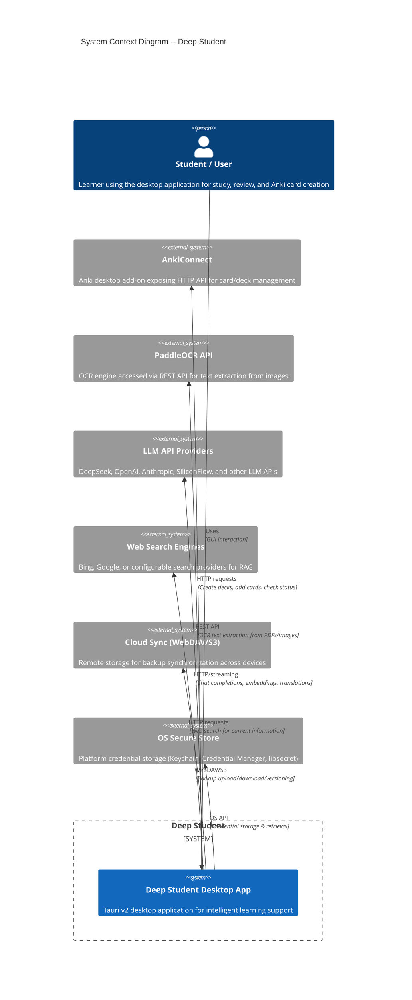
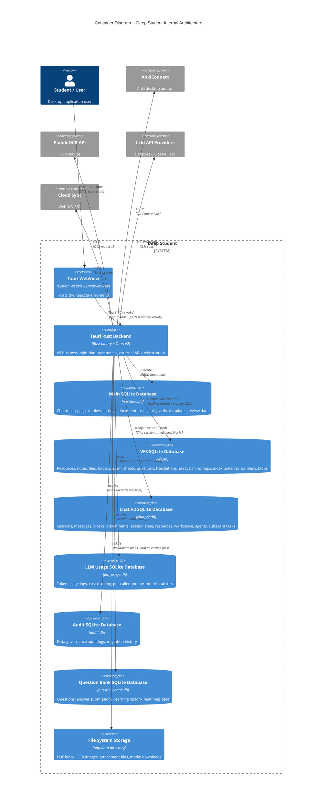

# 系统总览 — C4 架构图

> 本文档以 C4 模型的系统上下文和容器层级描述 Deep Student 系统。
> 基于 `src-tauri/`（Rust 后端）和 `src/`（React 前端）的源代码分析生成。

---

## 系统上下文图

下图将 Deep Student 展示为一个与外部参与者和服务交互的单一系统。



### 外部系统参考

| 参与者 | 技术 | 协议 | 用途 |
|-------|-----------|----------|---------|
| AnkiConnect | Anki 插件 (HTTP) | REST over `http://127.0.0.1:8765` | 牌组管理、卡片创建 |
| PaddleOCR API | 独立部署 / Docker | REST | 从图片中提取 OCR 文本 |
| LLM API | DeepSeek / OpenAI / Anthropic / 等 | HTTP SSE 流式 | 聊天补全、嵌入向量 |
| 网络搜索 | Bing Search API / 可配置 | HTTP | RAG 实时搜索 |
| 云同步 | WebDAV / S3 兼容 | HTTP(s) | 跨设备备份同步 |
| 操作系统安全存储 | Keychain / libsecret / WinCred | 平台 SDK | 加密凭据存储 |

---

## 容器图

下图展示 Deep Student 内的主要容器（运行时进程/数据存储）。



### 容器汇总

| 容器 | 技术 | 持久化 | 核心职责 |
|-----------|-----------|-------------|-------------------|
| Tauri WebView | React 18 + TypeScript | 无（临时） | UI 渲染、用户交互 |
| Tauri Rust 后端 | Rust 1.96 + Tauri 2 | 见数据库 | 所有业务逻辑、外部 API 调用 |
| 主 SQLite DB (`mistakes.db`) | SQLite via rusqlite | 文件型 | 聊天遗留数据、错题、设置、anki_cards、document_tasks |
| VFS SQLite DB (`vfs.db`) | SQLite via r2d2 连接池 | 文件型 | 统一资源、笔记、文件、文件夹、题目、复习计划 |
| Chat V2 SQLite DB (`chat_v2.db`) | SQLite via r2d2 连接池 | 文件型 | 聊天会话、消息、块、附件、工作区代理 |
| LLM Usage DB (`llm_usage.db`) | SQLite via rusqlite | 文件型 | Token/费用统计 |
| 文件系统 | 本地 OS 文件系统 | 磁盘目录 | PDF blob、图片、附件、向量存储 (Lance) |

---

## 数据流：核心用例

### LLM 聊天
```
用户输入 --> WebView --> IPC invoke --> chat_v2::handlers
  --> LLMManager (调用外部 API) --> 流式块写入数据库
  --> 事件发射至 WebView --> UI 更新
```

### PDF OCR 处理
```
用户上传 PDF --> VFS file_handlers --> PdfProcessingService
  --> PaddleOCR API (HTTP) --> OCR 文本存入 vfs.db
  --> 创建索引单元 --> Lance 向量存储索引
```

### 题库复习 (SM-2)
```
用户答题 --> qbank_submit_answer
  --> review_plan_service (SM-2 算法) --> review_plans 表更新
  --> 记录复习历史 --> 计算下次复习日期
```

### Anki 卡片生成
```
文档上传 --> 创建 document_tasks --> LLM 生成卡片
  --> 填充 anki_cards 表 --> AnkiConnect HTTP API (导出)
```

---

## 图例

- **Person**（人类参与者）：绿色圆形
- **System**（本软件系统）：蓝色矩形
- **Container**（运行时进程/数据存储）：蓝色矩形，数据库用圆柱体
- **System_Ext**（外部系统）：灰色/黄色矩形
- **Rel**：带标签的关系箭头
- **Rel_D**：指向数据库的关系

---

## 关键源码引用

| 项目 | 文件 | 行号 |
|------|------|-------|
| 模块声明 | `src-tauri/src/lib.rs` | 6-92 |
| 应用初始化 | `src-tauri/src/lib.rs` | 169-174, 268-842 |
| 主数据库 Schema | `src-tauri/src/database/manager.rs` | 220-425 |
| VFS 数据库 Schema | `src-tauri/migrations/vfs/V20260130__init.sql` | 1-800+ |
| Chat V2 数据库 Schema | `src-tauri/migrations/chat_v2/V20260130__init.sql` | 1-230+ |
| LLM Usage 数据库 Schema | `src-tauri/migrations/llm_usage/V20260130__init.sql` | 1-60+ |
| Tauri 命令注册 | `src-tauri/src/lib.rs` | 847-1727 |
