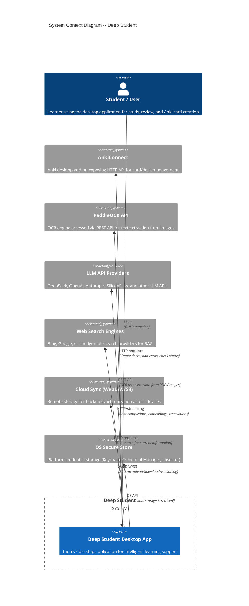
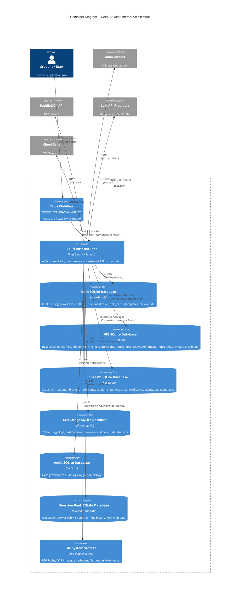

# System Overview -- C4 Architecture Diagrams

> This document describes the Deep Student system at the C4 Model's System Context and Container levels.
> Generated from source code analysis of `src-tauri/` (Rust backend) and `src/` (React frontend).

---

## System Context Diagram

The diagram below shows Deep Student as a single system interacting with external actors and services.



### External Systems Reference

| Actor | Technology | Protocol | Purpose |
|-------|-----------|----------|---------|
| AnkiConnect | Anki Add-on (HTTP) | REST over `http://127.0.0.1:8765` | Deck management, card creation |
| PaddleOCR API | Standalone / Docker | REST | OCR text extraction from images |
| LLM APIs | DeepSeek / OpenAI / Anthropic / etc | HTTP SSE streaming | Chat completions, embeddings |
| Web Search | Bing Search API / configurable | HTTP | Real-time search for RAG |
| Cloud Sync | WebDAV / S3 compatible | HTTP(s) | Cross-device backup sync |
| OS Secure Store | Keychain / libsecret / WinCred | Platform SDK | Encrypted credential storage |

---

## Container Diagram

The diagram below shows the major containers (runtime processes/datastores) within Deep Student.



### Container Summary

| Container | Technology | Persistence | Key Responsibility |
|-----------|-----------|-------------|-------------------|
| Tauri WebView | React 18 + TypeScript | None (ephemeral) | UI rendering, user interaction |
| Tauri Rust Backend | Rust 1.96 + Tauri 2 | See databases | All business logic, external API calls |
| Main SQLite DB (`mistakes.db`) | SQLite via rusqlite | File-based | Chat legacy, mistakes, settings, anki_cards, document_tasks |
| VFS SQLite DB (`vfs.db`) | SQLite via r2d2 pool | File-based | Unified resources, notes, files, folders, questions, review plans |
| Chat V2 SQLite DB (`chat_v2.db`) | SQLite via r2d2 pool | File-based | Chat sessions, messages, blocks, attachments, workspace agents |
| LLM Usage DB (`llm_usage.db`) | SQLite via rusqlite | File-based | Token/cost statistics |
| File System | Local OS filesystem | Directory on disk | PDF blobs, images, attachments, vector store (Lance) |

---

## Data Flow: Core Use Cases

### Chat with LLM
```
User Input --> WebView --> IPC invoke --> chat_v2::handlers
  --> LLMManager (calls external API) --> Streaming blocks written to DB
  --> Events emitted to WebView --> UI updated
```

### PDF OCR Processing
```
User uploads PDF --> VFS file_handlers --> PdfProcessingService
  --> PaddleOCR API (HTTP) --> OCR text stored in vfs.db
  --> Index units created --> Lance vector store indexed
```

### Question Bank Review (SM-2)
```
User answers question --> qbank_submit_answer
  --> review_plan_service (SM-2 algorithm) --> review_plans table updated
  --> review_history recorded --> Next review date computed
```

### Anki Card Generation
```
Document uploaded --> document_tasks created --> LLM generates cards
  --> anki_cards table populated --> AnkiConnect HTTP API (export)
```

---

## Legend

- **Person** (human actor): Green circle
- **System** (the software system): Blue rectangle
- **Container** (runtime process/datastore): Blue rectangle with database cylinder for DBs
- **System_Ext** (external system): Grey/yellow rectangle
- **Rel**: Relationship arrow with label
- **Rel_D**: Relationship to database

---

## Key Source References

| Item | File | Lines |
|------|------|-------|
| Module declarations | `src-tauri/src/lib.rs` | 6-92 |
| App initialization | `src-tauri/src/lib.rs` | 169-174, 268-842 |
| Main DB schema | `src-tauri/src/database/manager.rs` | 220-425 |
| VFS DB schema | `src-tauri/migrations/vfs/V20260130__init.sql` | 1-800+ |
| Chat V2 DB schema | `src-tauri/migrations/chat_v2/V20260130__init.sql` | 1-230+ |
| LLM Usage DB schema | `src-tauri/migrations/llm_usage/V20260130__init.sql` | 1-60+ |
| Tauri command registration | `src-tauri/src/lib.rs` | 847-1727 |
