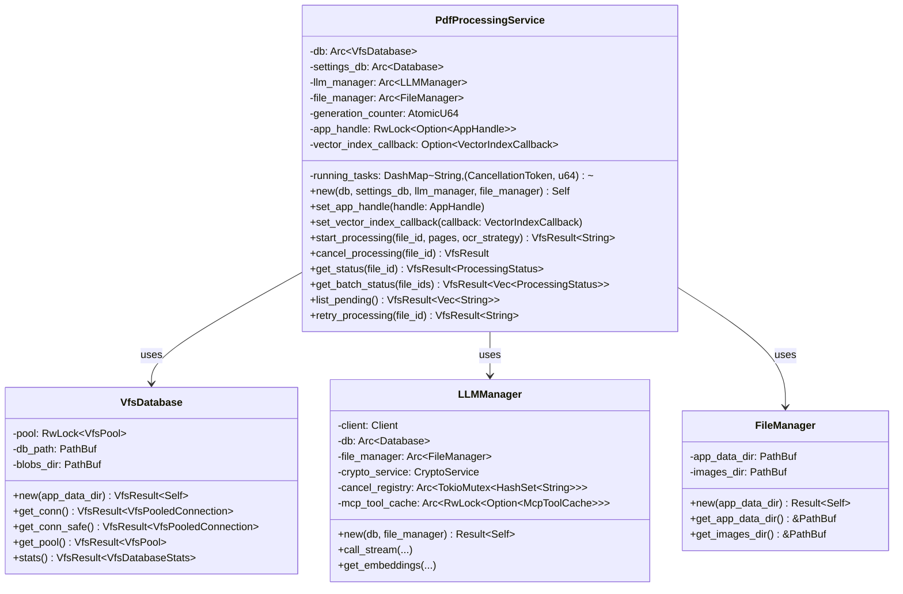
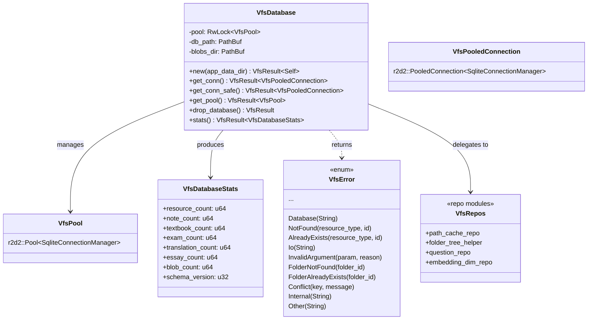
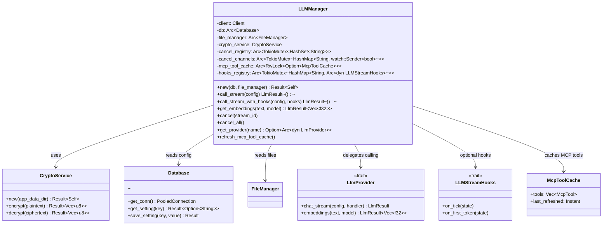
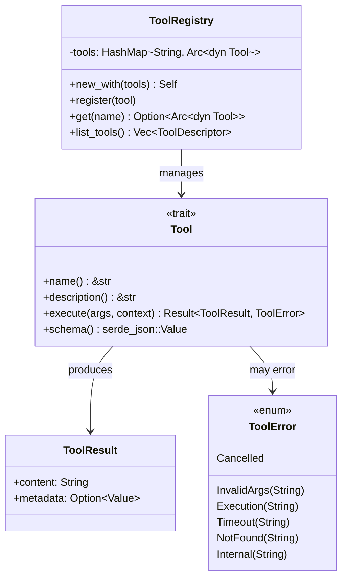

# 后端模块架构（Rust）

> 本文档描述 Rust 后端的模块依赖图和关键结构体/类图。
> 所有关系均来自 `src-tauri/src/` 中实际的 `use` 导入、模块声明和结构体定义。

---

## 模块依赖图

以下流程图展示顶层 Rust 模块及其关键依赖关系。箭头表示 `use` 方向：`A --> B` 表示模块 A 依赖模块 B。

```mermaid
flowchart TD
  %% Core Infrastructure Layer
  subgraph Core["Core Infrastructure"]
    database["📦 database
      (DB pool, migrations,
       mistakes, chat_messages,
       settings, document_tasks)"]
    models["📦 models
      (AppError, AppState,
       shared types)"]
    vfs["📦 vfs
      (VFS database, resources,
       notes, files, folders,
       questions, review_plans,
       todo, pomodoro, OCR storage)"]
  end

  %% Service Layer
  subgraph Services["Service Layer"]
    file_manager["📦 file_manager
      (app_data_dir, images_dir,
       file path resolution)"]
    llm_manager["📦 llm_manager
      (LLM client, providers,
       crypto service, streaming,
       cancel registry)"]
    tools["📦 tools
      (Tool trait, ToolRegistry,
       WebSearchTool)"]
    providers["📦 providers
      (LLM provider configs,
       vendor adapters)"]
    services_mod["📦 services
      (internal services)"]
  end

  %% Feature Modules
  subgraph Features["Feature Modules"]
    chat_v2["📦 chat_v2
      (Chat V2 pipeline,
       sessions, messages, blocks,
       workspace, tools executor)"]
    dstu["📦 dstu
      (Unified Finder protocol,
       path-based resource access,
       folders, trash)"]
    memory["📦 memory
      (Memory-as-VFS system)"]
    essay_grading["📦 essay_grading
      (Essay grading sessions,
       grading rounds, modes)"]
    data_governance["📦 data_governance
      (Migration, backup, sync,
       audit, schema registry)"]
    ocr_adapters["📦 ocr_adapters
      (OCR engine abstraction)"]
    translation["📦 translation
      (Text translation,
       aligned/plain chat
       popover translation)"]
    multimodal["📦 multimodal
      (Multi-modal KB using
       Qwen3-VL-Embedding)"]
    llm_usage["📦 llm_usage
      (Usage statistics database,
       UsageCollector)"]
  end

  %% Commands & Entry
  subgraph Commands["Commands Layer"]
    commands_mod["📦 commands
      (Tauri command functions)"]
    cmd["📦 cmd
      (sub-module commands:
       anki_connect, enhanced_anki,
       mcp, research_stubs,
       textbooks)"]
  end

  %% Infra / Support
  subgraph Infra["Infrastructure / Support"]
    crypto["🔐 crypto
      (CryptoService)"]
    cloud_storage["☁️ cloud_storage
      (WebDAV + S3)"]
    mcp["🔌 mcp
      (Model Context Protocol)"]
    secure_store["🔒 secure_store
      (OS credential store)"]
    database_optimizations["⚡ database_optimizations"]
    document_parser["📄 document_parser"]
    document_processing_service["📄 document_processing_service"]
    pdfium_utils["📄 pdfium_utils"]
    pdf_ocr_service["📄 pdf_ocr_service"]
    utils["🔧 utils"]
    vector_store["🔍 vector_store"]
    lance_vector_store["🔍 lance_vector_store"]
    persistent_message_queue["📨 persistent_message_queue"]
  end

  %% External API Modules
  subgraph External["External API Adapters"]
    anki_connect_service["🃏 anki_connect_service
      (AnkiConnect HTTP client)"]
    enhanced_anki_service["🃏 enhanced_anki_service
      (Anki card generation)"]
    streaming_anki_service["🃏 streaming_anki_service"]
    paddleocr_api["🔍 paddleocr_api"]
    deepseek_ocr_parser["🔍 deepseek_ocr_parser"]
  end

  %% === Dependencies ===

  %% Core depends on database & models
  vfs --> database
  vfs --> models

  %% Service layer depends on core
  llm_manager --> database
  llm_manager --> file_manager
  llm_manager --> crypto
  llm_manager --> providers
  tools --> vfs

  %% Features depend on core + services
  chat_v2 --> database
  chat_v2 --> vfs
  chat_v2 --> llm_manager
  chat_v2 --> tools
  chat_v2 --> file_manager
  chat_v2 --> services_mod

  dstu --> vfs
  dstu --> database

  memory --> vfs

  essay_grading --> database
  essay_grading --> vfs
  essay_grading --> llm_manager

  data_governance --> database
  data_governance --> vfs

  ocr_adapters --> llm_manager

  translation --> llm_manager

  multimodal --> vfs
  multimodal --> llm_manager
  multimodal --> lance_vector_store

  llm_usage --> database

  %% Commands depend on everything
  commands_mod --> database
  commands_mod --> vfs
  commands_mod --> llm_manager
  commands_mod --> chat_v2
  commands_mod --> dstu
  commands_mod --> memory
  commands_mod --> essay_grading
  commands_mod --> file_manager
  commands_mod --> llm_usage
  commands_mod --> data_governance
  commands_mod --> anki_connect_service
  commands_mod --> enhanced_anki_service
  commands_mod --> cloud_storage
  commands_mod --> secure_store
  commands_mod --> translation
  commands_mod --> ocr_adapters
  commands_mod --> persistent_message_queue

  %% External adapters
  anki_connect_service --> utils
  enhanced_anki_service --> llm_manager
  enhanced_anki_service --> vfs

  %% Module linking
  cmd --> commands_mod

  %% Style
  classDef infra fill:#e1f5fe,stroke:#0288d1
  classDef core fill:#e8f5e9,stroke:#388e3c
  classDef service fill:#fff3e0,stroke:#f57c00
  classDef feature fill:#f3e5f5,stroke:#7b1fa2
  classDef cmdcl fill:#fce4ec,stroke:#c62828
  classDef external fill:#e0f2f1,stroke:#00796b

  class database,models,vfs core
  class file_manager,llm_manager,tools,providers,services_mod service
  class chat_v2,dstu,memory,essay_grading,data_governance,ocr_adapters,translation,multimodal,llm_usage feature
  class commands_mod,cmd cmdcl
  class crypto,cloud_storage,mcp,secure_store,database_optimizations,document_parser,document_processing_service,pdfium_utils,pdf_ocr_service,utils,vector_store,lance_vector_store,persistent_message_queue infra
  class anki_connect_service,enhanced_anki_service,streaming_anki_service,paddleocr_api,deepseek_ocr_parser external
```

### 模块数量（来自 `lib.rs`）

- **已声明模块总数**：~93（含 feature 门控的 `data_governance` 和 `mcp`）
- **始终编译**：~91
- **条件编译**：`data_governance`（feature）、`mcp`（feature）、`menu`（仅 macOS）

---

## 类/结构体图

### 1. PdfProcessingService

文件：`src-tauri/src/vfs/pdf_processing_service.rs`（第 416 行）

### 2. VfsDatabase

文件：`src-tauri/src/vfs/database.rs`（第 45 行）

### 3. LLMManager

文件：`src-tauri/src/llm_manager/mod.rs`（第 47 行）

### 4. ToolError (chat_v2 tools executor)

文件：`src-tauri/src/chat_v2/tools/executor.rs`（第 74 行）

---

## 图例

| 符号 | 含义 |
|--------|---------|
| `+` | 公开方法/字段 |
| `-` | 私有方法/字段 |
| `-->` | 关联（使用/拥有） |
| `..>` | 依赖（临时使用） |
| `--|>` | 继承 |
| `<<trait>>` | Rust trait |
| `<<enum>>` | Rust 枚举 |
| `Box~T~` | `Box<T>`（堆分配） |
| `Arc~T~` | `Arc<T>`（原子引用计数） |
| `RwLock~T~` | `RwLock<T>`（读写锁） |
| `Mutex~T~` | `Mutex<T>`（互斥锁） |

---

## 关键源码引用

| 结构体/模块 | 文件 | 行号 |
|---------------|------|-------|
| PdfProcessingService | `src-tauri/src/vfs/pdf_processing_service.rs` | 416-434 |
| VfsDatabase | `src-tauri/src/vfs/database.rs` | 45-52 |
| LLMManager | `src-tauri/src/llm_manager/mod.rs` | 47-57 |
| ToolError | `src-tauri/src/chat_v2/tools/executor.rs` | 74-87 |
| FileManager | `src-tauri/src/file_manager.rs` | 26-29 |
| Tool trait | `src-tauri/src/chat_v2/tools/executor.rs` | ~50-70 |
| lib.rs 模块声明 | `src-tauri/src/lib.rs` | 6-92 |
