# Database Schema -- Entity Relationship Diagrams

> This document describes all SQLite tables used by Deep Student across its multiple database files.
> Table definitions and relationships are extracted from `src-tauri/src/database/`, `src-tauri/src/vfs/`, `migrations/`, and `src-tauri/src/chat_v2/`.

---

## Database Architecture Overview

Deep Student uses **5 separate SQLite database files** plus OS filesystem storage:

| Database File | Module | Purpose | Migrations |
|---------------|--------|---------|------------|
| `mistakes.db` | `database` | Legacy chat, mistakes, settings, document_tasks, anki_cards | `database/manager.rs` + `migrations/mistakes/` |
| `vfs.db` | `vfs` | Unified resources, notes, files, folders, questions, exams, review plans | `migrations/vfs/` (Refinery) |
| `chat_v2.db` | `chat_v2` | Chat sessions, messages, blocks, workspace agents | `migrations/chat_v2/` (Refinery) |
| `llm_usage.db` | `llm_usage` | Token usage statistics | `migrations/llm_usage/` (Refinery) |
| `audit.db` | `data_governance` | Data governance audit logs | `data_governance` module |

---

## 1. mistakes.db (Main Database)

### Core: mistakes & chat_messages

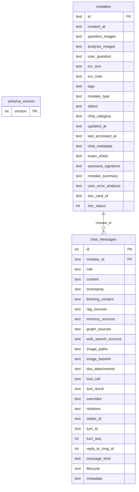

### Review & Sessions

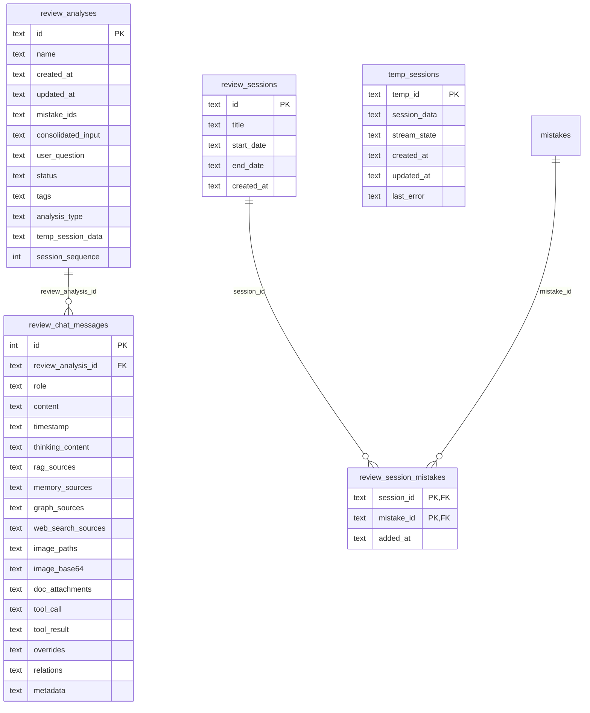

### Document Tasks & Anki Cards

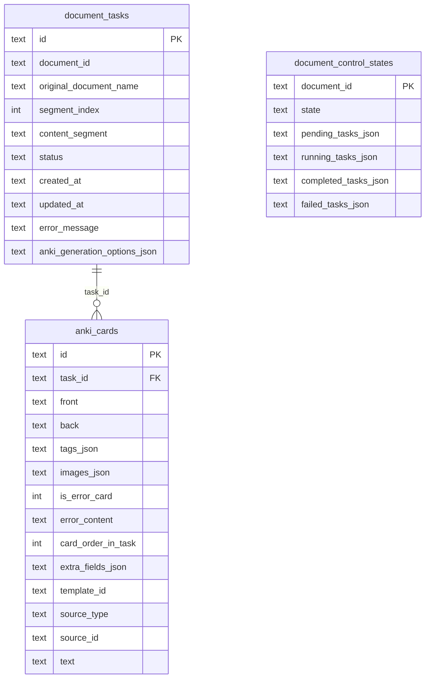

### Settings & Templates

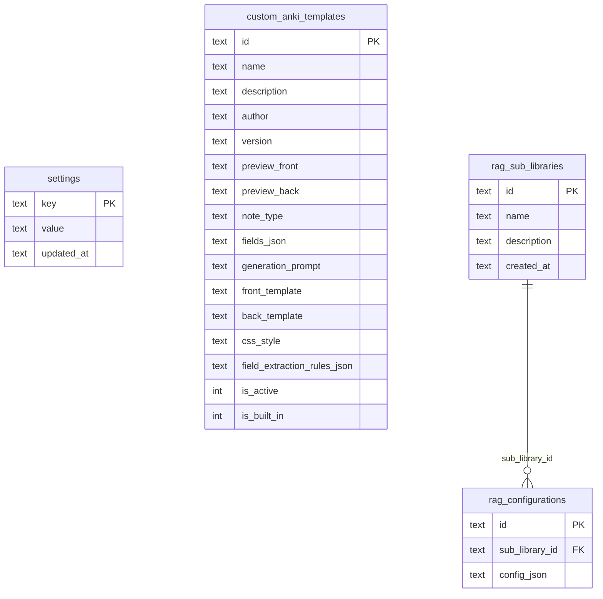

### Supporting Tables

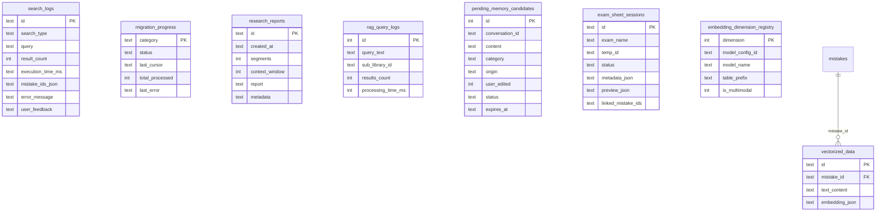

---

## 2. vfs.db (VFS Database -- 27 tables)

### Core Resource Tables

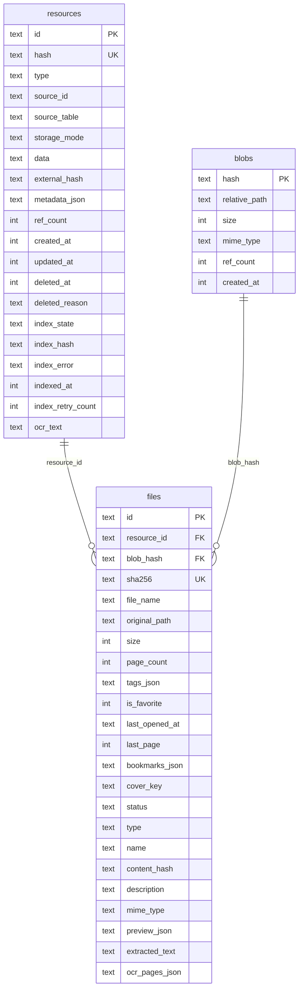

### Notes & Versions

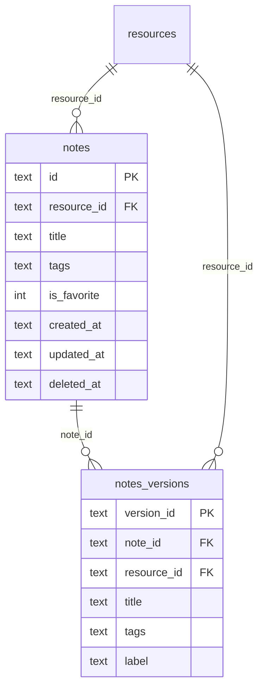

### Folder Hierarchy

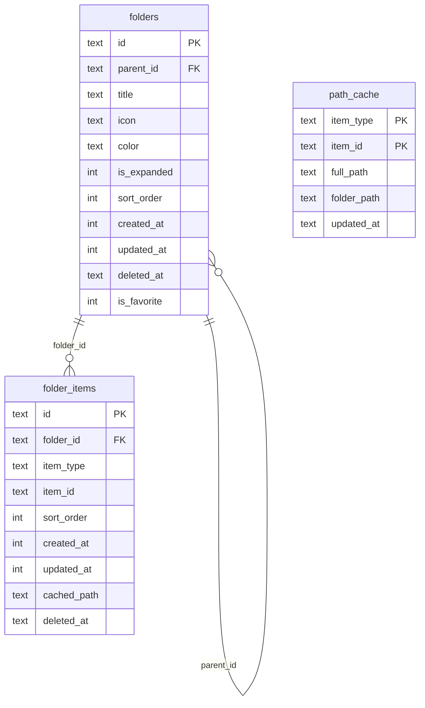

### Exam Sheets, Questions & Review Plans

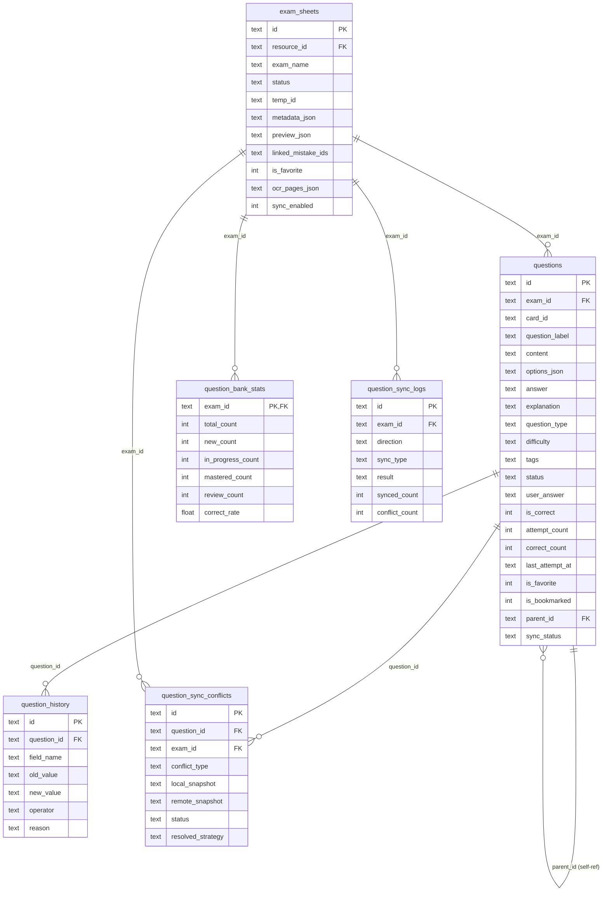

### SM-2 Review System

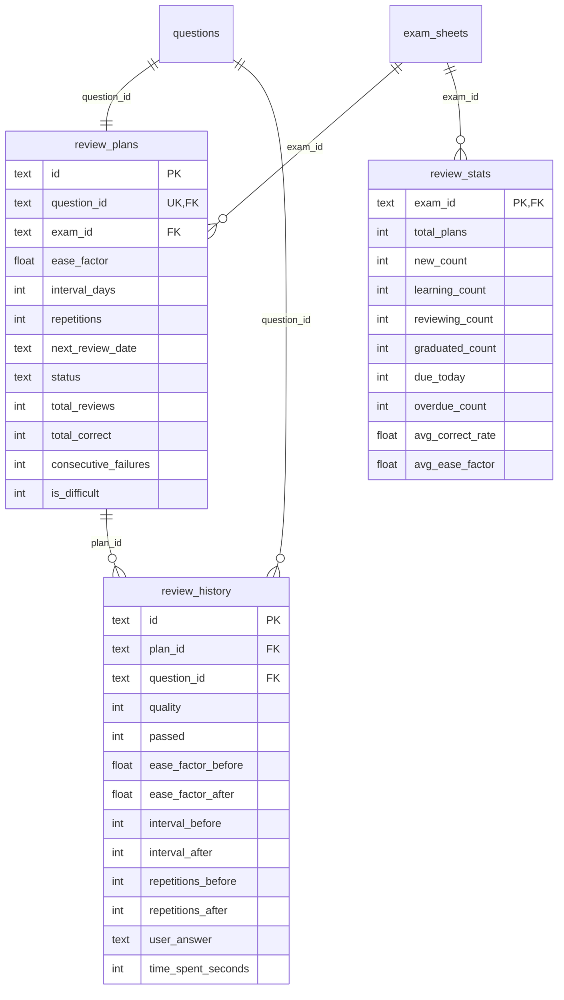

### Essays, Translations & Mindmaps

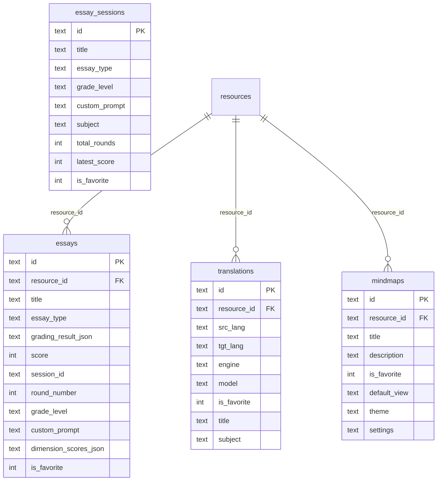

### Indexing System

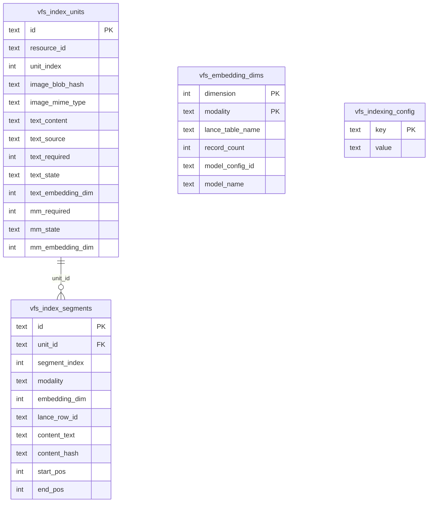

### Todo, Pomodoro & Memory Config

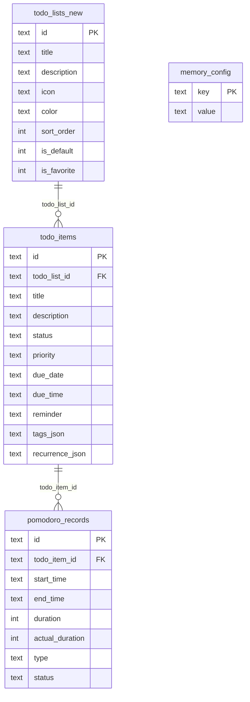

---

## 3. chat_v2.db (Chat V2 Database)

### Core Chat Tables

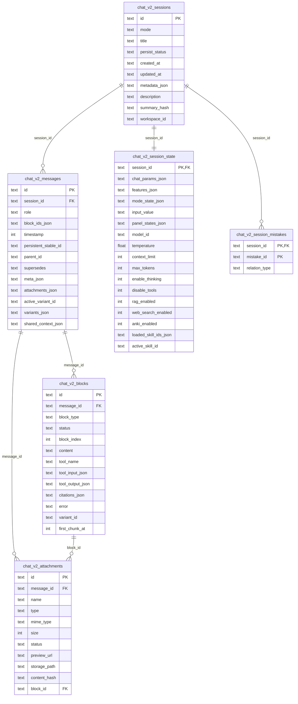

### Resources & Todo Lists

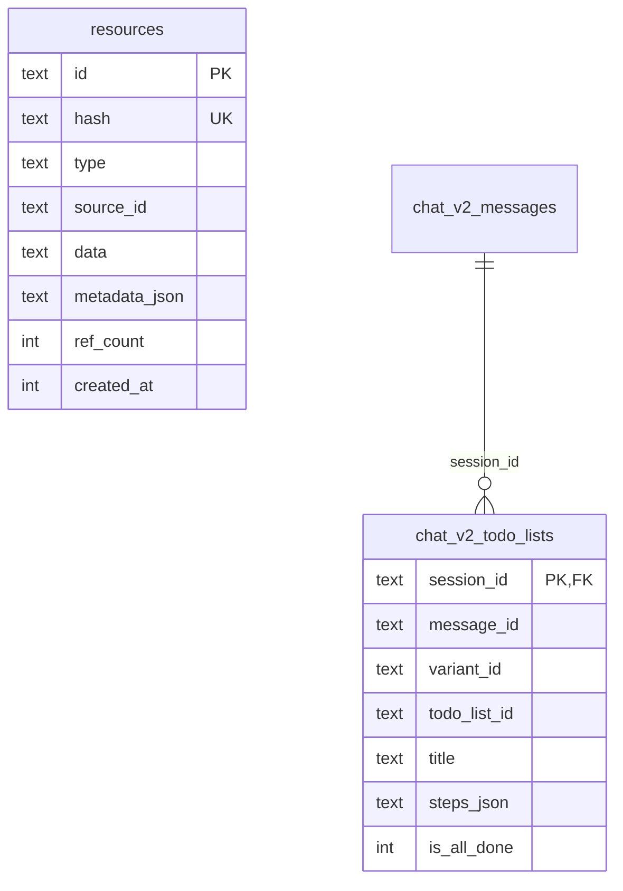

### Workspace & Agent System

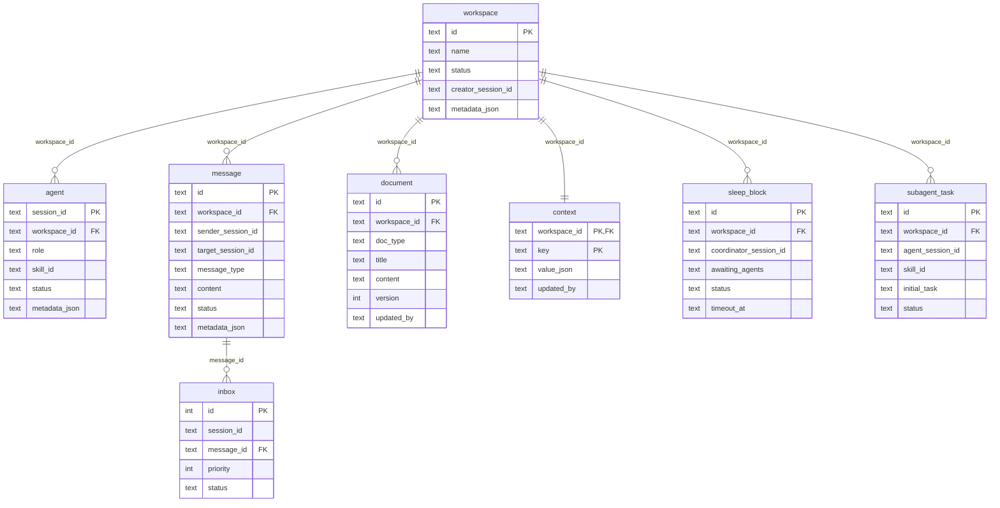

---

## 4. llm_usage.db (LLM Usage Statistics)

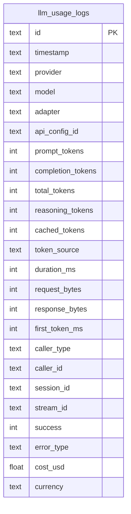

---

## 5. audit.db (Data Governance Audit)

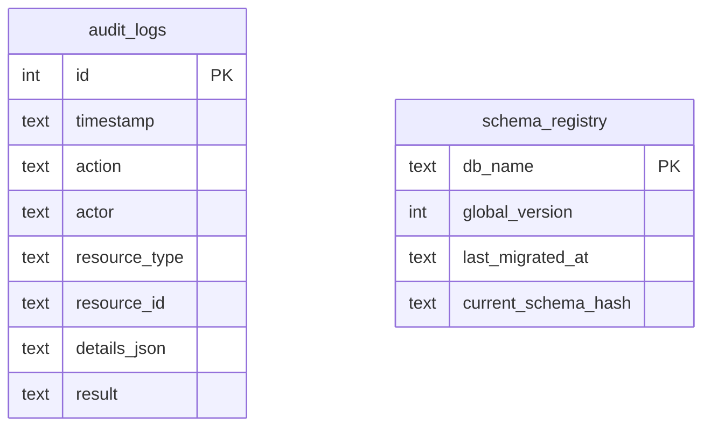

---

## Legend

| Notation | Meaning |
|----------|---------|
| `PK` | Primary Key |
| `FK` | Foreign Key |
| `UK` | Unique Key |
| `||--o{` | One-to-many relationship |
| `||--||` | One-to-one relationship |
| `}o--||` | Many-to-one relationship |
| `+` in `<>` | See VFS migration line references |
| `text` | `TEXT` column (SQLite) |
| `int` | `INTEGER` column (SQLite) |
| `float` | `REAL` column (SQLite) |

---

## Key Source References

| Database | Key File | Lines |
|----------|----------|-------|
| Main DB schema | `src-tauri/src/database/manager.rs` | 220-425 (init), 640-820 (compat) |
| Main DB schema (v13+) | `src-tauri/src/database/mod.rs` | 710-845, 4960-5056 |
| Mistakes migrations | `src-tauri/migrations/mistakes/V20260130__init.sql` | 1-300+ |
| VFS complete schema | `src-tauri/migrations/vfs/V20260130__init.sql` | 1-800+ |
| VFS todo/pomodoro | `src-tauri/migrations/vfs/V20260308__add_todo_tables.sql` | 1-50+ |
| VFS pomodoro | `src-tauri/migrations/vfs/V20260310__add_pomodoro.sql` | 1-30+ |
| VFS decouple todo | `src-tauri/migrations/vfs/V20260309__decouple_todo_from_vfs.sql` | 1-30+ |
| Chat V2 schema | `src-tauri/migrations/chat_v2/V20260130__init.sql` | 1-230+ |
| Workspace schema | `src-tauri/src/chat_v2/workspace/database.rs` | 14-117 |
| LLM Usage schema | `src-tauri/migrations/llm_usage/V20260130__init.sql` | 1-60+ |
| Memory intake tables | `src-tauri/src/database/manager.rs` | 383-411 |
