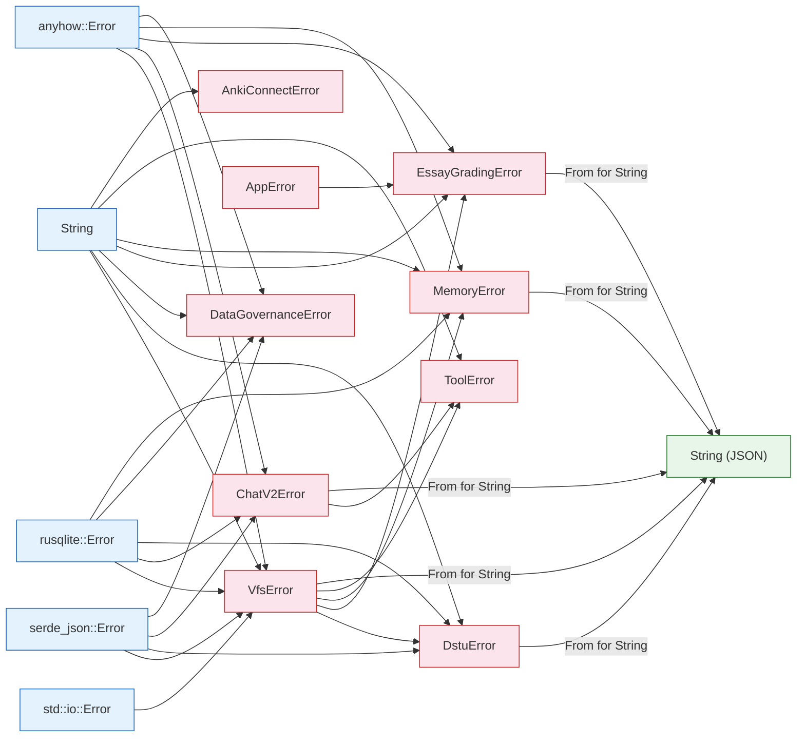
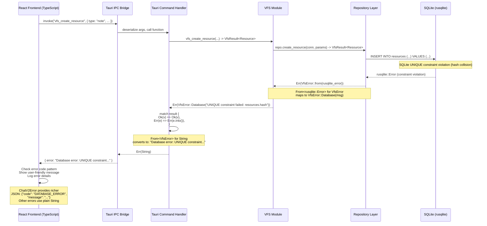

# 错误类型层级与传播

> 本文档描述 Rust 后端的错误类型架构，包括类型层级、`From` 转换关系，以及从数据库到前端的典型错误传播流程。

---

## 错误类型层级

```mermaid
classDiagram
  class std::error::Error {
    <<trait>>
  }

  class VfsError {
    <<enum>> + Serialize
    Database(String)
    NotFound(resource_type, id)
    AlreadyExists(resource_type, id)
    HashCollision(hash)
    Io(String)
    Serialization(String)
    InvalidArgument(param, reason)
    PathParse(path, reason)
    RefCount(resource_id, reason)
    Migration(String)
    Pool(String)
    FolderNotFound(folder_id)
    FolderAlreadyExists(folder_id)
    FolderDepthExceeded(folder_id, depth, max)
    ItemNotFound(item_type, item_id)
    InvalidParent(folder_id, reason)
    FolderCountExceeded(count, max)
    InvalidOperation(operation, reason)
    InvalidState(message)
    Conflict(key, message)
    Internal(String)
    Other(String)
  }

  class DstuError {
    <<enum>> + Serialize + thiserror
    InvalidPath(String)
    MissingSegment(String)
    InvalidNodeType(String)
    NotFound(String)
    AlreadyExists(String)
    NotSupported(String)
    PermissionDenied(String)
    VfsError(String)
    DatabaseError(String)
    SerializationError(String)
    IoError(String)
    Internal(String)
  }

  class ChatV2Error {
    <<enum>> + Serialize + thiserror
    SessionNotFound(String)
    GroupNotFound(String)
    MessageNotFound(String)
    BlockNotFound(String)
    ResourceNotFound(String)
    VariantNotFound(String)
    VariantCannotActivateFailed(String)
    VariantCannotDeleteLast
    VariantAlreadyStreaming(String)
    VariantCannotRetry(String, String)
    LimitExceeded(String)
    Database(String)
    Llm(String)
    Tool(String)
    Cancelled
    Serialization(String)
    Validation(String)
    Other(String)
    IoError(String)
    InvalidInput(String)
    DatabaseCorrupted { original, rollback }
    Timeout(String)
  }

  class ToolError {
    <<enum>>
    InvalidArgs(String)
    Execution(String)
    Timeout(String)
    NotFound(String)
    Cancelled
    Internal(String)
  }

  class DataGovernanceError {
    <<enum>> + thiserror + manual Serialize
    Migration(MigrationError)
    SchemaRegistry(SchemaRegistryError)
    Backup(String)
    Sync(String)
    NotImplemented(String)
  }

  class EssayGradingError {
    <<enum>> + Serialize
    Database(String)
    Validation(String)
    NotFound(String)
    Internal(String)
    Other(String)
  }

  class MemoryError {
    <<enum>> + Serialize
    Database(String)
    Validation(String)
    NotFound(String)
    Other(String)
  }

  class AnkiConnectError {
    <<enum>>
    Request(String)
    Parse(String)
    Other(String)
  }

  class AppError {
    <<enum>> (legacy, commands.rs)
    -- phased out --
  }

  %% Error implements std::error::Error
  VfsError --|> std::error::Error
  DstuError --|> std::error::Error
  ChatV2Error --|> std::error::Error
  ToolError --|> std::error::Error
  DataGovernanceError --|> std::error::Error
  EssayGradingError --|> std::error::Error
  MemoryError --|> std::error::Error
  AnkiConnectError --|> std::error::Error
  AppError --|> std::error::Error
```

---

## From<> 转换映射

下图展示所有将一个错误类型转换为另一个错误类型的 `From` trait 实现，从而建立错误传播链。



### 转换链汇总

| 源类型 | 目标类型 | 文件 | 行号 |
|-------------|-------------|------|-------|
| `std::io::Error` | `VfsError` | `src-tauri/src/vfs/error.rs` | 174-178 |
| `std::io::Error` | `DstuError` | `src-tauri/src/dstu/error.rs` | 125-129 |
| `rusqlite::Error` | `VfsError` | `src-tauri/src/vfs/error.rs` | 186-190 |
| `rusqlite::Error` | `ChatV2Error` | `src-tauri/src/chat_v2/error.rs` | 104-108 |
| `rusqlite::Error` | `DstuError` | `src-tauri/src/dstu/error.rs` | 139-143 |
| `rusqlite::Error` | `DataGovernanceError` | `src-tauri/src/data_governance/mod.rs` | 159+ |
| `rusqlite::Error` | `MemoryError` | `src-tauri/src/memory/error.rs` | 38-42 |
| `serde_json::Error` | `VfsError` | `src-tauri/src/vfs/error.rs` | 180-184 |
| `serde_json::Error` | `DstuError` | `src-tauri/src/dstu/error.rs` | 132-136 |
| `serde_json::Error` | `ChatV2Error` | `src-tauri/src/chat_v2/error.rs` | 111-115 |
| `anyhow::Error` | `VfsError` | `src-tauri/src/vfs/error.rs` | 199-203 |
| `anyhow::Error` | `ChatV2Error` | `src-tauri/src/chat_v2/error.rs` | 118-122 |
| `anyhow::Error` | `EssayGradingError` | `src-tauri/src/essay_grading/error.rs` | 45-49 |
| `anyhow::Error` | `MemoryError` | `src-tauri/src/memory/error.rs` | 32-36 |
| `anyhow::Error` | `DataGovernanceError` | `src-tauri/src/data_governance/mod.rs` | 153-157 |
| `String` | `VfsError` | `src-tauri/src/vfs/error.rs` | 205-209 |
| `String` | `DstuError` | `src-tauri/src/dstu/error.rs` | 118-122 |
| `String` | `MemoryError` | `src-tauri/src/memory/error.rs` | 44-48 |
| `String` | `ToolError` | `src-tauri/src/chat_v2/tools/executor.rs` | ~100 |
| `String` | `AnkiConnectError` | `src-tauri/src/anki_connect_service.rs` | 30-31 |
| `VfsError` | `DstuError` | `src-tauri/src/dstu/error.rs` | 146-150 |
| `VfsError` | `EssayGradingError` | `src-tauri/src/essay_grading/error.rs` | 39-43 |
| `VfsError` | `MemoryError` | `src-tauri/src/memory/error.rs` | 26-30 |
| `ChatV2Error` | `ToolError` | `src-tauri/src/chat_v2/tools/executor.rs` | ~100 |
| `AppError` | `EssayGradingError` | `src-tauri/src/essay_grading/error.rs` | 28-37 |
| `VfsError` | `String` | `src-tauri/src/vfs/error.rs` | 193-197 |
| `DstuError` | `String` | `src-tauri/src/dstu/error.rs` | 112-116 |
| `ChatV2Error` | `String` (JSON) | `src-tauri/src/chat_v2/error.rs` | 125-154 |
| `MemoryError` | `String` | `src-tauri/src/memory/error.rs` | 52-56 |
| `EssayGradingError` | `String` | `src-tauri/src/essay_grading/error.rs` | 53-57 |

---

## 错误传播时序

以下时序图追踪一个真实的错误流程：在 VFS 资源创建过程中发生的**数据库完整性冲突**，通过类型系统传播，跨越 Tauri IPC 边界，最终在前端被处理。



---

## 错误类型特性

| 错误类型 | 文件 | `Serialize` | `Display` (thiserror?) | `From` 来源 | 行数 |
|------------|------|------------|------------------------|----------------|------------|
| **VfsError** | `src-tauri/src/vfs/error.rs` | derive | 手动 Display（~25 变体） | io, serde_json, rusqlite, anyhow, String | 239 |
| **DstuError** | `src-tauri/src/dstu/error.rs` | derive | thiserror（~11 变体） | io, serde_json, rusqlite, VfsError, String | 174 |
| **ChatV2Error** | `src-tauri/src/chat_v2/error.rs` | derive | thiserror（~20 变体） | serde_json, rusqlite, anyhow | 215 |
| **ToolError** | `src-tauri/src/chat_v2/tools/executor.rs` | -- | 手动（~6 变体） | String, ChatV2Error | ~30 |
| **DataGovernanceError** | `src-tauri/src/data_governance/mod.rs` | 手动自定义 | thiserror（~5 变体） | MigrationError, SchemaRegistryError, anyhow, rusqlite, String | ~60 |
| **EssayGradingError** | `src-tauri/src/essay_grading/error.rs` | derive | 手动（~5 变体） | AppError, VfsError, anyhow | 57 |
| **MemoryError** | `src-tauri/src/memory/error.rs` | derive | 手动（~4 变体） | VfsError, anyhow, rusqlite, String | 56 |
| **AnkiConnectError** | `src-tauri/src/anki_connect_service.rs` | -- | 手动（~3 变体） | String | ~30 |

### ChatV2Error JSON 序列化

`ChatV2Error` 使用自定义的 `From<ChatV2Error> for String` 转换，输出带有错误码的结构化 JSON：

| 变体 | 错误码 |
|---------|-----------|
| `SessionNotFound` | `SESSION_NOT_FOUND` |
| `Database` | `DATABASE_ERROR` |
| `Llm` | `LLM_ERROR` |
| `Tool` | `TOOL_ERROR` |
| `Cancelled` | `CANCELLED` |
| `DatabaseCorrupted` | `DATABASE_CORRUPTED` |
| `Timeout` | `TIMEOUT` |
| （其他） | 各变体特定错误码 |

### DataGovernanceError 序列化

`DataGovernanceError` 实现了手动 `Serialize`，输出 `{ "code": "MIGRATION_ERROR", "message": "..." }` 格式，包含 5 个错误码：`MIGRATION_ERROR`、`SCHEMA_REGISTRY_ERROR`、`BACKUP_ERROR`、`SYNC_ERROR`、`NOT_IMPLEMENTED`。

---

## 关键文件与行号

| 错误类型 | 文件 | 枚举定义行号 |
|------------|------|---------------------|
| VfsError | `src-tauri/src/vfs/error.rs` | 12 |
| DstuError | `src-tauri/src/dstu/error.rs` | 10 |
| ChatV2Error | `src-tauri/src/chat_v2/error.rs` | 9 |
| ToolError | `src-tauri/src/chat_v2/tools/executor.rs` | 74 |
| DataGovernanceError | `src-tauri/src/data_governance/mod.rs` | 110 |
| EssayGradingError | `src-tauri/src/essay_grading/error.rs` | 6 |
| MemoryError | `src-tauri/src/memory/error.rs` | 6 |
| AnkiConnectError | `src-tauri/src/anki_connect_service.rs` | 12 |
