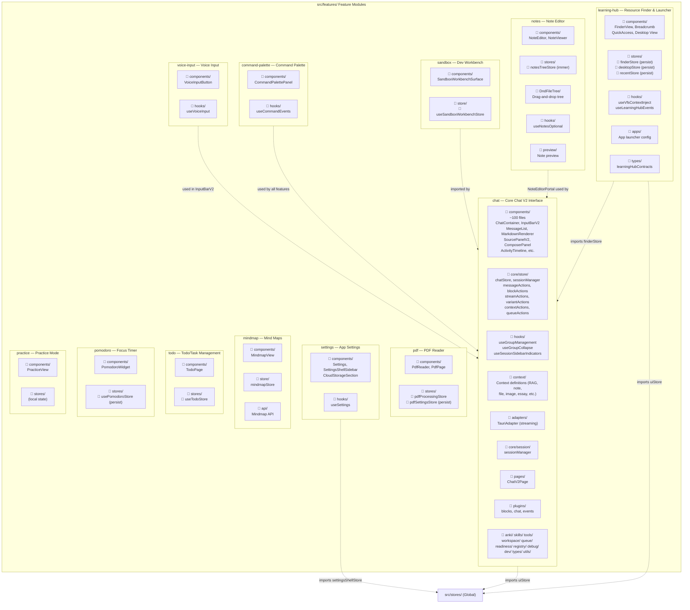
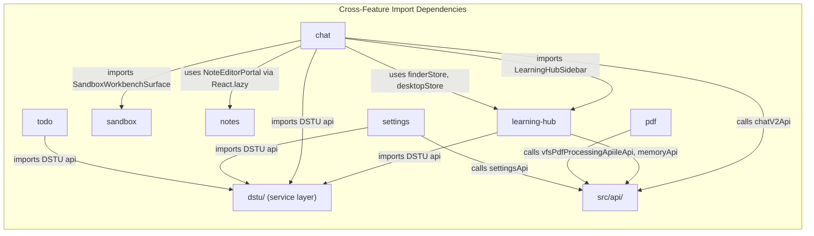

# 前端架构 — React/TypeScript 图

> **最后更新**：2026-06-06（从源代码分析推导）
> **源文件**：`src/App.tsx`、`src/main.tsx`、`src/lazyComponents.tsx`、`src/features/*`
> **范围**：基于 React 18 + TypeScript 前端的 Tauri v2 应用

---

## a) 组件树图

以下图示展示完整的 React 组件层级，从应用根节点到布局、功能页面和共享组件。

```mermaid
flowchart TB
  subgraph Root["Application Root (main.tsx)"]
    direction TB
    EB["ErrorBoundary (TopLevel)"]
    OCP["OverlayCoordinatorProvider"]
    DCP["DialogControlProvider"]
    App["App.tsx (Main Shell)"]
  end

  subgraph AppShell["App Shell Structure"]
    CPP["CommandPaletteProvider"]
    TCM["TextContextMenuProvider"]
    MLP["MobileLayoutProvider"]
    MHP["MobileHeaderProvider"]
    MHAVS["MobileHeaderActiveViewSync"]
    LHNP["LearningHubNavigationProvider"]
    DSSP["DesktopShellSidebarPortalProvider"]

    %% Desktop Shell
    subgraph DesktopTitlebar["Desktop Shell Titlebar"]
      CC["ChatV2Page ChatHeader"]
      CPB["CommandPaletteButton"]
      LHBC["LearningHubTopbarBreadcrumb"]
      TS["TextSwap (View Label)"]
      WC["WindowControls"]
      DHNC["DesktopHeaderNavControls"]
      DSA["DesktopSidebarAccessory"]
    end

    subgraph MobileElements["Mobile Elements"]
      UMH["UnifiedMobileHeader"]
      MSS["Mobile Settings Sheet"]
    end

    subgraph DesktopSidebar["Desktop Sidebar Navigation"]
      MS["ModernSidebar (Main Navigation)"]
      SSS["SettingsShellSidebar"]
      TSS["TodoShellSidebar"]
      DPSS["DesktopPageShellSidebar"]
    end

    subgraph Workspace["Workspace Area"]
      MB["MigrationStatusBanner"]
      subgraph ViewLayers["View Layers (LRU-Cached)"]
        direction TB
        CV2["View: chat-v2"]
        LH["View: learning-hub"]
        ST["View: settings"]
        DB["View: dashboard"]
        TD["View: task-dashboard"]
        SK["View: skills-management"]
        DM["View: data-management"]
        TM["View: template-management"]
        PR["View: pdf-reader"]
        TO["View: todo"]
        SW["View: sandbox-workbench"]
        UL["View: ui-lab (dev)"]
        TJP["View: template-json-preview"]
        CD["View: crepe-demo (dev)"]
        CT["View: chat-v2-test (dev)"]
        TT["View: tree-test (dev)"]
        LLP["View: llm-playground (dev)"]
      end
    end
  end

  subgraph GlobalOverlays["Global Overlays"]
    NC["NotificationContainer"]
    CD_["CloudStorageSettings Dialog"]
    GD["GlobalDebugPanel (dev)"]
    CMD["CommandPalette"]
    GPW["GlobalPomodoroWidget"]
    NEP["LazyNoteEditorPortal"]
    AB["AnnProgressBar"]
  end

  Root --> App
  App --> CPP
  CPP --> TCM
  TCM --> MLP
  MLP --> MHP
  MHP --> MHAVS
  MHAVS --> LHNP
  LHNP --> DSSP
  DSSP --> DesktopTitlebar
  DSSP --> DesktopSidebar
  DSSP --> Workspace
  DSSP --> MobileElements
  App --> GlobalOverlays

  subgraph ChatV2Page["Chat V2 Page (lazy)"]
    direction TB
    CHC["ChatContainer"]
    SBR["SessionBrowser"]
    GEP["GroupEditorPanel"]
    SBW["SandboxWorkbenchSurface"]
    LHS["LearningHubSidebar (Embedded)"]
    CHC --> MSGL["MessageList"]
    CHC --> IB["InputBarV2"]
    CHC --> SRC["SourcePanelV2"]
    CHC --> CC2["ComposerPanel"]
    MSGL --> MI["MessageItem"]
    MI --> MA["MessageActions"]
    MI --> AI["ActivityTimeline"]
    MI --> MR["MarkdownRenderer"]
    IB --> MS["ModelSelector"]
    IB --> MP["ModelPicker"]
    IB --> AC["AttachmentUploader"]
  end

  subgraph LearningHubPage["Learning Hub Page (lazy)"]
    direction TB
    LHSB["LearningHubSidebar"]
    LHTB["LearningHubToolbar"]
    LHAB["LearningHubActionBar"]
    FV["FinderView (Grid/List)"]
    BC["Breadcrumb"]
    QA["QuickAccess"]
    DS["Desktop View"]
  end

  subgraph SettingsPage["Settings Page (lazy)"]
    direction TB
    ST["Settings Tabs"]
    CSS["CloudStorageSection"]
    DG["DataGovernance"]
    SHT["Shortcuts"]
  end

  CV2 --> ChatV2Page
  LH --> LearningHubPage
  ST --> SettingsPage

  DB --> SOTA["LazySOTADashboard"]
  TD --> TDP["TaskDashboardPage"]
  SK --> SMP["SkillsManagementPage"]
  DM --> DIE["DataImportExport"]
  DM --> ICD["ImportConversationDialog"]
  TM --> TMP["TemplateManagementPage"]
  TJP --> TJPP["TemplateJsonPreviewPage"]
  PR --> PDF["PdfReader"]
  TO --> TP["TodoPage"]
  SW --> SWP["SandboxWorkbenchPage"]
```

---

## b) 路由结构图

本应用使用**基于视图的导航系统**（非传统 URL 路由）。视图通过 `CurrentView` 类型管理，并通过 `ViewLayerRenderer` 组件配合 LRU 缓存进行渲染。

```mermaid
flowchart LR
  subgraph RouteMapping["View Navigation System"]
    direction TB
    CV["CurrentView State<br/>(useState in App.tsx)"]
    CN["canonicalizeView()<br/>Deprecated → Active Mapping"]
    VR["ViewLayerRenderer<br/>(LRU-cached layers)"]
    NH["useNavigationHistory<br/>(Back/Forward Stack)"]
  end

  subgraph Views["All View Types"]
    direction TB
    V_MAIN["Primary Views"]
    V_SETT["Settings Views"]
    V_TOOL["Tool/Utility Views"]
    V_DEV["Developer Views (DEV only)"]
  end

  subgraph PrimaryViews["Primary Views"]
    CV2["chat-v2<br/>Chat Interface"]
    LH["learning-hub<br/>Resource Finder"]
    STG["settings<br/>App Settings"]
    DB["dashboard<br/>SOTA Dashboard"]
    TD["task-dashboard<br/>Anki Task Management"]
  end

  subgraph SecondaryViews["Secondary Views"]
    SK["skills-management<br/>Skill Management"]
    DM["data-management<br/>Data Import/Export"]
    TM["template-management<br/>Anki Template Library"]
    PR["pdf-reader<br/>PDF Viewer"]
    TO["todo<br/>Todo List"]
    SW["sandbox-workbench<br/>HTML Preview Workbench"]
  end

  subgraph DevViews["DEV-Only Views"]
    TT["tree-test<br/>Drag Tree Test"]
    CD["crepe-demo<br/>Crepe Editor Demo"]
    CT["chat-v2-test<br/>Integration Test"]
    LLP["llm-playground<br/>LLM Output Playground"]
  end

  subgraph DeprecatedViews["Deprecated → Redirected"]
    AN["analysis → chat-v2"]
    CH["chat → chat-v2"]
    NT["notes → learning-hub"]
    ME["markdown-editor → learning-hub"]
    TL["textbook-library → learning-hub"]
    ES["exam-sheet → learning-hub"]
    IR["irec → chat-v2"]
    LU["llm-usage-stats → dashboard"]
    MW["math-workflow → chat-v2"]
  end

  CV --> CN
  CN --> Views
  Views --> PrimaryViews
  Views --> SecondaryViews
  Views --> DevViews
  Views --> DeprecatedViews

  VR -->|"LRU Cache"| PrimaryViews
  VR -->|"LRU Cache"| SecondaryViews
  VR -->|"DEV only"| DevViews
  NH -->|"Back/Forward"| CV

  subgraph ViewNavigation["Navigation Triggers"]
    SIDEBAR["ModernSidebar Click"]
    CMD_PAL["CommandPalette Command"]
    KEYBOARD["Keyboard Shortcut"]
    EVENT["Window Event (NAVIGATE_TO_VIEW)"]
    HISTORY["Browser Back/Forward"]
  end

  ViewNavigation --> CV
```

---

## c) 功能模块地图

### 图例
- `📁 components/` — UI 组件目录
- `📁 stores/` — Zustand 状态管理
- `📁 hooks/` — 自定义 React 钩子
- `📁 api/` 或服务文件 — 后端通信
- `⟶` — 跨功能导入（仅关键关系）

### 功能模块概览

---

## 源文件参考

| 模块 | 关键文件 | 路径 |
|--------|-----------|------|
| 应用根壳 | `App.tsx` | `src/App.tsx` |
| 应用入口 | `main.tsx` | `src/main.tsx` |
| 懒加载页面 | `lazyComponents.tsx` | `src/lazyComponents.tsx` |
| 视图类型 | `navigation.ts` | `src/types/navigation.ts` |
| 视图规范化 | `canonicalView.ts` | `src/app/navigation/canonicalView.ts` |
| 视图层渲染器 | `ViewLayerRenderer.tsx` | `src/app/components/ViewLayerRenderer.tsx` |
| 桌面壳 | `desktopShell.ts` | `src/app/shell/desktopShell.ts` |
| 移动壳 | `mobileShell.ts` | `src/app/shell/mobileShell.ts` |
| 导航 | `ModernSidebar.tsx` | `src/components/ModernSidebar.tsx` |
| 导航历史 | `useNavigationHistory.ts` | `src/hooks/useNavigationHistory.ts` |
| Chat V2 页面 | `ChatV2Page.tsx` | `src/features/chat/pages/ChatV2Page.tsx` |
| Chat V2 导出 | `index.ts` | `src/features/chat/pages/index.ts` |
| Learning Hub 页面 | `LearningHubPage.tsx` | `src/features/learning-hub/LearningHubPage.tsx` |
| Learning Hub 导出 | `index.ts` | `src/features/learning-hub/index.ts` |
| 布局组件 | `index.ts` | `src/components/layout/index.ts` |
| 共享组件 | `index.ts` | `src/components/shared/index.ts` |
| 全局 Store | `viewStore.ts`, `uiStore.ts`, 等 | `src/stores/*` |
| 命令面板 | — | `src/command-palette/` |
| 通知 | `UnifiedNotification.tsx` | `src/components/UnifiedNotification.tsx` |
