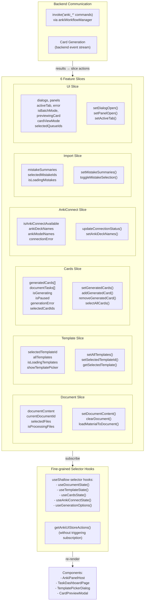
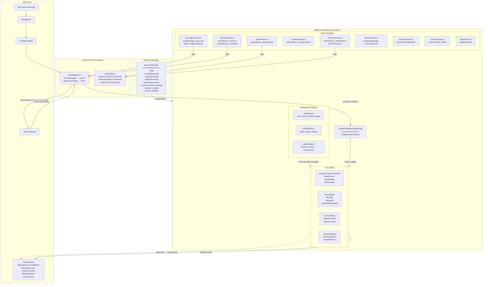

# 状态管理架构 — Zustand 图

> **最后更新**: 2026-06-06（基于源码分析）
> **源文件**: `src/stores/*`、`src/features/*/stores/*`
> **库**: Zustand（使用 `persist`、`subscribeWithSelector`、`immer` 中间件）

---

## a) Zustand Store 总览

本图展示所有 Zustand store、其数据领域、持久化状态以及 store 间依赖关系。

```mermaid
flowchart TB
  subgraph GlobalStores["Global Stores (src/stores/)"]
    direction TB

    subgraph Persistent["Persistent Stores (localStorage)"]
      UI["useUIStore<br/>━━━━━━━━━━━━━━<br/>leftPanelCollapsed<br/>toggleLeftPanel()"]
    end

    subgraph NonPersistent["Non-Persistent Stores"]
      VS["useViewStore<br/>━━━━━━━━━━━━━━<br/>currentView<br/>previousView<br/>setCurrentView()"]
      SYS["useSystemStatusStore<br/>━━━━━━━━━━━━━━<br/>migrationVisible<br/>maintenanceMode<br/>showMigrationStatus()"]
      NET["useNetworkStore<br/>━━━━━━━━━━━━━━<br/>isOnline<br/>lastChangedAt"]
      SSS["useSettingsShellStore<br/>━━━━━━━━━━━━━━<br/>activeTab<br/>dataGovernanceTabTarget"]
    end

    subgraph APIBacked["API-Backed Stores (fetch → cache)"]
      QB["useQuestionBankStore<br/>━━━━━━━━━━━━━━<br/>questions, filters<br/>stats, pagination<br/>CRUD + answer tracking"]
      RP["useReviewPlanStore<br/>━━━━━━━━━━━━━━<br/>dueReviews, history<br/>review stats<br/>SM-2 algorithm"]
      RS["useResearchStore (HpiasStore)<br/>━━━━━━━━━━━━━━<br/>sessionId, round, synthesis<br/>events log, artifacts<br/>research orchestration"]
      UI2["useUnifiedIndexStore<br/>━━━━━━━━━━━━━━<br/>summary, selectedResource<br/>filters, reindex actions"]
    end

    subgraph AnkiStores["Anki Stores"]
      ANK["useAnkiUIStore<br/>━━━━━━━━━━━━━━<br/>Document, Template, Cards<br/>AnkiConnect, Import, UI<br/>6 slices via Slice Pattern"]
      ANKQ["useAnkiQueueStore"]
      TA["useTemplateAiStore"]
    end
  end

  subgraph FeatureStores["Feature Stores (src/features/*/stores/)"]
    direction TB

    subgraph LHPersist["Learning Hub (persistent)"]
      FS["useFinderStore (persist)<br/>━━━━━━━━━━━━━━<br/>currentPath, history<br/>items, search, selection<br/>navigation actions<br/>backend: dstu API"]
      DS["useDesktopStore (persist)<br/>━━━━━━━━━━━━━━<br/>shortcuts list<br/>desktopRoot config<br/>shortcut CRUD"]
      RS["useRecentStore (persist)<br/>━━━━━━━━━━━━━━<br/>recent items list<br/>maxItems: 50<br/>addRecent / removeRecent"]
    end

    subgraph PDFStores["PDF Reader"]
      PPS["usePdfProcessingStore<br/>━━━━━━━━━━━━━━<br/>statusMap: fileId→status<br/>stage, percent, readyModes<br/>auto-cleanup after 60s"]
      PSS["usePdfSettingsStore (persist)<br/>━━━━━━━━━━━━━━<br/>DPR, text layer, annotation<br/>thumbnail, default view<br/>scroll DPR downgrade"]
    end

    subgraph OtherFeature["Other Feature Stores"]
      NTS["useNotesTreeStore<br/>(immer + subscribeWithSelector)<br/>━━━━━━━━━━━━━━<br/>treeData, expandedIds<br/>drag state, filter<br/>persistence snapshot"]
      TDS["useTodoStore<br/>━━━━━━━━━━━━━━<br/>lists, items, filter<br/>CRUD + view queries<br/>backend: todo API"]
      PMS["usePomodoroStore (persist)<br/>━━━━━━━━━━━━━━<br/>mode, timeLeft<br/>currentTaskId<br/>session recording"]
      SBS["useSandboxWorkbenchStore<br/>━━━━━━━━━━━━━━<br/>workbench state"]
      TMS["template-management stores"]
      PRS["practice stores"]
    end
  end

  subgraph ChatStoreSystem["Chat V2 Store System<br/>(Per-Session)"]
    direction TB
    CHAT["ChatStore<br/>(created per session via createChatStore)<br/>━━━━━━━━━━━━━━<br/>messages, blocks, variants<br/>session state, params<br/>streaming state<br/>queued messages"]
    SM["sessionManager<br/>(manages multiple ChatStores)<br/>━━━━━━━━━━━━━━<br/>session lifecycle<br/>current-session-changed events"]
    GC["groupCache<br/>(group metadata cache)"]
  end

  %% Store-to-Store Dependencies
  VS -->|"currentView changed → re-renders"| ANK
  VS -->|"visibility check"| PPS
  VS -->|"visibility check"| SBS

  FS -->|"imports recentStore"| RS
  FS -->|"imports desktopStore (for quickAccess)"| DS
  SYS -->|"maintenance mode blocks writes"| QB

  SM -->|"creates/manages"| CHAT
  GC -->|"provides group data to"| CHAT

  %% Store → API → Backend flows
  FS -.->|"dstu.list(), dstu.search()"| DSTU_API["DSTU API"]
  FS -.->|"folderApi, trashApi"| DSTU_API
  QB -.->|"invoke question bank commands"| TAURI["Tauri IPC (invoke)"]
  RP -.->|"invoke review plan commands"| TAURI
  PPS -.->|"invoke pdf processing commands"| TAURI
  TDS -.->|"invoke todo commands"| TAURI
  ANK -.->|"invoke Anki commands"| TAURI
  UI2 -.->|"vfsUnifiedIndexApi"| TAURI

  PSS -.->|"localStorage only (no backend)"| NONE["No Backend Calls"]
  RS -.->|"localStorage only"| NONE
  DS -.->|"localStorage only"| NONE
  UI -.->|"localStorage only"| NONE

  %% Component subscriptions
  subgraph ComponentSubs["Key Component → Store Subscriptions"]
    direction LR
    APP["App.tsx"] --> VS
    APP -->|"sidebar collapse"| UI
    APP --> SYS
    SIDEBAR["ModernSidebar"] --> UI
    SIDEBAR --> VS
    CHATPG["ChatV2Page"] --> FS
    CHATPG --> SM
    LHUB_PG["LearningHubPage"] --> FS
    LHUB_PG --> DS
    LHUB_PG --> RS
    PDFRD["PdfReader"] --> PSS
    PDFRD --> PPS
    TODO_PG["TodoPage"] --> TDS
    TODO_PG --> PMS
    SETTPG["SettingsPage"] --> SSS
    SETTPG --> SYS
  end
```

---

## b) 按 Store 的数据流 — 关键 Store 详细分析

### Store 1：`useFinderStore`（Learning Hub — 文件浏览器）

**文件**：`src/features/learning-hub/stores/finderStore.ts`

```mermaid
flowchart LR
  subgraph InitState["Initial State"]
    CP["currentPath: {<br/>  viewKind: 'folder',<br/>  breadcrumbs: [],<br/>  folderId: null,<br/>  typeFilter: null<br/>}"]
    HIS["history: [DEFAULT_PATH]<br/>historyIndex: 0"]
    VIEW["viewMode: 'grid'<br/>sortBy: 'updatedAt'<br/>sortOrder: 'desc'"]
    SEL["selectedIds: Set()<br/>lastSelectedId: null"]
    DATA["items: []<br/>isLoading: false<br/>error: null"]
    SEARCH["searchQuery: ''<br/>isSearching: false"]
  end

  subgraph Actions["Key Actions"]
    NAV["navigateTo(path)"]
    ENTER["enterFolder(folderId)"]
    GO_UP["goUp()"]
    GO_BACK["goBack() / goForward()"]
    LOAD["loadItems() ⟶ dstu.list()"]
    SEARCH_ACT["executeSearch() ⟶ dstu.search()"]
    SELECT["select(id, mode)"]
    REFRESH["refresh()"]
    SORT["setSorting(sortBy, sortOrder)"]
  end

  subgraph Backend["Backend Calls"]
    DL["dstu.list(options)<br/>→ 'dstu_list_folder'"]
    DS["dstu.search(query, options)<br/>→ 'dstu_search'"]
    SIF["dstu.searchInFolder()"]
    DLIST["dstu.listDeleted()"]
    TLIST["trashApi.listTrash()"]
    BRE["folderApi.getBreadcrumbs(id)"]
  end

  subgraph Persistence["localStorage Persistence (key: 'learning-hub-finder')"]
    PV["Persisted Fields:<br/>- viewMode<br/>- sortBy<br/>- sortOrder<br/>- quickAccessCollapsed<br/><br/>NOT persisted:<br/>- items, isLoading, error<br/>- selection, search<br/>- currentPath, history"]
  end

  subgraph ReRender["Trigger Re-renders"]
    COMPS["Components subscribing:<br/>- LearningHubSidebar<br/>- FinderView (Grid/List)<br/>- Breadcrumb<br/>- QuickAccess panel<br/>- Selection toolbar"]
    SELE["Fine-grained selectors:<br/>useFinderStore(s => s.items)<br/>useFinderStore(s => s.isLoading)<br/>useFinderStore(s => s.selectedIds)"]
  end

  InitState --> Actions
  Actions --> Backend
  Actions -->|"set()"| ReRender
  Backend -->|"result → set()"| ReRender
  Persistence -.->|"hydrate on init"| InitState
  Actions -.->|"partialize"| Persistence

  subgraph CacheInvalidation["Cache Invalidation"]
    REQ_ID["_currentRequestId counter<br/>Each new request increments"]
    STALE["On response: check requestId match<br/>Stale responses discarded"]
    AUTO_REFRESH["refresh() called after:<br/>- sort change<br/>- folder navigation<br/>- external mutation events"]
  end
  Actions --> CacheInvalidation
```

### Store 2：`usePdfProcessingStore`（媒体处理进度）

**文件**：`src/features/pdf/stores/pdfProcessingStore.ts`

```mermaid
flowchart LR
  subgraph InitState["Initial State"]
    MAP["statusMap: Map<fileId, ProcessingStatus>"]
  end

  subgraph ProcessingStage["Processing Pipeline"]
    PEND["pending"]
    TEX["text_extraction"]
    REND["page_rendering"]
    COMP["page_compression /<br/>image_compression"]
    OCR["ocr_processing"]
    VEC["vector_indexing"]
    DONE["completed /<br/>completed_with_issues"]
    ERR["error"]
  end

  subgraph Actions["Actions"]
    UPD["update(fileId, partialStatus)"]
    COMPL["setCompleted(fileId, readyModes)"]
    ERRS["setError(fileId, error)"]
    FULL["setFullStatus(fileId, status)"]
    REM["remove(fileId)"]
    CLR["clear()"]
  end

  subgraph DataFlow["Data Sources"]
    POLL["Polling from component<br/>(usePdfProcessingProgress hook)"]
    EVENT["Backend events<br/>(processing progress)"]
    INIT["Initial state on file upload"]
  end

  subgraph Cleanup["Auto-cleanup"]
    EVICT["enforceMaxEntries(MAX_ENTRIES=100)"]
    TIMER["setTimeout 60s<br/>→ remove terminal entries"]
    STAGE["Stage ordering guard<br/>→ reject stale updates"]
  end

  InitState --> Actions
  DataFlow -->|"invoke"| Actions
  Actions -->|"set state"| ProcessingStage
  Actions --> Cleanup
  ProcessingStage -->|"re-render"| COMPS2["Components:<br/>- ProcessingIndicator<br/>- Chat InputBar (readyModes)<br/>- LearningHub items"]
```

### Store 3：`usePdfSettingsStore`（PDF 阅读器配置）

**文件**：`src/features/pdf/stores/pdfSettingsStore.ts`

```mermaid
flowchart LR
  subgraph Init["Initial State (Defaults)"]
    MDPR["maxDevicePixelRatio: 1.5"]
    SCR["enableScrollDprDowngrade: true"]
    VIRT["virtualizerOverscan: 5"]
    TXT["enableTextLayerByDefault: true"]
    ANN["enableAnnotationLayerByDefault: false"]
    THUMB["thumbnailWidth: 100"]
    SCALE["defaultScale: 1.0"]
    VIEWM["defaultViewMode: 'single'"]
  end

  subgraph Actions["Actions"]
    UPD_SET["updateSetting(key, value)<br/>with range validation"]
    UPD_BATCH["updateSettings(partial)<br/>batch with validation"]
    RESET["resetSettings()"]
    DPR["getRenderDpr(isScrolling)<br/>→ DPR = min(device, max, scroll)"]
  end

  subgraph Persist["localStorage Persistence"]
    KEY["key: 'pdf-settings'<br/>version: 1"]
    PARTIAL["partialize: settings only"]
  end

  subgraph Consumers["Component Consumers"]
    PDF_RDR["PdfReader<br/>(page rendering)"]
    PDF_SETTINGS["PdfSettingsPanel<br/>(UI controls)"]
    THUMBNAIL["ThumbnailSidebar<br/>(thumbnail DPR)"]
  end

  Init --> Actions
  Actions -->|"set() → re-render"| Consumers
  Actions -.->|"persist"| Persist
  Persist -.->|"hydrate"| Init
```

### Store 4：`useAnkiUIStore`（Anki 制卡 — Slice 模式）

**文件**：`src/stores/anki/useAnkiUIStore.ts`

### Store 5：Chat V2 Store 系统（按会话的 Store 架构）

**文件**：`src/features/chat/core/store/*`、`src/features/chat/core/session/sessionManager.ts`

### 缓存失效策略总结

| Store | 策略 | 详情 |
|-------|----------|---------|
| `useFinderStore` | 基于请求 ID | `_currentRequestId` 计数器；不匹配时丢弃过期响应。排序/导航变更时自动刷新。 |
| `usePdfProcessingStore` | 阶段排序 + TTL | `shouldAcceptUpdate()` 检查阶段优先级映射。终结条目 60 秒后自动移除。最大 100 条。 |
| `usePdfSettingsStore` | 无（持久化） | 无需失效；仅用户操作改变设置。写入时做范围校验。 |
| `useAnkiUIStore` | 显式刷新 | 模板在挂载/显式操作时重新加载。新生成时清空卡片。AnkiConnect 状态按需重新检查。 |
| `useQuestionBankStore` | 基于页面 + 筛选 | 页面/筛选/搜索变更时重新加载题目。提交答案时重新计算统计。 |
| `useReviewPlanStore` | 提交时刷新 | 每次复习提交后刷新到期复习列表。SM-2 算法客户端执行后同步。 |
| Chat Store 系统 | 事件驱动 | 后端流式事件实时更新 store。自动保存中间件在状态变更时持久化到数据库。从后端恢复会话。 |
| 笔记树 Store | 基于快照 | 树变更时创建持久化快照。版本化以支持迁移。 |
| 待办 Store | 基于请求版本 | `itemsRequestVersion` 追踪过时状态。变更时刷新。 |

---

## 源文件引用

| Store | 文件路径 | 中间件 | 持久化 Key |
|-------|-----------|-----------|-----------------|
| `useViewStore` | `src/stores/viewStore.ts` | — | — |
| `useUIStore` | `src/stores/uiStore.ts` | `persist` | `dstu-ui-store` |
| `useSystemStatusStore` | `src/stores/systemStatusStore.ts` | — | — |
| `useNetworkStore` | `src/stores/networkStore.ts` | — | — |
| `useSettingsShellStore` | `src/stores/settingsShellStore.ts` | — | — |
| `useQuestionBankStore` | `src/stores/questionBankStore.ts` | `subscribeWithSelector`, `devtools` | — |
| `useReviewPlanStore` | `src/stores/reviewPlanStore.ts` | `subscribeWithSelector`, `devtools` | — |
| `useResearchStore` | `src/stores/researchStore.ts` | `subscribeWithSelector`, `devtools` | — |
| `useUnifiedIndexStore` | `src/stores/unifiedIndexStore.ts` | — | — |
| `useAnkiUIStore` | `src/stores/anki/useAnkiUIStore.ts` | `subscribeWithSelector` | — |
| `useAnkiUIStore types` | `src/stores/anki/types.ts` | — | — |
| `useFinderStore` | `src/features/learning-hub/stores/finderStore.ts` | `persist` | `learning-hub-finder` |
| `useDesktopStore` | `src/features/learning-hub/stores/desktopStore.ts` | `persist` | `learning-hub-desktop` |
| `useRecentStore` | `src/features/learning-hub/stores/recentStore.ts` | `persist` | `learning-hub-recent` |
| `usePdfProcessingStore` | `src/features/pdf/stores/pdfProcessingStore.ts` | — | — |
| `usePdfSettingsStore` | `src/features/pdf/stores/pdfSettingsStore.ts` | `subscribeWithSelector`, `persist` | `pdf-settings` |
| `useNotesTreeStore` | `src/features/notes/stores/notesTreeStore.ts` | `subscribeWithSelector`, `immer` | — |
| `useTodoStore` | `src/features/todo/stores/useTodoStore.ts` | — | — |
| `usePomodoroStore` | `src/features/pomodoro/stores/usePomodoroStore.ts` | `persist` | (pomodoro) |
| `useSandboxWorkbenchStore` | `src/features/sandbox/store/useSandboxWorkbenchStore.ts` | — | — |
| Chat Store 工厂 | `src/features/chat/core/store/createChatStore.ts` | — | — |
| `sessionManager` | `src/features/chat/core/session/sessionManager.ts` | — | — |
| `groupCache` | `src/features/chat/core/store/groupCache.ts` | — | — |
