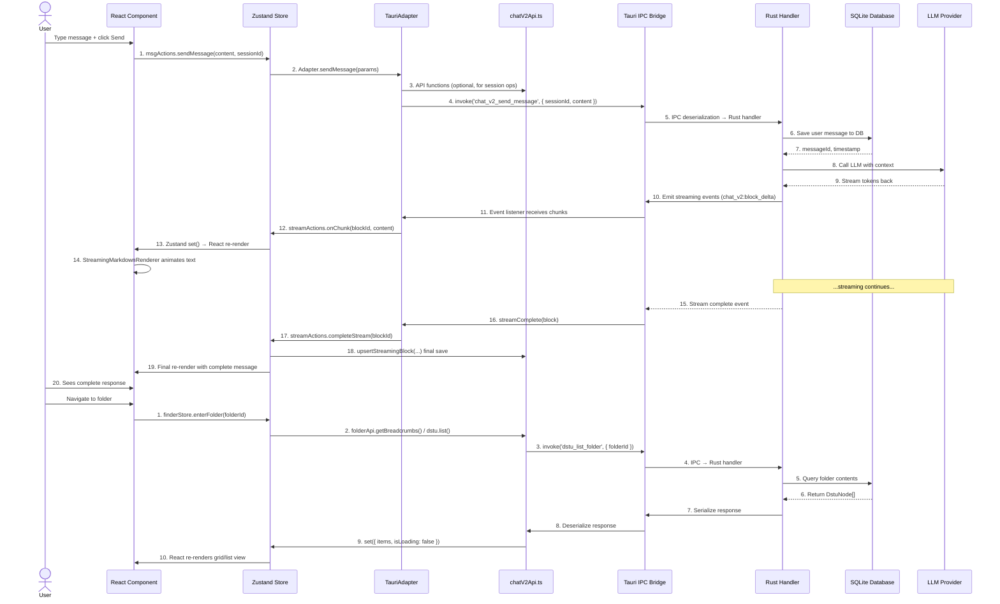

# API 层 — Tauri 命令调用图

> **最后更新**: 2026-06-06（基于源码分析）
> **源文件**: `src/api/*`、`src/hooks/*`、`src/features/*`
> **运行时**: `@tauri-apps/api/core` → `invoke()` → Tauri IPC → Rust 处理器

---

## a) API 模块总览

每个 `src/api/` 下的 API 模块封装对一个或多个 Tauri 后端命令的调用。

```mermaid
flowchart LR
  subgraph ApiModules["src/api/ — All API Modules"]
    direction TB

    CHAT_V2["📦 chatV2Api.ts<br/>━━━━━━━━━━━━━━<br/>deleteSession, saveSession<br/>updateSessionSettings<br/>upsertStreamingBlock<br/>cancelStream, addTag<br/>reorderGroups, askUserRespond<br/>toolApprovalRespond"]

    SETTINGS["📦 settingsApi.ts<br/>━━━━━━━━━━━━━━<br/>get(settingKey)<br/>save(settingKey, value)<br/>delete(settingKey)<br/>getByPrefix(prefix)"]

    VFS_PDF["📦 vfsPdfProcessingApi.ts<br/>━━━━━━━━━━━━━━<br/>getStatus(fileId)<br/>getBatchStatus(fileIds)<br/>cancel(fileId)<br/>retry(fileId)<br/>start(fileId)"]

    VFS_FILE["📦 vfsFileApi.ts<br/>━━━━━━━━━━━━━━<br/>upload, download<br/>file CRUD operations<br/>OCR status queries"]

    VFS_RAG["📦 vfsRagApi.ts<br/>━━━━━━━━━━━━━━<br/>vfsRagSearch<br/>getVfsLanceStats<br/>optimizeVfsLance"]

    VFS_OCR["📦 vfsOcrStorageApi.ts<br/>━━━━━━━━━━━━━━<br/>OCR storage operations"]

    VFS_UNIFIED["📦 vfsUnifiedIndexApi.ts<br/>━━━━━━━━━━━━━━<br/>getUnifiedIndexStatus<br/>selectResource, reindexUnit<br/>batchIndex"]

    MEMORY["📦 memoryApi.ts<br/>━━━━━━━━━━━━━━<br/>config CRUD<br/>search, list, read, write<br/>batchWrite, smartWrite<br/>delete, tags"]

    DATA_GOV["📦 dataGovernance.ts<br/>━━━━━━━━━━━━━━<br/>Schema, Migration, Health<br/>Audit, Backup, Restore<br/>Sync, Conflict, Zip<br/>Cloud Storage config<br/>Asset scanning"]

    QUESTION_BANK["📦 questionBankApi.ts<br/>━━━━━━━━━━━━━━<br/>questions CRUD<br/>answer submission<br/>stats, filters, search<br/>exam sessions"]

    LLM_USAGE["📦 llmUsageApi.ts<br/>━━━━━━━━━━━━━━<br/>getTrends, getByModel<br/>getByCaller, getSummary<br/>getRecent, cleanup"]

    DEBUG_DB["📦 debugDatabase.ts<br/>━━━━━━━━━━━━━━<br/>database debug commands"]

    ATTACH["📦 attachmentConfigApi.ts<br/>━━━━━━━━━━━━━━<br/>getConfig, setRootFolder<br/>createRootFolder"]
  end

  subgraph TauriCommands["Tauri Backend Command Namespaces"]
    CHAT_CMD["chat_v2_*<br/>(~10 commands)"]
    SET_CMD["get_setting / save_setting<br/>delete_setting / get_settings_by_prefix"]
    VFS_CMD["vfs_*<br/>(PDF, File, RAG, OCR, Index)"]
    MEM_CMD["memory_*"]
    DG_CMD["data_governance_*"]
    QB_CMD["question_bank_*, exam_*"]
    LLM_CMD["llm_usage_*"]
    DBG_CMD["debug_*"]
    ANKI_CMD["anki_*"]
  end

  CHAT_V2 -->|"invoke"| CHAT_CMD
  SETTINGS -->|"invoke"| SET_CMD
  VFS_PDF -->|"invoke"| VFS_CMD
  VFS_FILE -->|"invoke"| VFS_CMD
  VFS_RAG -->|"invoke"| VFS_CMD
  VFS_OCR -->|"invoke"| VFS_CMD
  VFS_UNIFIED -->|"invoke"| VFS_CMD
  MEMORY -->|"invoke"| MEM_CMD
  DATA_GOV -->|"invoke"| DG_CMD
  QUESTION_BANK -->|"invoke"| QB_CMD
  LLM_USAGE -->|"invoke"| LLM_CMD
  DEBUG_DB -->|"invoke"| DBG_CMD
  ATTACH -->|"invoke"| VFS_CMD
```

---

## b) 请求/响应流程 — 典型 API 调用序列

本时序图追踪从用户操作到数据库再返回的完整 `sendMessage` 生命周期。

---

## c) Hook → API → 命令映射表

下表映射了 30+ 个最常用 hook 到其 API 函数和底层 Tauri 命令。

### 图例
- **Hook**: 来自 `src/hooks/` 或功能模块 `hooks/` 目录的 React 自定义 hook
- **API 函数**: Hook 内部调用的函数（来自 `src/api/` 或模块内部 API）
- **Tauri 命令**: 通过 `invoke()` 调用的 Rust 后端命令

```mermaid
flowchart TB
  subgraph Hooks["Key Hooks"]
    H1["useAppInitialization"]
    H2["useTheme"]
    H3["useSystemSettings"]
    H4["useNetworkStatus"]
    H5["useBreakpoint"]
    H6["useNavigationHistory"]
    H7["useNavigationShortcuts"]
    H8["usePdfLoader"]
    H9["usePdfProcessingProgress"]
    H10["useChatV2Stats"]
    H11["useQuestionBankSession"]
    H12["useQbankAiGrading"]
    H13["useLearningHeatmap"]
    H14["useStatisticsData"]
    H15["useMultimodalSearch"]
    H16["useVendorModels"]
    H17["useTauriDragAndDrop"]
    H18["useTauriEventListener"]
    H19["useNotification"]
    H20["useUnifiedNotification"]
    H21["useAppUpdater"]
    H22["useMigrationStatusListener"]
    H23["useConflictResolution"]
    H24["useFocusTrap"]
    H25["useWindowDrag"]
    H26["useCountdown"]
    H27["useDebounce"]
    H28["useExamSheetProgress"]
    H29["useDocumentTitle"]
    H30["useBackupJobListener"]
  end

  subgraph API_LAYER["API Functions Called"]
    A1["settingsApi.get()<br/>settingsApi.save()"]
    A2["chatV2Api.*()"]
    A3["vfsPdfProcessingApi.*()"]
    A4["vfsFileApi.*()"]
    A5["vfsRagApi.*()"]
    A6["memoryApi.*()"]
    A7["questionBankApi.*()"]
    A8["dataGovernance.*()"]
    A9["llmUsageApi.*()"]
    A10["attachmentConfigApi.*()"]
  end

  subgraph INVOKE["Tauri Backend Commands"]
    I1["get_setting / save_setting / delete_setting / get_settings_by_prefix"]
    I2["chat_v2_delete_session / save_session / upsert_streaming_block / cancel_stream / add_tag / ..."]
    I3["vfs_get_pdf_processing_status / vfs_cancel_pdf_processing / vfs_start_pdf_processing"]
    I4["vfs_upload_file / vfs_get_file / vfs_list_files"]
    I5["vfs_rag_search / vfs_lance_stats"]
    I6["memory_search / memory_write / memory_read / memory_list / memory_delete"]
    I7["question_bank_list / question_bank_create / question_bank_answer / exam_sheet_start"]
    I8["data_governance_* (schema, migration, backup, sync, audit, zip)"]
    I9["llm_usage_get_trends / llm_usage_summary / llm_usage_recent"]
    I10["vfs_get_attachment_config / vfs_set_attachment_root_folder"]
  end

  H1 -.->|"reads settings"| A1
  H2 -.-> A1
  H3 -.-> A1
  H4 -.-> A1
  H8 -.-> A3
  H9 -.-> A3
  H10 -.-> A2
  H11 -.-> A7
  H12 -.-> A7
  H13 -.-> A9
  H14 -.-> A9
  H15 -.-> A5
  H16 -.-> A1
  H21 -.-> I1
  H22 -.-> I1
  H23 -.-> I1
  H30 -.-> A8

  A1 --> I1
  A2 --> I2
  A3 --> I3
  A4 --> I4
  A5 --> I5
  A6 --> I6
  A7 --> I7
  A8 --> I8
  A9 --> I9
  A10 --> I10
```

### 详细 Hook → API → 命令映射

| # | Hook 名称 | 源文件 | API 函数 | Tauri 命令 | 参数 | 返回类型 |
|---|-----------|-------------|-----------------|-------------------|------------|-------------|
| 1 | `useAppInitialization` | `src/hooks/useAppInitialization.ts` | `settingsApi.get()` | `get_setting` | `key: string` | `string \| null` |
| 2 | `useTheme` | `src/hooks/useTheme.ts` | `settingsApi.get()`, `invoke('get_setting')` | `get_setting` | `key: 'theme'` | `'light' \| 'dark'` |
| 3 | `useSystemSettings` | `src/hooks/useSystemSettings.ts` | `settingsApi.get()`, `settingsApi.save()` | `get_setting`, `save_setting` | `key, value` | `string \| null` / `void` |
| 4 | `useNetworkStatus` | `src/hooks/useNetworkStatus.ts` | —（使用 `navigator.onLine`） | — | — | `isOnline: boolean` |
| 5 | `useBreakpoint` | `src/hooks/useBreakpoint.ts` | —（CSS 媒体查询） | — | — | `isSmallScreen: boolean` |
| 6 | `useNavigationHistory` | `src/hooks/useNavigationHistory.ts` | —（本地状态管理） | — | `currentView` | `{ canGoBack, canGoForward, goBack, goForward }` |
| 7 | `useNavigationShortcuts` | `src/hooks/useNavigationShortcuts.ts` | —（键盘事件） | — | callbacks | — |
| 8 | `usePdfLoader` | `src/hooks/usePdfLoader.ts` | `vfsPdfProcessingApi.getStatus()` | `vfs_get_pdf_processing_status` | `fileId: string` | `PdfProcessingStatusResponse` |
| 9 | `usePdfProcessingProgress` | `src/hooks/usePdfProcessingProgress.ts` | `vfsPdfProcessingApi.getStatus()`, `getBatchStatus()` | `vfs_get_pdf_processing_status`, `vfs_get_batch_pdf_processing_status` | `fileId: string` | `PdfProcessingStatusResponse` |
| 10 | `useChatV2Stats` | `src/hooks/useChatV2Stats.ts` | `chatV2Api.*()` | `chat_v2_get_stats` | 筛选参数 | 会话统计 |
| 11 | `useQuestionBankSession` | `src/hooks/useQuestionBankSession.ts` | `questionBankApi.*()` | `question_bank_*`, `exam_sheet_*` | `sessionId` | 会话状态 |
| 12 | `useQbankAiGrading` | `src/hooks/useQbankAiGrading.ts` | `questionBankApi.*()` | `question_bank_ai_grade` | `questionId, answer` | AI 评分结果 |
| 13 | `useLearningHeatmap` | `src/hooks/useLearningHeatmap.ts` | `llmUsageApi.getTrends()`（间接） | `llm_usage_get_trends` | `days, granularity` | `UsageTrendPoint[]` |
| 14 | `useStatisticsData` | `src/hooks/useStatisticsData.ts` | `llmUsageApi.getSummary()`, `getByModel()` | `llm_usage_summary`, `llm_usage_by_model` | 日期范围 | `UsageSummary` |
| 15 | `useMultimodalSearch` | `src/hooks/useMultimodalSearch.ts` | `vfsRagApi.vfsRagSearch()` | `vfs_rag_search` | 查询参数 | `VfsSearchResult[]` |
| 16 | `useVendorModels` | `src/hooks/useVendorModels.ts` | `settingsApi.getByPrefix()` | `get_settings_by_prefix` | `prefix: 'models.'` | 模型配置 |
| 17 | `useTauriDragAndDrop` | `src/hooks/useTauriDragAndDrop.ts` | —（Tauri 拖放事件） | Tauri `drag-drop` 事件 | — | 文件路径 |
| 18 | `useTauriEventListener` | `src/hooks/useTauriEventListener.ts` | —（Tauri 事件 `listen()`） | 各类事件 | 事件类型 | 事件载荷 |
| 19 | `useNotification` | `src/hooks/useNotification.ts` | —（本地状态） | — | — | toast 状态 |
| 20 | `useUnifiedNotification` | `src/hooks/useUnifiedNotification.ts` | —（全局事件分发） | — | 消息、类型 | — |
| 21 | `useAppUpdater` | `src/hooks/useAppUpdater.ts` | `invoke('get_setting')` | `get_setting`, Tauri 更新 API | — | 更新器状态 |
| 22 | `useMigrationStatusListener` | `src/hooks/useMigrationStatusListener.ts` | `invoke('get_setting')` | `get_setting` | — | 迁移状态 |
| 23 | `useConflictResolution` | `src/hooks/useConflictResolution.ts` | `settingsApi.*()` / 事件 | 同步事件 | — | 冲突状态 |
| 24 | `useFocusTrap` | `src/hooks/useFocusTrap.ts` | —（DOM 操作） | — | ref | — |
| 25 | `useWindowDrag` | `src/hooks/useWindowDrag.ts` | `getCurrentWindow().startDragging()` | Tauri 窗口 API | event | — |
| 26 | `useCountdown` | `src/hooks/useCountdown.ts` | —（计时器逻辑） | — | duration | 剩余时间 |
| 27 | `useDebounce` | `src/hooks/useDebounce.ts` | —（工具函数） | — | value, delay | 防抖值 |
| 28 | `useExamSheetProgress` | `src/hooks/useExamSheetProgress.ts` | `questionBankApi.*()` | `exam_sheet_get_progress` | session | 进度 |
| 29 | `useDocumentTitle` | `src/hooks/useDocumentTitle.ts` | —（DOM 操作） | — | title | — |
| 30 | `useBackupJobListener` | `src/hooks/useBackupJobListener.ts` | `dataGovernance.*()` | `data_governance_*` 备份命令 | — | 备份状态 |

### 功能模块级 Hook 映射

下表列出了来自功能模块（不在 `src/hooks/` 中）的关键 hook：

| Hook | 功能模块 | 源文件 | API 函数 | Tauri 命令 |
|------|---------------|-------------|-----------------|---------------|
| `useGroupManagement` | chat | `src/features/chat/hooks/useGroupManagement.ts` | —（本地状态） | — |
| `useGroupCollapse` | chat | `src/features/chat/hooks/useGroupCollapse.ts` | —（本地状态） | — |
| `useInputBarV2` | chat | `src/features/chat/hooks/useInputBarV2.ts` | —（组合） | — |
| `usePdfPageRefs` | chat | `src/features/chat/hooks/usePdfPageRefs.ts` | —（本地状态） | — |
| `useSessionSidebarIndicators` | chat | `src/features/chat/hooks/useSessionSidebarIndicators.ts` | —（派生状态） | — |
| `useVfsContextInject` | learning-hub | `src/features/learning-hub/hooks/useVfsContextInject.ts` | `dstu.*()` | `dstu_*` |
| `useLearningHubEvents` | learning-hub | `src/features/learning-hub/hooks/useLearningHubEvents.ts` | —（事件监听器） | — |
| `useNotesOptional` | notes | `src/features/notes/hooks/useNotesOptional.ts` | —（context） | — |
| `useSettings` | settings | `src/features/settings/hooks/useSettings.ts` | `settingsApi.*()` | `get_setting`, `save_setting` |

---

## 源文件引用

| API 模块 | 文件路径 | 封装的命令 |
|------------|-----------|----------------------|
| `chatV2Api` | `src/api/chatV2Api.ts` | `chat_v2_delete_session`, `chat_v2_update_session_settings`, `chat_v2_archive_session`, `chat_v2_save_session`, `chat_v2_upsert_streaming_block`, `chat_v2_update_block_tool_output`, `chat_v2_cancel_stream`, `chat_v2_add_tag`, `chat_v2_remove_tag`, `chat_v2_reorder_groups`, `chat_v2_ask_user_respond`, `chat_v2_tool_approval_respond` |
| `settingsApi` | `src/api/settingsApi.ts` | `get_setting`, `save_setting`, `delete_setting`, `get_settings_by_prefix` |
| `vfsPdfProcessingApi` | `src/api/vfsPdfProcessingApi.ts` | `vfs_get_pdf_processing_status`, `vfs_get_batch_pdf_processing_status`, `vfs_cancel_pdf_processing`, `vfs_retry_pdf_processing`, `vfs_start_pdf_processing` |
| `vfsFileApi` | `src/api/vfsFileApi.ts` | `vfs_upload_file`, `vfs_get_file`, `vfs_list_files`, `vfs_delete_file`, `vfs_rename_file`, `vfs_get_ocr_status` |
| `vfsRagApi` | `src/api/vfsRagApi.ts` | `vfs_rag_search`, `vfs_get_lance_stats`, `vfs_optimize_lance` |
| `vfsOcrStorageApi` | `src/api/vfsOcrStorageApi.ts` | `vfs_*` OCR 存储命令 |
| `vfsUnifiedIndexApi` | `src/api/vfsUnifiedIndexApi.ts` | `vfs_get_unified_index_status`, `vfs_select_resource_units`, `vfs_reindex_unit`, `vfs_batch_index` |
| `memoryApi` | `src/api/memoryApi.ts` | `memory_get_config`, `memory_update_config`, `memory_search`, `memory_list`, `memory_read`, `memory_write`, `memory_batch_write`, `memory_smart_write`, `memory_delete`, `memory_add_tag`, `memory_remove_tag` |
| `dataGovernance` | `src/api/dataGovernance.ts` | `data_governance_*`（schema、migration、health、audit、backup、restore、sync、conflict、zip、cloud_storage、asset_scan） |
| `questionBankApi` | `src/api/questionBankApi.ts` | `question_bank_*`, `exam_sheet_*` |
| `llmUsageApi` | `src/api/llmUsageApi.ts` | `llm_usage_get_trends`, `llm_usage_by_model`, `llm_usage_by_caller`, `llm_usage_summary`, `llm_usage_recent`, `llm_usage_daily`, `llm_usage_cleanup` |
| `debugDatabase` | `src/api/debugDatabase.ts` | `debug_*` |
| `attachmentConfigApi` | `src/api/attachmentConfigApi.ts` | `vfs_get_attachment_config`, `vfs_set_attachment_root_folder`, `vfs_create_attachment_root_folder` |

### Hook 源文件

| Hooks 文件 | 路径 |
|------------|------|
| 通用 Hooks | `src/hooks/`（34 个文件） |
| 聊天功能 Hooks | `src/features/chat/hooks/` |
| Learning Hub Hooks | `src/features/learning-hub/hooks/` |
| 笔记 Hooks | `src/features/notes/hooks/` |
| 设置 Hooks | `src/features/settings/hooks/` |
| 语音输入 Hooks | `src/features/voice-input/hooks/` |
| 命令面板 Hooks | `src/command-palette/hooks/` |
