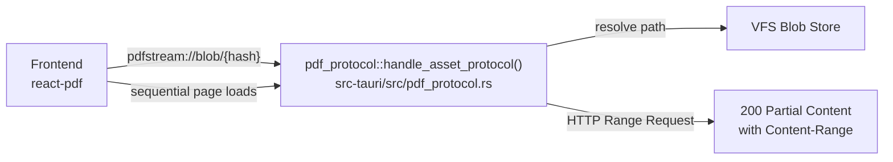

# Tauri Command Map — Frontend-Backend Data Connectivity

> This document maps every Tauri command group from its registration in `lib.rs` through its Rust handler to its frontend `invoke()` call site.

---

## a) Command Registration Map

### Overview Flowchart

```mermaid
flowchart TB
    subgraph Frontend["Frontend (React/TypeScript)"]
        UI["React Components"]
        API["src/api/*.ts</br>invoke() wrappers"]
        HOOKS["Custom Hooks</br>useXxx()"]
        ADAPTER["TauriAdapter.ts</br>ChatV2 event bridge"]
    end

    subgraph TauriBridge["Tauri IPC Bridge"]
        INVOKE["invoke_handler</br>tauri::generate_handler![...]"]
        EVENTS["Event Emitter</br>window.emit()"]
        PROTO["pdfstream://</br>Custom Protocol"]
    end

    subgraph RustHandlers["Rust Command Handlers"]
        CORE["commands.rs</br>~150 commands"]
        CHAT_V2["chat_v2/handlers/</br>~50 commands"]
        VFS["vfs/handlers/</br>~90 commands"]
        VFS_INDEX["vfs/index_handlers.rs</br>~10 commands"]
        VFS_TODO["vfs/todo_handlers.rs</br>~17 commands"]
        DSTU["dstu/handlers/</br>~35 commands"]
        DSTU_FOLDER["dstu/folder_handlers.rs</br>~14 commands"]
        DSTU_TRASH["dstu/trash_handlers.rs</br>~5 commands"]
        MEMORY["memory/handlers/</br>~20 commands"]
        ESSAY["essay_grading/</br>~20 commands"]
        DATA_GOV["data_governance/commands*.rs</br>~40 commands"]
        LLM_USAGE["llm_usage/handlers/</br>~7 commands"]
        CMD_GROUP["cmd/*.rs</br>anki/ocr/mcp/textbooks"]
        REVIEW["review_plan_service/</br>~17 commands"]
        QBANK["commands.rs qbank_*</br>~25 commands"]
        SYNC["question_sync_service/</br>~6 commands"]
        RESEARCH["cmd/research_stubs.rs</br>~25 commands"]
    end

    subgraph Services["Rust Services & Databases"]
        DB["Main Database</br>SQLite (settings, Anki, notes)"]
        VFS_DB["VFS Database</br>SQLite (files, resources, indices)"]
        CHAT_DB["Chat V2 Database</br>SQLite (sessions, messages)"]
        LANCE["LanceVectorStore</br>Vector embeddings"]
        LLM_MGR["LLMManager</br>Provider routing"]
        FILE_MGR["FileManager</br>Blob storage"]
        PDF_SVC["PdfProcessingService</br>Media pipeline"]
        OCR_SVC["PdfOcrService</br>OCR processing"]
        MCP["MCP Client</br>External tools"]
    end

    UI -->|"user interaction"| API
    UI -->|"event listeners"| ADAPTER
    API -->|"invoke('cmd_name', args)"| INVOKE
    ADAPTER -->|"invoke()"| INVOKE
    HOOKS -->|"listen('event_name', handler)"| EVENTS

    INVOKE --> CORE
    INVOKE --> CHAT_V2
    INVOKE --> VFS
    INVOKE --> VFS_INDEX
    INVOKE --> VFS_TODO
    INVOKE --> DSTU
    INVOKE --> DSTU_FOLDER
    INVOKE --> DSTU_TRASH
    INVOKE --> MEMORY
    INVOKE --> ESSAY
    INVOKE --> DATA_GOV
    INVOKE --> LLM_USAGE
    INVOKE --> CMD_GROUP
    INVOKE --> REVIEW
    INVOKE --> QBANK
    INVOKE --> SYNC
    INVOKE --> RESEARCH

    CORE --> DB
    CORE --> FILE_MGR
    CORE --> OCR_SVC
    CORE --> LLM_MGR
    CHAT_V2 --> CHAT_DB
    CHAT_V2 --> LLM_MGR
    VFS --> VFS_DB
    VFS --> LANCE
    VFS_INDEX --> VFS_DB
    VFS_INDEX --> LANCE
    DSTU --> VFS_DB
    MEMORY --> VFS_DB
    ESSAY --> VFS_DB
    DATA_GOV --> DB
    LLM_USAGE --> DB
    REVIEW --> DB
    QBANK --> VFS_DB

    PROTO -->|"HTTP Range Request"| VFS_DB
    PDF_SVC -->|"media-processing-*"| EVENTS
    OCR_SVC -->|"pdf_ocr_progress"| EVENTS
    CHAT_V2 -->|"chat_v2_event_{id}"| EVENTS
    CHAT_V2 -->|"chat_v2_session_{id}"| EVENTS
    LLM_MGR -->|"chat_v2_llm_request_body"| EVENTS
```

### Command Registration in `lib.rs`

```mermaid
flowchart LR
    subgraph lib_rs["src-tauri/src/lib.rs:847-1727"]
        GENERATE["tauri::generate_handler!["]
        GROUP1["commands.rs</br>~150 commands"]
        GROUP2["chat_v2/handlers/*</br>~50 commands"]
        GROUP3["vfs/handlers/*</br>~90 commands"]
        GROUP4["vfs/index_handlers.rs</br>~10 commands"]
        GROUP5["vfs/todo_handlers.rs</br>~17 commands"]
        GROUP6["vfs/ocr_storage_handlers.rs</br>~5 commands"]
        GROUP7["dstu/handlers/*</br>~35 commands"]
        GROUP8["dstu/folder_handlers.rs</br>~14 commands"]
        GROUP9["dstu/trash_handlers.rs</br>~5 commands"]
        GROUP10["dstu/export.rs</br>~2 commands"]
        GROUP11["memory/handlers/*</br>~20 commands"]
        GROUP12["essay_grading/*</br>~20 commands"]
        GROUP13["data_governance/commands*.rs</br>~40 commands"]
        GROUP14["llm_usage/handlers/*</br>~7 commands"]
        GROUP15["cmd/*.rs</br>anki/ocr/mcp/textbooks"]
        GROUP16["review_plan_service/*</br>~17 commands"]
        GROUP17["question_sync_service/*</br>~6 commands"]
        GROUP18["cmd/research_stubs.rs</br>~25 commands"]
        GROUP19["config_recovery.rs</br>2 commands"]
        GROUP20["debug_logger.rs</br>1 command"]
        GROUP21["debug_commands.rs</br>4 commands"]
        GROUP22["data_space/*</br>~6 commands"]
    end

    GENERATE --> GROUP1
    GENERATE --> GROUP2
    GENERATE --> GROUP3
    GENERATE --> GROUP4
    GENERATE --> GROUP5
    GENERATE --> GROUP6
    GENERATE --> GROUP7
    GENERATE --> GROUP8
    GENERATE --> GROUP9
    GENERATE --> GROUP10
    GENERATE --> GROUP11
    GENERATE --> GROUP12
    GENERATE --> GROUP13
    GENERATE --> GROUP14
    GENERATE --> GROUP15
    GENERATE --> GROUP16
    GENERATE --> GROUP17
    GENERATE --> GROUP18
    GENERATE --> GROUP19
    GENERATE --> GROUP20
    GENERATE --> GROUP21
    GENERATE --> GROUP22
```

### Handler-to-Dependency Map

```mermaid
flowchart TB
    subgraph Handler["Handler File (src-tauri/src/...)"]
        FILE[".rs file"]
        CMDS["Exported Tauri commands"]
    end

    subgraph Deps["Dependencies Accessed"]
        DB_MAIN["crate::database::Database"]
        DB_VFS["crate::vfs::VfsDatabase"]
        DB_CHAT["crate::chat_v2::ChatV2Database"]
        LLM["crate::llm_manager::LLMManager"]
        FM["crate::file_manager::FileManager"]
        LANCE["crate::vfs::VfsLanceStore"]
        PDF["crate::vfs::PdfProcessingService"]
    end

    %% commands.rs
    FILE_CMDS["commands.rs"] --> DB_MAIN
    FILE_CMDS --> FM
    FILE_CMDS --> LLM
    FILE_CMDS -->|"pdf_ocr_*"| DB_VFS

    %% chat_v2 handlers
    FILE_CHAT["chat_v2/handlers/send_message.rs</br>chat_v2_send_message</br>chat_v2_cancel_stream</br>chat_v2_retry_message</br>chat_v2_edit_and_resend</br>chat_v2_continue_message"] --> DB_CHAT
    FILE_CHAT --> LLM

    FILE_CHAT_SESS["chat_v2/handlers/manage_session.rs</br>chat_v2_create_session</br>chat_v2_load_session</br>chat_v2_list_sessions</br>chat_v2_delete_session</br>chat_v2_branch_session</br>etc."] --> DB_CHAT

    FILE_CHAT_BLOCK["chat_v2/handlers/block_actions.rs</br>chat_v2_delete_message</br>chat_v2_copy_block_content</br>chat_v2_update_block_content</br>etc."] --> DB_CHAT

    FILE_CHAT_GRP["chat_v2/handlers/group_handlers.rs</br>chat_v2_create_group</br>chat_v2_reorder_groups</br>etc."] --> DB_CHAT

    FILE_CHAT_OCR["chat_v2/handlers/ocr.rs</br>chat_v2_perform_ocr"] --> LLM

    FILE_CHAT_SEARCH["chat_v2/handlers/search_handlers.rs</br>chat_v2_search_content</br>chat_v2_*_tag"] --> DB_CHAT

    FILE_CHAT_WORK["chat_v2/handlers/workspace_handlers.rs</br>chat_v2_workspace_*"] --> DB_CHAT

    %% VFS handlers
    FILE_VFS_FILE["vfs/handlers/file_handlers.rs</br>vfs_upload_file</br>vfs_get_file</br>vfs_list_files</br>vfs_delete_file</br>vfs_get_file_content"] --> DB_VFS
    FILE_VFS_FILE --> FM

    FILE_VFS_PDF["vfs/handlers/pdf_handlers.rs</br>vfs_download_paper</br>vfs_get_blob_base64</br>vfs_get_pdf_page_image</br>vfs_start_pdf_processing</br>vfs_get_pdf_processing_status</br>etc."] --> DB_VFS

    FILE_VFS_ATTACH["vfs/handlers/attachment_handlers.rs</br>vfs_upload_attachment</br>vfs_get_attachment_content</br>vfs_delete_attachment</br>etc."] --> DB_VFS
    FILE_VFS_ATTACH --> FM

    FILE_VFS_RES["vfs/handlers/resource_handlers.rs</br>vfs_create_or_reuse</br>vfs_get_resource</br>vfs_increment_ref</br>vfs_decrement_ref"] --> DB_VFS

    FILE_VFS_NOTE["vfs/handlers/note_handlers.rs</br>vfs_create_note</br>vfs_update_note</br>vfs_get_note</br>vfs_list_notes</br>vfs_delete_note"] --> DB_VFS

    FILE_VFS_INDEX["vfs/handlers/index_handlers.rs</br>vfs_list_textbooks</br>vfs_search_all</br>vfs_rag_search</br>vfs_search</br>vfs_reindex_resource</br>etc."] --> DB_VFS
    FILE_VFS_INDEX --> LANCE

    FILE_VFS_MM["vfs/handlers/multimodal_handlers.rs</br>vfs_multimodal_*"] --> LANCE

    FILE_VFS_MIND["vfs/handlers/mindmap_handlers.rs</br>vfs_create_mindmap</br>vfs_get_mindmap</br>etc."] --> DB_VFS

    FILE_VFS_OCR_H["vfs/handlers/ocr_handlers.rs</br>vfs_get_resource_ocr_info</br>vfs_clear_resource_ocr</br>vfs_get_resource_text_chunks"] --> DB_VFS

    FILE_VFS_TODO["vfs/todo_handlers.rs</br>vfs_todo_*</br>vfs_pomodoro_*"] --> DB_VFS

    FILE_VFS_OCR_S["vfs/ocr_storage_handlers.rs</br>vfs_ocr_store_result</br>vfs_ocr_list_results</br>etc."] --> DB_VFS

    %% Unified index
    FILE_VFS_UNI["vfs/index_handlers.rs</br>vfs_unified_index_status</br>vfs_get_resource_units</br>vfs_reindex_unit</br>vfs_unified_batch_index</br>vfs_sync_resource_units</br>etc."] --> DB_VFS
    FILE_VFS_UNI --> LANCE

    %% DSTU
    FILE_DSTU["dstu/handlers/common.rs</br>dstu_list / get / create / update / delete</br>dstu_move / rename / copy</br>dstu_search / dstu_get_content</br>dstu_parse_path / dstu_build_path</br>etc."] --> DB_VFS

    FILE_DSTU_F["dstu/folder_handlers.rs</br>dstu_folder_create / get / rename / delete</br>dstu_folder_list / get_tree</br>dstu_folder_reorder</br>etc."] --> DB_VFS

    FILE_DSTU_T["dstu/trash_handlers.rs</br>dstu_soft_delete / restore</br>dstu_list_trash / empty_trash</br>etc."] --> DB_VFS

    %% Memory
    FILE_MEM["memory/handlers/*</br>memory_get_config</br>memory_search / read / write</br>memory_list / get_tree</br>memory_update_by_id / delete</br>etc."] --> DB_VFS

    %% Essay Grading
    FILE_ESSAY["essay_grading/*</br>essay_grading_stream</br>essay_grading_create_session</br>essay_grading_get_session</br>essay_grading_list_sessions</br>essay_grading_*"] --> DB_VFS

    %% Data Governance
    FILE_DG["data_governance/commands*.rs</br>data_governance_get_maintenance_status</br>data_governance_get_schema_registry</br>data_governance_run_backup</br>data_governance_restore_backup</br>etc."] --> DB_MAIN
    FILE_DG --> FM

    %% LLM Usage
    FILE_LU["llm_usage/handlers/*</br>llm_usage_get_trends</br>llm_usage_by_model</br>llm_usage_summary</br>etc."] --> DB_MAIN

    %% Review Plan
    FILE_RP["review_plan_service/*</br>review_plan_create / process / get_due</br>review_plan_get_stats</br>review_plan_suspend / resume</br>etc."] --> DB_MAIN

    %% CMD group
    FILE_CMD["cmd/*.rs</br>anki_cards / anki_connect</br>enhanced_anki / ocr</br>textbooks / mcp</br>translation / web_search</br>notes / research_stubs"] --> DB_MAIN
    FILE_CMD --> LLM
```

---

## b) Frontend-Backend Command Mapping Table

### Core Commands (`src-tauri/src/commands.rs`)

| Command Name | Rust Handler File | Frontend API File | invoke() Location | Parameters | Return Type |
|---|---|---|---|---|---|
| `get_app_version` | `commands.rs` | — (called within TauriAdapter) | `src/features/chat/adapters/TauriAdapter.ts` | — | `string` |
| `get_setting` | `commands.rs` | `src/api/settingsApi.ts:getSetting()` | `src/api/settingsApi.ts:9` | `key: string` | `string \| null` |
| `save_setting` | `commands.rs` | `src/api/settingsApi.ts:setSetting()` | `src/api/settingsApi.ts:14` | `key: string, value: string` | `void` |
| `vfs_upload_file` | `vfs/handlers/file_handlers.rs` | `src/api/vfsFileApi.ts:vfsFileApi.upload()` | `src/api/vfsFileApi.ts:92` | `params: UploadFileParams` | `UploadFileResult` |
| `vfs_get_file` | `vfs/handlers/file_handlers.rs` | `src/api/vfsFileApi.ts:vfsFileApi.get()` | `src/api/vfsFileApi.ts:95` | `fileId: string` | `VfsFile \| null` |
| `vfs_list_files` | `vfs/handlers/file_handlers.rs` | `src/api/vfsFileApi.ts:vfsFileApi.list()` | `src/api/vfsFileApi.ts:99` | `fileType?, limit?, offset?` | `VfsFile[]` |
| `vfs_get_attachment_content` | `vfs/handlers/attachment_handlers.rs` | `src/api/attachmentConfigApi.ts` | `src/features/chat/context/vfsRefApiEnhancements.ts` | `attachmentId: string` | `string` (base64) |
| `get_image_as_base64` | `commands.rs` | — | `src/features/chat/context/vfsRefApiEnhancements.ts` | `path: string` | `string` (base64) |

### Chat V2 Commands (`src-tauri/src/chat_v2/handlers/`)

| Command Name | Rust Handler File | Frontend API File | invoke() Location | Parameters | Return Type |
|---|---|---|---|---|---|
| `chat_v2_send_message` | `send_message.rs` | — | `src/features/chat/adapters/TauriAdapter.ts` | `sessionId, content, contextRefs, ...` | `void` (streams via events) |
| `chat_v2_cancel_stream` | `send_message.rs` | `src/api/chatV2Api.ts:cancelStream()` | `src/api/chatV2Api.ts:19` | `sessionId, messageId` | `void` |
| `chat_v2_load_session` | `manage_session.rs` | — | `src/features/chat/adapters/TauriAdapter.ts` | `sessionId` | `LoadSessionResponseType` |
| `chat_v2_create_session` | `manage_session.rs` | — | `src/features/chat/core/session/sessionManager.ts` | `title?, type?, ...` | `{ sessionId: string }` |
| `chat_v2_list_sessions` | `manage_session.rs` | — | `src/features/chat/core/session/sessionManager.ts` | `limit?, offset?` | `SessionSummary[]` |
| `chat_v2_delete_session` | `manage_session.rs` | `src/api/chatV2Api.ts:deleteSession()` | `src/api/chatV2Api.ts:11` | `sessionId: string` | `void` |
| `chat_v2_add_tag` | `search_handlers.rs` | `src/api/chatV2Api.ts:addTag()` | `src/api/chatV2Api.ts:22` | `sessionId, tag` | `void` |
| `chat_v2_perform_ocr` | `ocr.rs` | — | `src/features/chat/adapters/TauriAdapter.ts` | `imageBase64, fileName` | `{ text: string }` |
| `chat_v2_search_content` | `search_handlers.rs` | — | `src/features/chat/adapters/TauriAdapter.ts` | `query, limit?` | `SearchResult[]` |

### VFS Commands (`src-tauri/src/vfs/handlers/`)

| Command Name | Rust Handler File | Frontend API File | invoke() Location | Parameters | Return Type |
|---|---|---|---|---|---|
| `vfs_search` | `index_handlers.rs` | `src/api/vfsRagApi.ts` | `src/features/learning-hub/views/IndexStatusView.tsx` | `query, limit?, folderId?` | `SearchResult[]` |
| `vfs_list_textbooks` | `index_handlers.rs` | — | `src/features/learning-hub/LearningHubSidebar.tsx` | `limit?, offset?` | `ResourceSummary[]` |
| `vfs_get_blob_base64` | `pdf_handlers.rs` | — | `src/features/learning-hub/views/FileContentView.tsx` | `fileId, pageIndex?` | `string` (base64) |
| `vfs_start_pdf_processing` | `pdf_handlers.rs` | `src/api/vfsPdfProcessingApi.ts` | `src/features/learning-hub/views/FileContentView.tsx` | `fileId` | `void` |
| `vfs_get_pdf_processing_status` | `pdf_handlers.rs` | `src/api/vfsPdfProcessingApi.ts:getProcessingStatus()` | `src/api/vfsPdfProcessingApi.ts` | `fileId` | `ProcessingStatus` |
| `vfs_unified_index_status` | `index_handlers.rs` | `src/api/vfsUnifiedIndexApi.ts:getUnifiedIndexStatus()` | `src/api/vfsUnifiedIndexApi.ts:92` | — | `IndexStatusSummary` |
| `vfs_reindex_resource` | `index_handlers.rs` | `src/api/vfsUnifiedIndexApi.ts:reindexResource()` | `src/api/vfsUnifiedIndexApi.ts:192` | `resourceId: string` | `number` (units) |
| `vfs_todo_create_item` | `todo_handlers.rs` | — | `src/features/todo/TodoView.tsx` | `listId, title, ...` | `TodoItem` |

### DSTU Commands (`src-tauri/src/dstu/handlers/`)

| Command Name | Rust Handler File | Frontend API File | invoke() Location | Parameters | Return Type |
|---|---|---|---|---|---|
| `dstu_list` | `handlers/common.rs` | — | `src/features/dstu/DstuListView.tsx` | `folderId?, resourceType?` | `DstuNode[]` |
| `dstu_get` | `handlers/common.rs` | — | `src/features/dstu/DstuNodeView.tsx` | `id: string` | `DstuNode` |
| `dstu_search` | `handlers/search_handlers.rs` | — | `src/features/dstu/DstuSearchBar.tsx` | `query, limit?` | `SearchResult[]` |
| `dstu_folder_create` | `folder_handlers.rs` | — | `src/features/dstu/DstuFolderTree.tsx` | `name, parentId?` | `DstuFolder` |
| `dstu_soft_delete` | `trash_handlers.rs` | — | `src/features/dstu/DstuNodeActions.tsx` | `id: string` | `void` |

### Data Governance Commands (`src-tauri/src/data_governance/commands*.rs`)

| Command Name | Rust Handler File | Frontend API File | invoke() Location | Parameters | Return Type |
|---|---|---|---|---|---|
| `data_governance_get_schema_registry` | `commands.rs` | `src/api/dataGovernance.ts:getSchemaRegistry()` | `src/api/dataGovernance.ts:64` | — | `SchemaRegistryResponse` |
| `data_governance_run_backup` | `commands_backup.rs` | `src/api/dataGovernance.ts:runBackup()` | `src/api/dataGovernance.ts` | `options` | `BackupResultResponse` |
| `data_governance_restore_backup` | `commands_restore.rs` | `src/api/dataGovernance.ts:restoreBackup()` | `src/api/dataGovernance.ts` | `backupId, options` | `RestoreResultResponse` |
| `data_governance_run_sync` | `commands_sync.rs` | `src/api/dataGovernance.ts:runSync()` | `src/api/dataGovernance.ts` | — | `SyncResultResponse` |

### Other Commands

| Command Name | Rust Handler File | Frontend API File | invoke() Location | Parameters | Return Type |
|---|---|---|---|---|---|
| `memory_search` | `memory/handlers/*` | `src/api/memoryApi.ts:memorySearch()` | `src/api/memoryApi.ts` | `query, limit?` | `MemoryEntry[]` |
| `memory_write` | `memory/handlers/*` | `src/api/memoryApi.ts:memoryWrite()` | `src/api/memoryApi.ts` | `content, tags?` | `MemoryEntry` |
| `essay_grading_stream` | `essay_grading/*` | — | `src/features/essay/EssayGradingView.tsx` | `content, criteria` | `void` (streams via events) |
| `review_plan_get_due` | `review_plan_service/*` | — | `src/features/review/ReviewPlanView.tsx` | `limit?` | `DueItem[]` |
| `qbank_search_questions` | `commands.rs` | `src/api/questionBankApi.ts` | `src/api/questionBankApi.ts` | `query, filters?` | `Question[]` |
| `translate_text_stream` | `translation/*` | — | `src/features/translation/TranslationView.tsx` | `text, sourceLang, targetLang` | `void` (streams via events) |

---

## c) Custom Protocol: `pdfstream://`

Registered in `lib.rs:1729` via `register_uri_scheme_protocol("pdfstream", ...)`. This custom protocol serves PDF blob data directly to the frontend with HTTP Range Request support, enabling efficient page-by-page rendering without loading entire PDFs into memory.

---

> **Note**: This mapping covers the major command groups. The total registered command count is approximately 500+ across all subsystems (see `lib.rs:847-1727` for the complete list).
