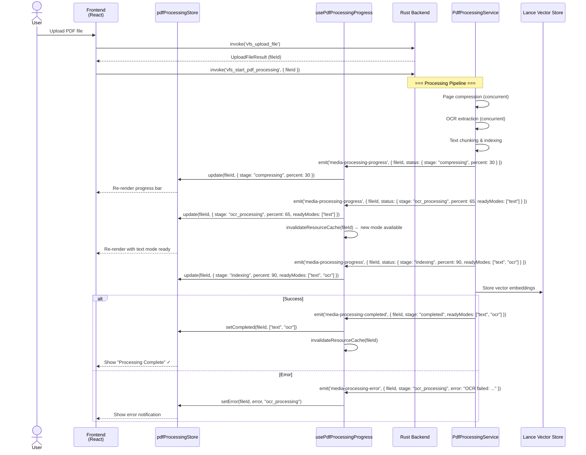
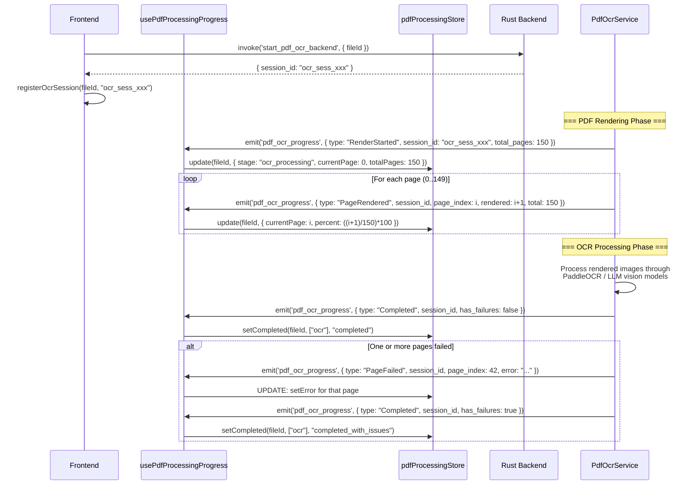
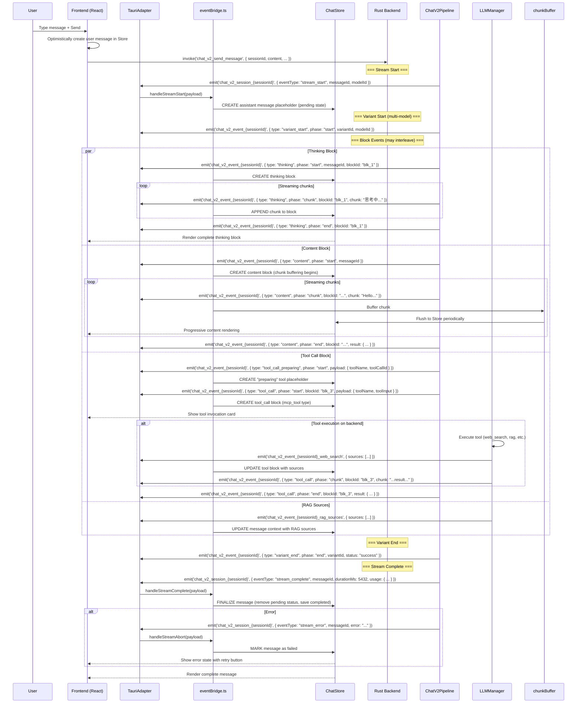

# 事件系统 — 前后端事件流

> 本文档映射由 Rust 后端发射的每个 Tauri 事件及其对应的前端 `listen()` 消费方。

## 事件分类

| 类别 | 频道模式 | 后端来源 | 前端消费方 |
|---|---|---|---|
| 聊天流式传输 | `chat_v2_event_{session_id}` | `chat_v2/events.rs` | `TauriAdapter.ts` |
| 聊天会话 | `chat_v2_session_{session_id}` | `chat_v2/events.rs` | `TauriAdapter.ts` |
| 聊天请求体 | `chat_v2_llm_request_body` | `llm_manager/model2_pipeline.rs` | `TauriAdapter.ts` |
| 媒体处理 | `media-processing-*` | `vfs/pdf_processing_service.rs` | `usePdfProcessingProgress.ts` |
| 媒体处理（旧版） | `pdf-processing-*` | `vfs/pdf_processing_service.rs` | `usePdfProcessingProgress.ts` |
| OCR 进度（旧版） | `pdf_ocr_progress` | `pdf_ocr_service.rs` | `usePdfProcessingProgress.ts` |
| Anki 生成 | `anki_generation_event` | `enhanced_anki_service.rs`, `streaming_anki_service.rs` | `TauriAdapter.ts` |
| 工作区 | `workspace_*` | `chat_v2/workspace/emitter.rs` | `workspace/events.ts` |
| 数据治理 | `data-governance-migration-status` | `lib.rs` (setup) | `useMigrationStatusListener.ts` |
| 数据治理同步 | `data-governance-sync-progress` | `data_governance/sync/emitter.rs` | `DataGovernanceDashboard.tsx` |
| 备份 | `backup-job-progress` | `backup_job_manager.rs` | `useBackupJobListener.ts` |
| 云同步 | `cloud-sync-progress` | `cloud_storage/mod.rs` | `CloudSyncManager` |
| MCP | `mcp_tools_changed` | `lib.rs` (MCP init) | `McpService` |
| MCP 测试 | `mcp-test-progress` | `cmd/mcp.rs` | MCP 调试面板 |
| 菜单 | `menu-event-*` | `menu.rs` | `menuEventBridge.ts` |
| DSTU | `dstu:change:{path}` | `dstu/handler_utils/node_converters.rs` | `LearningHubSidebar.tsx` |
| 画布 | `canvas:ai-edit-request` | `chat_v2/tools/canvas_executor.rs` | `useCanvasAIEditHandler.ts` |
| 导入进度 | `question_import_progress`, `csv_import_progress`, `textbook-import-progress`, `notes-import-progress` | `commands.rs`, `cmd/textbooks.rs`, `cmd/notes.rs` | `DataImportExport.tsx` |
| 旧版迁移 | `chat_v2_migration_event` | `chat_v2/migration/legacy_migration.rs` | `ChatMigrationSection.tsx` |
| Anki 工具 | `anki_tool_call` | `chat_v2/tools/anki_executor.rs` | `CardEngine.ts` |

---

## a) 事件发射映射 — 后端来源

```mermaid
flowchart TB
    subgraph Backend["Rust Backend — Event Emitters"]
        CHAT_EVTS["chat_v2/events.rs</br>ChatV2EventEmitter"]
        LLM_STR["llm_manager/streaming.rs</br>citations & sources events"]
        MODEL2["llm_manager/model2_pipeline.rs</br>chat_v2_llm_request_body"]
        
        PDF_SVC["vfs/pdf_processing_service.rs</br>PdfProcessingService"]
        OCR_SVC["pdf_ocr_service.rs</br>PdfOcrService"]
        
        ESSAY_EVTS["essay_grading/events.rs</br>EssayGradingEventEmitter"]
        QBANK_EVTS["qbank_grading/events.rs</br>QbankGradingEventEmitter"]
        TRANS_EVTS["translation/events.rs</br>TranslationEventEmitter"]
        
        ANKI_SVC["enhanced_anki_service.rs</br>streaming_anki_service.rs"]
        
        WORK_EMIT["chat_v2/workspace/emitter.rs</br>WorkspaceEventEmitter"]
        
        BACKUP_MGR["backup_job_manager.rs"]
        CLOUD_SYNC["cloud_storage/mod.rs"]
        DG_SYNC["data_governance/sync/emitter.rs</br>SyncProgressEmitter"]
        
        DSTU_NODE["dstu/handler_utils/node_converters.rs"]
        CANVAS["chat_v2/tools/canvas_executor.rs"]
        
        MCP_CLIENT["mcp/client.rs</br>McpClient"]
    end

    subgraph Channels["Event Channels"]
        C1["chat_v2_event_{sessionId}</br>Block-level (content/thinking/tool_call/rag/memory/web_search)"]
        C2["chat_v2_session_{sessionId}</br>Session-level (stream_start/complete/error/cancelled)"]
        C3["chat_v2_event_{sessionId}_web_search</br>Source citations"]
        C4["chat_v2_event_{sessionId}_rag_sources</br>RAG citations"]
        C5["chat_v2_event_{sessionId}_memory_sources</br>Memory citations"]
        
        C6["media-processing-progress</br>media-processing-completed</br>media-processing-error"]
        C7["pdf-processing-progress</br>pdf-processing-completed</br>pdf-processing-error"]
        C8["pdf_ocr_progress"]
        
        C9["essay_grading_event_{sessionId}"]
        C10["qbank_grading_event_{sessionId}"]
        C11["translation_event_{sessionId}"]
        
        C12["anki_generation_event"]
        
        C13["workspace_message_received</br>workspace_agent_joined</br>workspace_agent_status_changed</br>workspace_closed</br>workspace_coordinator_awakened</br>workspace_subagent_retry</br>workspace_warning"]
        
        C14["backup-job-progress</br>backup-jobs-resumable"]
        C15["cloud-sync-progress"]
        C16["data-governance-sync-progress"]
        
        C17["dstu:change:{path}</br>dstu:change"]
        C18["canvas:ai-edit-request"]
        
        C19["mcp_tools_changed</br>mcp-test-progress"]
        
        C20["question_import_progress</br>csv_import_progress</br>textbook-import-progress</br>notes-import-progress"]
        C21["chat_v2_llm_request_body"]
    end

    CHAT_EVTS --> C1
    CHAT_EVTS --> C2
    LLM_STR --> C3
    LLM_STR --> C4
    LLM_STR --> C5
    MODEL2 --> C21
    
    PDF_SVC --> C6
    PDF_SVC --> C7
    OCR_SVC --> C8
    
    ANKI_SVC --> C12
    
    WORK_EMIT --> C13
    CANVAS --> C18
    
    ESSAY_EVTS --> C9
    QBANK_EVTS --> C10
    TRANS_EVTS --> C11
    
    BACKUP_MGR --> C14
    CLOUD_SYNC --> C15
    DG_SYNC --> C16
    
    DSTU_NODE --> C17
    
    MCP_CLIENT --> C19
    
    %% Commands emitting progress
    CMDS_RS["commands.rs</br>(import progress)"] --> C20
```



### 事件发射方式（Rust 模式）

后端通过 `tauri::Emitter` 使用以下两种方式之一：
1. **Window**：`window.emit("event_name", payload)` — 限定在发射窗口内
2. **AppHandle**：`app_handle.emit("event_name", payload)` — 全局，所有窗口均可接收

全局 `AppHandle` 存储在 `src-tauri/src/lib.rs:124` 的模块级别：
```rust
static GLOBAL_APP_HANDLE: OnceLock<AppHandle> = OnceLock::new();
```

---

## b) 事件订阅映射 — 前端监听器

```mermaid
flowchart TB
    subgraph Frontend["Frontend (React/TypeScript) — Event Listeners"]
        TAURI_ADAPTER["src/features/chat/adapters/TauriAdapter.ts</br>ChatV2TauriAdapter"]
        
        MEDIA_HOOK["src/hooks/usePdfProcessingProgress.ts</br>usePdfProcessingProgress()"]
        
        WORKSPACE["src/features/chat/workspace/events.ts</br>initWorkspaceEventListeners()"]
        
        BACKUP["src/hooks/useBackupJobListener.ts"]
        MIGRATION["src/hooks/useMigrationStatusListener.ts"]
        
        DATA_GOV["src/components/DataGovernanceDashboard.tsx"]
        DATA_IMPORT["src/components/DataImportExport.tsx"]
        
        ANKI["src/components/anki/cardforge/engines/CardEngine.ts</br>src/services/ankiApiAdapter.ts"]
        
        DND["src/hooks/useTauriDragAndDrop.ts"]
        
        MENU_BRIDGE["src/menu/menuEventBridge.ts"]
        MCP["src/mcp/tauriStdioTransport.ts"]
        
        DEBUG["src/debug-panel/plugins/*"]
        
        CANVAS_HOOK["src/features/notes/hooks/useCanvasAIEditHandler.ts"]
        NOTES_CTX["src/features/notes/NotesContext.tsx"]
        SIDEBAR["src/features/learning-hub/LearningHubSidebar.tsx"]
        SYNC_SECTION["src/features/settings/components/SyncSettingsSection.tsx"]
    end

    subgraph Events["Event Channels"]
        E1["chat_v2_event_{sessionId}"]
        E2["chat_v2_session_{sessionId}"]
        E3["chat_v2_llm_request_body"]
        E4["anki_generation_event"]
        
        E5["media-processing-progress</br>media-processing-completed</br>media-processing-error"]
        E6["pdf-processing-progress</br>pdf-processing-completed</br>pdf-processing-error"]
        E7["pdf_ocr_progress"]
        
        E8["workspace_message_received"]
        E9["workspace_agent_joined"]
        E10["workspace_agent_status_changed"]
        E11["workspace_closed"]
        E12["workspace_coordinator_awakened"]
        E13["workspace_subagent_retry"]
        E14["workspace_warning"]
        E15["workspace_worker_ready"]
        
        E16["backup-job-progress"]
        E17["backup-jobs-resumable"]
        
        E18["data-governance-migration-status"]
        E19["data-governance-sync-progress"]
        
        E20["question_import_progress"]
        E21["csv_import_progress"]
        E22["textbook-import-progress"]
        E23["notes-import-progress"]
        
        E24["dstu:change"]
        E25["canvas:ai-edit-request"]
        
        E26["tauri://drag-drop</br>tauri://drag-enter</br>tauri://drag-leave</br>tauri://drag-over"]
        E27["tauri://close-requested"]
    end

    TAURI_ADAPTER --> E1
    TAURI_ADAPTER --> E2
    TAURI_ADAPTER --> E3
    TAURI_ADAPTER --> E4
    
    MEDIA_HOOK --> E5
    MEDIA_HOOK --> E6
    MEDIA_HOOK --> E7
    
    WORKSPACE --> E8
    WORKSPACE --> E9
    WORKSPACE --> E10
    WORKSPACE --> E11
    WORKSPACE --> E12
    WORKSPACE --> E13
    WORKSPACE --> E14
    WORKSPACE --> E15
    
    BACKUP --> E16
    BACKUP --> E17
    MIGRATION --> E18
    DATA_GOV --> E19
    SYNC_SECTION --> E19
    DATA_IMPORT --> E20
    DATA_IMPORT --> E21
    DATA_IMPORT --> E22
    DATA_IMPORT --> E23
    
    SIDEBAR --> E24
    CANVAS_HOOK --> E25
    
    DND --> E26
    NOTES_CTX --> E27
    
    ANKI --> E4
    MENU_BRIDGE -->|"menu-event-*"| EVT_MENU
    MCP -->|"mcp-stdio-*"| EVT_MCP
    DEBUG --> E1
    DEBUG --> E8
```



### 关键前端事件处理器

**ChatV2TauriAdapter** (`src/features/chat/adapters/TauriAdapter.ts:500-514`)
```typescript
// Event listeners registered in setup()
listen<BackendEvent>(`chat_v2_event_${sessionId}`, (event) => {
  this.handleBlockEvent(event.payload);  // content/thinking/tool_call/rag chunks
});
listen<SessionEventPayload>(`chat_v2_session_${sessionId}`, (event) => {
  this.handleSessionEvent(event.payload);  // stream_start/complete/error/cancelled
});
listen('anki_generation_event', (event) => {
  this.handleAnkiGenerationEvent(event.payload);
});
listen('chat_v2_llm_request_body', (event) => {
  this.handleLlmRequestBody(event.payload);
});
```

**usePdfProcessingProgress** (`src/hooks/usePdfProcessingProgress.ts:181-252`)
```typescript
// Unified events
listen('media-processing-progress', handler);
listen('media-processing-completed', handler);
listen('media-processing-error', handler);
// Legacy fallback
listen('pdf-processing-progress', handler);
listen('pdf-processing-completed', handler);
listen('pdf-processing-error', handler);
// Legacy OCR
listen('pdf_ocr_progress', handler);
```

---

## c) 事件生命周期时序图

### 1. 媒体处理事件（PDF 上传 → 处理 → 完成）



### 2. OCR 进度事件（旧版 `pdf_ocr_progress`）



### 3. Chat V2 流式传输事件



### 事件频道汇总表

| 频道模式 | 负载类型 | 用途 | 序列化方式 |
|---|---|---|---|
| `chat_v2_event_{sessionId}` | `BackendEvent` (camelCase) | 块级生命周期（start/chunk/end/error） | `#[serde(rename_all = "camelCase")]` |
| `chat_v2_session_{sessionId}` | `SessionEvent` (camelCase) | 会话级流程控制 | `#[serde(rename_all = "camelCase")]` |
| `{streamEvent}_web_search` | `{sources: [...], tool_name, timestamp}` | 网络搜索引用来源 | 手动 `json!()` |
| `{streamEvent}_rag_sources` | `{sources: [...], tool_name, timestamp}` | RAG 引用来源 | 手动 `json!()` |
| `{streamEvent}_memory_sources` | `{sources: [...], tool_name, timestamp}` | 记忆引用来源 | 手动 `json!()` |
| `chat_v2_llm_request_body` | `{streamEvent, model, url, requestBody, ...}` | LLM 请求体（调试用） | 手动 `json!()` |
| `anki_generation_event` | `{type, sessionId, ...}` | Anki 卡片生成进度 | 手动 `json!()` |
| `media-processing-*` | `{fileId, status/readyModes/error, mediaType}` | PDF/图片处理管线 | `#[serde(rename_all = "camelCase")]` |
| `pdf_ocr_progress` | `{type, session_id, page_index, ...}` | 旧版 OCR 逐页事件 | 手动 `json!()` |
| `workspace_*` | 因事件类型而异 | 多代理工作区事件 | 手动 `json!()` |
| `backup-job-progress` | `BackupJobSnapshot` | 备份任务进度 | `#[serde(rename_all = "camelCase")]` |
| `data-governance-sync-progress` | `SyncProgress` | 数据治理同步阶段 | `#[serde(rename_all = "camelCase")]` |
| `dstu:change:{path}` | `{action, resourceId, ...}` | DSTU 资源变更通知 | 手动 `json!()` |

---

> **关于序列 ID 的说明**：`ChatV2EventEmitter` 维护每个会话的原子序列计数器（`chat_v2/events.rs:713` 中的 `SESSION_SEQUENCE_COUNTERS`），生成严格递增的 `sequenceId` 值。前端 `eventBridge.ts` 利用这些值检测乱序或丢失的事件。
