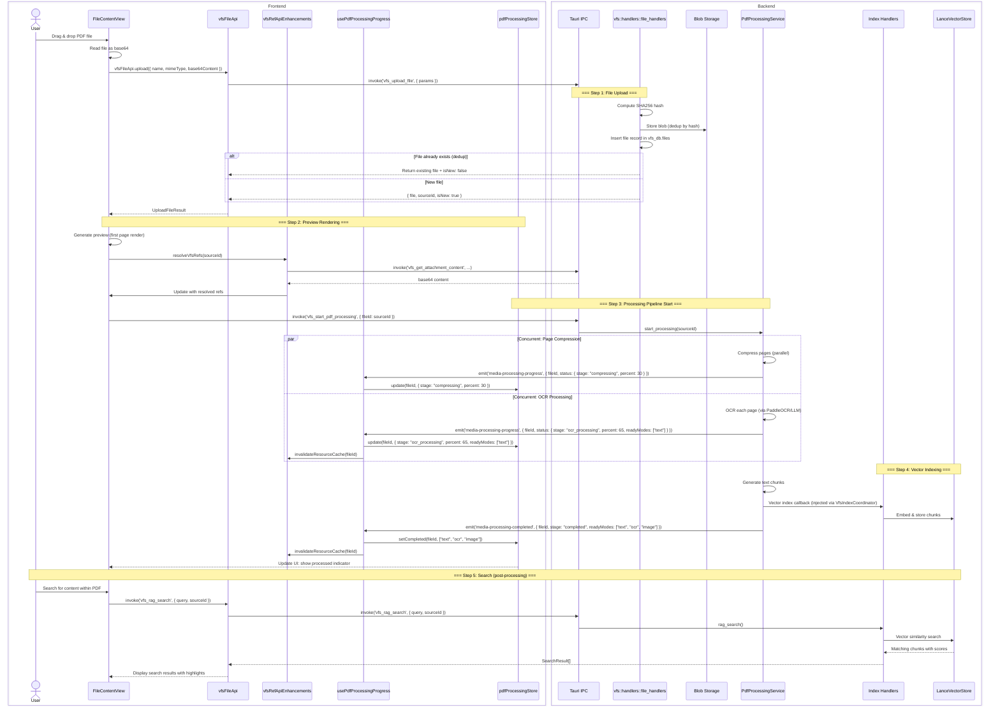
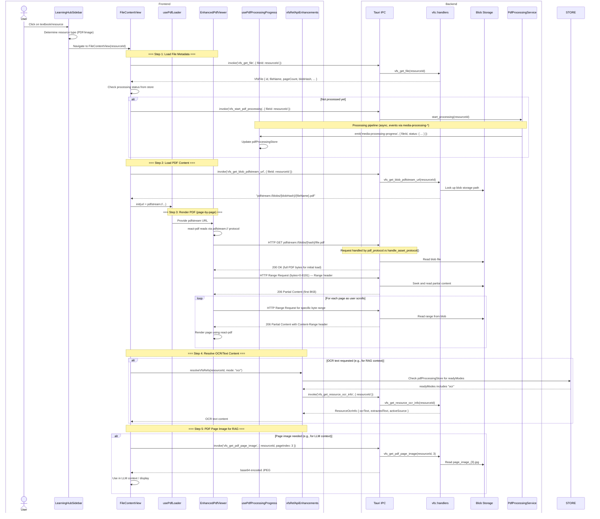
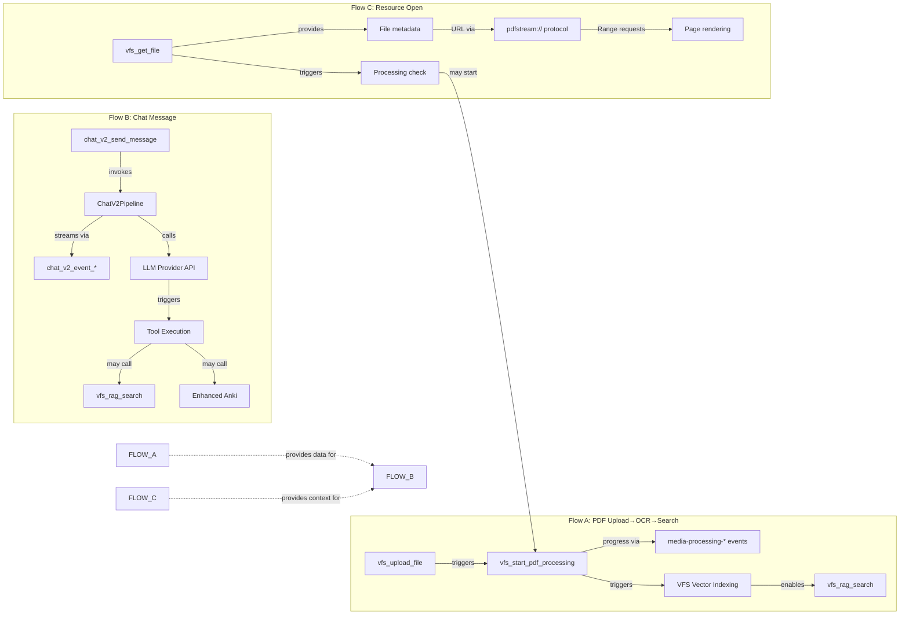

# 关键数据流 — 前后端交互序列

> 本文档追踪三个关键的端到端操作流程，覆盖完整的前后端栈，并引用源文件及行号。

---

## a) PDF 上传 → OCR → 可搜索流程

### 源文件

| 组件 | 文件 | 关键行号 |
|---|---|---|
| Learning Hub FileContentView | `src/features/learning-hub/views/FileContentView.tsx` | 拖放处理 |
| VFS Ref API | `src/features/chat/context/vfsRefApiEnhancements.ts` | `upload()` 封装 |
| VFS 文件 API | `src/api/vfsFileApi.ts` | 第 91-93 行：`vfsFileApi.upload()` |
| VFS 上传处理 | `src-tauri/src/vfs/handlers/file_handlers.rs` | `vfs_upload_file` |
| PDF 处理服务 | `src-tauri/src/vfs/pdf_processing_service.rs` | 事件发射 |
| PdfOcrService（旧版） | `src-tauri/src/pdf_ocr_service.rs` | 第 360-480 行：渲染事件 |
| PdfProcessing Hook | `src/hooks/usePdfProcessingProgress.ts` | 第 181-252 行：事件处理 |
| 媒体处理 Store | `src/features/pdf/stores/pdfProcessingStore.ts` | 状态管理 |
| VFS 索引处理 | `src-tauri/src/vfs/handlers/index_handlers.rs` | `vfs_rag_search` |

### 完整时序图



### 关键观察

- 文件上传去重通过 `vfs_upload_file` 内部的 SHA256 哈希完成
- 媒体处理流水线异步运行，通过事件报告进度
- `invalidateResourceCache()` 在新 readyModes 出现时和处理完成时均被调用，确保 `resolveVfsRefs` 返回最新数据
- 旧版 OCR（`pdf_ocr_progress`）与统一的 `media-processing-*` 事件共存，两者均更新同一个 `pdfProcessingStore`
- `PdfProcessingService` 在应用启动时注入了 `VfsIndexCoordinator` 回调（`lib.rs:1875-1889`）

---

## b) 聊天消息流程

### 源文件

| 组件 | 文件 | 关键行号 |
|---|---|---|
| InputBar | `src/features/chat/InputBar.tsx` | 发送处理 |
| ChatStore | `src/features/chat/core/store/chatStore.ts` | 状态管理 |
| TauriAdapter | `src/features/chat/adapters/TauriAdapter.ts` | 第 453-569 行：设置，监听器 500-514 |
| EventBridge | `src/features/chat/core/middleware/eventBridge.ts` | `handleBackendEventWithSequence()` |
| Chat V2 发送 | `src-tauri/src/chat_v2/handlers/send_message.rs` | `chat_v2_send_message` |
| Chat V2 流水线 | `src-tauri/src/chat_v2/pipeline/` | 消息处理 |
| LLM Manager | `src-tauri/src/llm_manager/` | 供应商路由 + 流式 |
| Chat V2 事件 | `src-tauri/src/chat_v2/events.rs` | 第 688-1349 行：EventEmitter |
| 流式 (LLM) | `src-tauri/src/llm_manager/streaming.rs` | 第 485-590 行：引用 |
| 块缓冲 | `src/features/chat/core/middleware/chunkBuffer.ts` | `chunkBuffer` 模块 |

### 完整时序图

```mermaid
sequenceDiagram
    box Frontend
        actor User
        participant IB as InputBar
        participant CS as ChatStore (Zustand)
        participant TA as TauriAdapter
        participant EB as eventBridge.ts
        participant CB as chunkBuffer.ts
        participant UI as React UI
    end
    box Backend
        participant IPC as Tauri IPC
        participant SEND as send_message.rs
        participant PL as ChatV2Pipeline
        participant LLM as LLMManager
        participant EVT as chat_v2/events.rs
        participant DB as ChatV2Database
    end

    User->>IB: Type message + Press Enter/Send
    IB->>CS: sendMessage(content, contextRefs)
    CS->>CS: ADD user message (optimistic)
    CS-->>UI: Re-render with user message
    
    CS->>TA: sendMessage(sessionId, content, ...)
    
    TA->>TA: buildSendOptionsSnapshot()
    TA->>TA: collectContextRefs()
    TA->>TA: buildSendContextRefs()  ← context refs for attachments
    
    TA->>IPC: invoke('chat_v2_send_message', { sessionId, content, contextRefs, ... })
    
    Note over SEND,DB: === Backend Processing ===
    SEND->>DB: Create/append message record
    SEND->>PL: process_message(message)
    
    PL->>EVT: emit('chat_v2_session_{sessionId}', SessionEvent::stream_start(messageId, modelId))
    
    Note over EVT,UI: === Frontend: Stream Start ===
    EVT-->>TA: Event received (session channel)
    TA->>EB: handleStreamStart({ messageId, modelId })
    EB->>CS: CREATE assistant message (pending)
    CS-->>UI: Show "AI is typing..." placeholder, model badge

    Note over PL,LLM: === LLM Invocation ===
    PL->>LLM: stream_response(prompt, tools, ...)
    
    loop Per tool round (max N rounds)
        Note over LLM: === Tool Call (if triggered) ===
        LLM->>EVT: emit('chat_v2_event_{sessionId}', BackendEvent::start("tool_call_preparing", payload: { toolName, toolCallId }))
        EVT-->>TA: Event received
        TA->>EB: handleBackendEventWithSequence(event)
        EB->>CS: CREATE "preparing" tool placeholder
        CS-->>UI: Show tool placeholder
        
        LLM->>EVT: emit('chat_v2_event_{sessionId}', BackendEvent::start("tool_call", blockId, payload: { toolName, toolInput }))
        EVT-->>TA: Event received
        TA->>EB: handleBackendEventWithSequence(event)
        EB->>CS: CREATE tool_call block (mcp_tool type)
        CS-->>UI: Show tool card with name + input
        
        LLM->>LLM: Execute tool (web_search, rag, anki, ...)
        
        alt Tool has streaming output
            loop Tool chunk events
                LLM->>EVT: emit_chunk("tool_call", blockId, chunk)
                EVT-->>TA: chunk event
                TA->>EB: handleBackendEventWithSequence
                EB->>CS: APPEND chunk to tool block
            end
        end
        
        LLM->>EVT: emit end("tool_call", blockId, result)
        EVT-->>TA: end event
        TA->>EB: handleBackendEventWithSequence
        EB->>CS: FINALIZE tool block with result
        
        LLM->>EVT: emit citations ({streamEvent}_web_search / _rag_sources)
        EVT-->>TA: citation event
        TA->>CS: UPDATE tool block with source citations
        CS-->>UI: Show citation sources
    end

    Note over LLM,UI: === Content Streaming ===
    LLM->>EVT: emit('chat_v2_event_{sessionId}', BackendEvent::start("thinking", messageId, blockId))
    EVT-->>TA
    TA->>EB: handleBackendEventWithSequence
    EB->>CS: CREATE thinking block
    
    loop Thinking chunks
        LLM->>EVT: emit_chunk("thinking", blockId, "Analyzing...")
        EVT-->>TA
        TA->>EB: handleBackendEventWithSequence
        EB->>CS: APPEND to thinking block
        CS-->>UI: Show reasoning in progress
    end
    
    LLM->>EVT: emit end("thinking", blockId)
    EVT-->>TA
    TA->>EB: handleBackendEventWithSequence
    EB->>CS: FINALIZE thinking block

    LLM->>EVT: emit('chat_v2_event_{sessionId}', BackendEvent::start("content", messageId, blockId))
    EVT-->>TA
    TA->>EB: handleBackendEventWithSequence
    EB->>CS: CREATE content block
    CB->>CB: Initialize chunk buffer for this block

    loop Content chunks (streamed text)
        LLM->>EVT: emit_chunk("content", blockId, "Hello world...")
        EVT-->>TA
        TA->>EB: handleBackendEventWithSequence(event)
        EB->>CB: Buffer chunk
        CB->>CS: Flush (debounced, ~50ms interval)
        CS-->>UI: Progressive text rendering (token-by-token)
    end
    
    LLM->>EVT: emit end("content", blockId)
    EVT-->>TA
    TA->>EB: handleBackendEventWithSequence
    EB->>CB: Flush remaining chunks
    CB->>CS: FINALIZE block
    CS-->>UI: Show complete response

    Note over SEND,UI: === Stream Complete ===
    SEND->>EVT: emit('chat_v2_session_{sessionId}', SessionEvent::stream_complete_with_usage(messageId, durationMs, usage))
    EVT-->>TA
    TA->>EB: handleStreamComplete({ messageId, durationMs, usage })
    EB->>autoSave: Auto-save session
    EB->>CS: UPDATE message status → "completed"
    EB->>CS: UPDATE token usage
    CS-->>UI: Show completion indicator, token stats, model info

    Note over TA,EB: Cleanup
    TA->>TA: clearEventContext()
    TA->>TA: resetBridgeState()

    alt Error during stream
        PL->>EVT: emit('chat_v2_session_{sessionId}', SessionEvent::stream_error(messageId, error))
        EVT-->>TA
        TA->>EB: handleStreamAbort({ messageId, error })
        EB->>CS: UPDATE message status → "error"
        CS-->>UI: Show error state with retry button
        
        TA->>TA: Attempt reconnection (retrySetupListeners)
    end

    alt User cancels
        User->>IB: Click Cancel
        CS->>TA: abortStream(sessionId, messageId)
        TA->>IPC: invoke('chat_v2_cancel_stream', { sessionId, messageId })
        PL->>LLM: Cancel LLM stream
        PL->>EVT: emit('chat_v2_session_{sessionId}', SessionEvent::stream_cancelled(messageId))
        EVT-->>TA
        TA->>EB: handleStreamAbort({ messageId })
        EB->>CS: UPDATE message status → "cancelled"
        CS-->>UI: Show "Generation cancelled"
    end
```

### 关键观察

- 前端在 `invoke()` 调用之前乐观创建用户消息，实现即时 UI 响应
- 事件序列 ID 按会话追踪，用于检测乱序或丢失事件（`chat_v2/events.rs:713`）
- 块缓冲（`chunkBuffer.ts`）将快速到达的内容块防抖为周期性的 store 更新（通常约 50ms 间隔）
- `autoSave` 中间件在流完成后保存会话
- 工具调用可跨多轮（工具循环），每轮独立发射块事件
- 在多模型（变体）模式下，每个模型的块事件由 `variant_start`/`variant_end` 事件括起来

---

## c) Learning Hub 资源打开流程

### 源文件

| 组件 | 文件 | 关键行号 |
|---|---|---|
| Learning Hub | `src/features/learning-hub/LearningHubSidebar.tsx` | 资源点击处理 |
| FileContentView | `src/features/learning-hub/views/FileContentView.tsx` | PDF 查看器容器 |
| usePdfLoader | `src/features/learning-hub/hooks/usePdfLoader.ts` | PDF 加载逻辑 |
| VFS 文件 API | `src/api/vfsFileApi.ts` | 第 91-97 行 |
| pdfstream 协议 | `src-tauri/src/pdf_protocol.rs` | HTTP Range Request 处理 |
| VFS 附件 | `src-tauri/src/vfs/handlers/attachment_handlers.rs` | `vfs_get_attachment_content` |
| VFS PDF 处理 | `src-tauri/src/vfs/handlers/pdf_handlers.rs` | `vfs_get_blob_pdfstream_url` |
| EnhancedPdfViewer | `src/features/learning-hub/components/EnhancedPdfViewer.tsx` | react-pdf 集成 |

### 完整时序图



### 关键观察

- `pdfstream://` 协议（`lib.rs:1729-1756`、`pdf_protocol.rs`）是一个自定义的 Tauri URI 方案，处理 HTTP Range Requests，使 react-pdf 能够逐页高效加载 PDF，而无需将整个文件加载到内存中
- 处理流水线异步运行；UI 在等待时显示来自 store 的处理状态
- `resolveVfsRefs` 同时检查内存中的 store（缓存已解析引用）和后端（获取最新 OCR/文本结果）
- OCR 文本块存储在 VFS 中并索引到 Lance 进行向量搜索；`vfs_get_pdf_page_image` 命令提供页面级图像用于多模态 RAG
- 该流程同时支持初始完整 PDF 加载（首次 HTTP GET 返回完整字节）和高效的部分范围加载（后续 Range 请求返回 206 Partial Content）

---

## 流程依赖图



---

## 事件驱动架构总结

该应用使用 **混合 invoke + 事件驱动** 架构：

1. **命令模式**：前端调用 `invoke('command_name', args)` 进行请求-响应操作（CRUD、配置）
2. **事件模式**：后端通过 `window.emit()` 发射流式和状态变更事件（聊天 token、处理进度）
3. **自定义协议**：`pdfstream://` 用于高效的二进制数据流（PDF 文件服务）

```
Invoke (request-response)       Event (streaming/async)
┌──────────┐                    ┌──────────┐
│ Frontend │──invoke('cmd')──▶  │ Backend  │
│          │◀───Result────────  │          │
└──────────┘                    └──────────┘

                                ┌──────────┐
                                │ Backend  │──emit('event', payload)──▶  ┌──────────┐
                                │          │                              │ Frontend │
                                └──────────┘                              │(listen)  │
                                                                          └──────────┘
```
