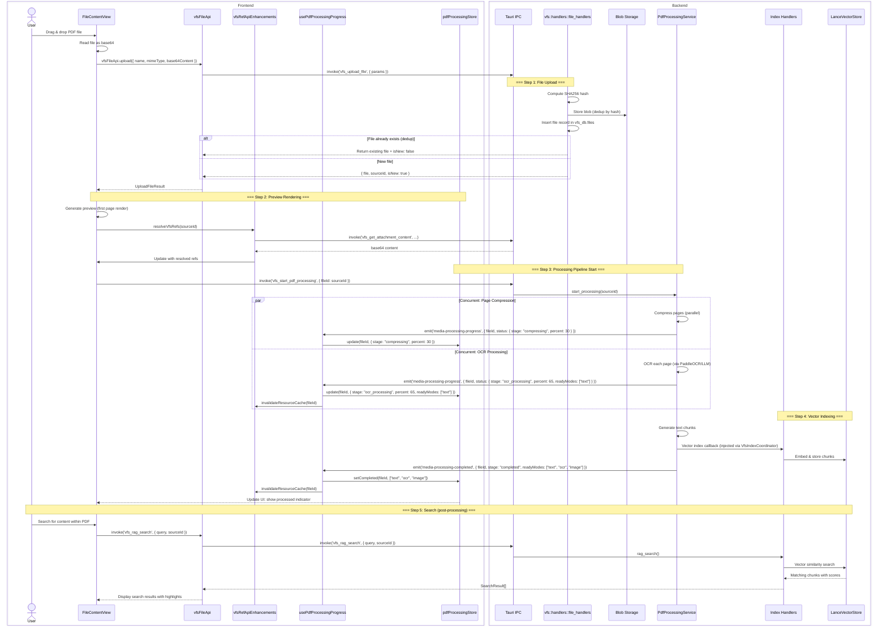
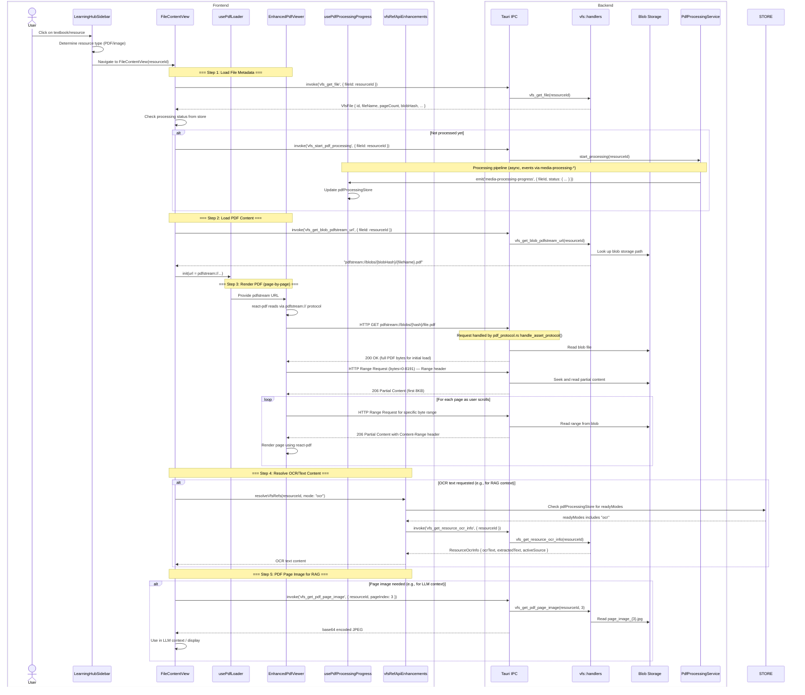
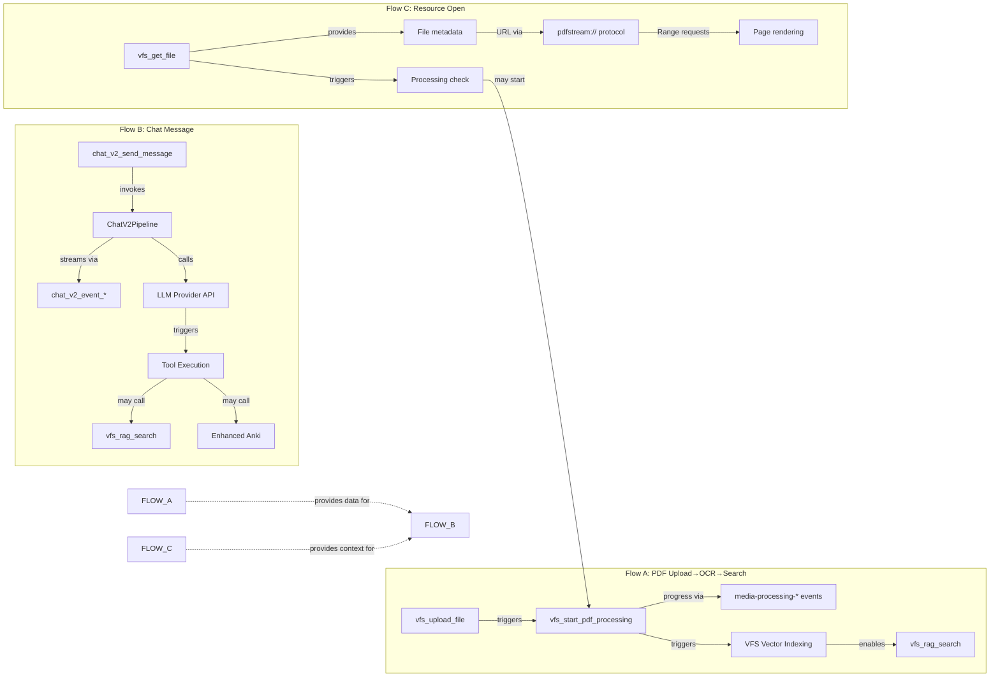

# Critical Data Flows — Frontend-Backend Interaction Sequences

> This document traces three critical end-to-end operations through the full frontend-backend stack, referencing source files and line numbers.

---

## a) PDF Upload → OCR → Searchable Flow

### Source Files

| Component | File | Key Lines |
|---|---|---|
| Learning Hub FileContentView | `src/features/learning-hub/views/FileContentView.tsx` | Drop handler |
| VFS Ref API | `src/features/chat/context/vfsRefApiEnhancements.ts` | `upload()` wrapper |
| VFS File API | `src/api/vfsFileApi.ts` | Lines 91-93: `vfsFileApi.upload()` |
| VFS Upload Handler | `src-tauri/src/vfs/handlers/file_handlers.rs` | `vfs_upload_file` |
| PDF Processing Service | `src-tauri/src/vfs/pdf_processing_service.rs` | Event emission |
| PdfOcrService (legacy) | `src-tauri/src/pdf_ocr_service.rs` | Lines 360-480: render events |
| PdfProcessing Hook | `src/hooks/usePdfProcessingProgress.ts` | Lines 181-252: event handlers |
| Media Processing Store | `src/features/pdf/stores/pdfProcessingStore.ts` | State management |
| VFS Index Handlers | `src-tauri/src/vfs/handlers/index_handlers.rs` | `vfs_rag_search` |

### Full Sequence Diagram



### Key Observations

- File upload deduplication happens by SHA256 hash inside `vfs_upload_file`
- The media processing pipeline runs asynchronously and reports progress via events
- `invalidateResourceCache()` is called both when new readyModes appear and on completion, ensuring `resolveVfsRefs` returns fresh data
- Legacy OCR (`pdf_ocr_progress`) coexists with the unified `media-processing-*` events; both update the same `pdfProcessingStore`
- The `PdfProcessingService` has `VfsIndexCoordinator` callback injected at app startup (`lib.rs:1875-1889`)

---

## b) Chat Message Flow

### Source Files

| Component | File | Key Lines |
|---|---|---|
| InputBar | `src/features/chat/InputBar.tsx` | Send handler |
| ChatStore | `src/features/chat/core/store/chatStore.ts` | State management |
| TauriAdapter | `src/features/chat/adapters/TauriAdapter.ts` | Lines 453-569: setup, Listeners 500-514 |
| EventBridge | `src/features/chat/core/middleware/eventBridge.ts` | `handleBackendEventWithSequence()` |
| Chat V2 Send | `src-tauri/src/chat_v2/handlers/send_message.rs` | `chat_v2_send_message` |
| Chat V2 Pipeline | `src-tauri/src/chat_v2/pipeline/` | Message processing |
| LLM Manager | `src-tauri/src/llm_manager/` | Provider routing + streaming |
| Chat V2 Events | `src-tauri/src/chat_v2/events.rs` | Lines 688-1349: EventEmitter |
| Streaming (LLM) | `src-tauri/src/llm_manager/streaming.rs` | Lines 485-590: citations |
| Chunk Buffer | `src/features/chat/core/middleware/chunkBuffer.ts` | `chunkBuffer` module |

### Full Sequence Diagram

```mermaid
sequenceDiagram
    box Frontend
        actor User
        participant IB as InputBar
        participant CS as ChatStore (Zustand)
        participant TA as TauriAdapter
        participant EB as eventBridge.ts
        participant CB as chunkBuffer.ts
        participant UI as React UI
    end
    box Backend
        participant IPC as Tauri IPC
        participant SEND as send_message.rs
        participant PL as ChatV2Pipeline
        participant LLM as LLMManager
        participant EVT as chat_v2/events.rs
        participant DB as ChatV2Database
    end

    User->>IB: Type message + Press Enter/Send
    IB->>CS: sendMessage(content, contextRefs)
    CS->>CS: ADD user message (optimistic)
    CS-->>UI: Re-render with user message
    
    CS->>TA: sendMessage(sessionId, content, ...)
    
    TA->>TA: buildSendOptionsSnapshot()
    TA->>TA: collectContextRefs()
    TA->>TA: buildSendContextRefs()  ← context refs for attachments
    
    TA->>IPC: invoke('chat_v2_send_message', { sessionId, content, contextRefs, ... })
    
    Note over SEND,DB: === Backend Processing ===
    SEND->>DB: Create/append message record
    SEND->>PL: process_message(message)
    
    PL->>EVT: emit('chat_v2_session_{sessionId}', SessionEvent::stream_start(messageId, modelId))
    
    Note over EVT,UI: === Frontend: Stream Start ===
    EVT-->>TA: Event received (session channel)
    TA->>EB: handleStreamStart({ messageId, modelId })
    EB->>CS: CREATE assistant message (pending)
    CS-->>UI: Show "AI is typing..." placeholder, model badge

    Note over PL,LLM: === LLM Invocation ===
    PL->>LLM: stream_response(prompt, tools, ...)
    
    loop Per tool round (max N rounds)
        Note over LLM: === Tool Call (if triggered) ===
        LLM->>EVT: emit('chat_v2_event_{sessionId}', BackendEvent::start("tool_call_preparing", payload: { toolName, toolCallId }))
        EVT-->>TA: Event received
        TA->>EB: handleBackendEventWithSequence(event)
        EB->>CS: CREATE "preparing" tool placeholder
        CS-->>UI: Show tool placeholder
        
        LLM->>EVT: emit('chat_v2_event_{sessionId}', BackendEvent::start("tool_call", blockId, payload: { toolName, toolInput }))
        EVT-->>TA: Event received
        TA->>EB: handleBackendEventWithSequence(event)
        EB->>CS: CREATE tool_call block (mcp_tool type)
        CS-->>UI: Show tool card with name + input
        
        LLM->>LLM: Execute tool (web_search, rag, anki, ...)
        
        alt Tool has streaming output
            loop Tool chunk events
                LLM->>EVT: emit_chunk("tool_call", blockId, chunk)
                EVT-->>TA: chunk event
                TA->>EB: handleBackendEventWithSequence
                EB->>CS: APPEND chunk to tool block
            end
        end
        
        LLM->>EVT: emit end("tool_call", blockId, result)
        EVT-->>TA: end event
        TA->>EB: handleBackendEventWithSequence
        EB->>CS: FINALIZE tool block with result
        
        LLM->>EVT: emit citations ({streamEvent}_web_search / _rag_sources)
        EVT-->>TA: citation event
        TA->>CS: UPDATE tool block with source citations
        CS-->>UI: Show citation sources
    end

    Note over LLM,UI: === Content Streaming ===
    LLM->>EVT: emit('chat_v2_event_{sessionId}', BackendEvent::start("thinking", messageId, blockId))
    EVT-->>TA
    TA->>EB: handleBackendEventWithSequence
    EB->>CS: CREATE thinking block
    
    loop Thinking chunks
        LLM->>EVT: emit_chunk("thinking", blockId, "Analyzing...")
        EVT-->>TA
        TA->>EB: handleBackendEventWithSequence
        EB->>CS: APPEND to thinking block
        CS-->>UI: Show reasoning in progress
    end
    
    LLM->>EVT: emit end("thinking", blockId)
    EVT-->>TA
    TA->>EB: handleBackendEventWithSequence
    EB->>CS: FINALIZE thinking block

    LLM->>EVT: emit('chat_v2_event_{sessionId}', BackendEvent::start("content", messageId, blockId))
    EVT-->>TA
    TA->>EB: handleBackendEventWithSequence
    EB->>CS: CREATE content block
    CB->>CB: Initialize chunk buffer for this block

    loop Content chunks (streamed text)
        LLM->>EVT: emit_chunk("content", blockId, "Hello world...")
        EVT-->>TA
        TA->>EB: handleBackendEventWithSequence(event)
        EB->>CB: Buffer chunk
        CB->>CS: Flush (debounced, ~50ms interval)
        CS-->>UI: Progressive text rendering (token-by-token)
    end
    
    LLM->>EVT: emit end("content", blockId)
    EVT-->>TA
    TA->>EB: handleBackendEventWithSequence
    EB->>CB: Flush remaining chunks
    CB->>CS: FINALIZE block
    CS-->>UI: Show complete response

    Note over SEND,UI: === Stream Complete ===
    SEND->>EVT: emit('chat_v2_session_{sessionId}', SessionEvent::stream_complete_with_usage(messageId, durationMs, usage))
    EVT-->>TA
    TA->>EB: handleStreamComplete({ messageId, durationMs, usage })
    EB->>autoSave: Auto-save session
    EB->>CS: UPDATE message status → "completed"
    EB->>CS: UPDATE token usage
    CS-->>UI: Show completion indicator, token stats, model info

    Note over TA,EB: Cleanup
    TA->>TA: clearEventContext()
    TA->>TA: resetBridgeState()

    alt Error during stream
        PL->>EVT: emit('chat_v2_session_{sessionId}', SessionEvent::stream_error(messageId, error))
        EVT-->>TA
        TA->>EB: handleStreamAbort({ messageId, error })
        EB->>CS: UPDATE message status → "error"
        CS-->>UI: Show error state with retry button
        
        TA->>TA: Attempt reconnection (retrySetupListeners)
    end

    alt User cancels
        User->>IB: Click Cancel
        CS->>TA: abortStream(sessionId, messageId)
        TA->>IPC: invoke('chat_v2_cancel_stream', { sessionId, messageId })
        PL->>LLM: Cancel LLM stream
        PL->>EVT: emit('chat_v2_session_{sessionId}', SessionEvent::stream_cancelled(messageId))
        EVT-->>TA
        TA->>EB: handleStreamAbort({ messageId })
        EB->>CS: UPDATE message status → "cancelled"
        CS-->>UI: Show "Generation cancelled"
    end
```

### Key Observations

- The frontend optimistically creates a user message before the `invoke()` call, enabling instant UI response
- Event sequence IDs are tracked per session to detect out-of-order or dropped events (`chat_v2/events.rs:713`)
- Chunk buffering (`chunkBuffer.ts`) debounces rapid content chunks into periodic store updates (typically ~50ms intervals)
- The `autoSave` middleware saves the session after stream completion
- Tool calls can span multiple rounds (tool loops), each round emitting block events independently
- In multi-model (variant) mode, `variant_start`/`variant_end` events bracket each model's block events

---

## c) Learning Hub Resource Open Flow

### Source Files

| Component | File | Key Lines |
|---|---|---|
| Learning Hub | `src/features/learning-hub/LearningHubSidebar.tsx` | Resource click handler |
| FileContentView | `src/features/learning-hub/views/FileContentView.tsx` | PDF viewer container |
| usePdfLoader | `src/features/learning-hub/hooks/usePdfLoader.ts` | PDF loading logic |
| VFS File API | `src/api/vfsFileApi.ts` | Lines 91-97 |
| pdfstream protocol | `src-tauri/src/pdf_protocol.rs` | HTTP Range Request handler |
| VFS Attachment | `src-tauri/src/vfs/handlers/attachment_handlers.rs` | `vfs_get_attachment_content` |
| VFS PDF handlers | `src-tauri/src/vfs/handlers/pdf_handlers.rs` | `vfs_get_blob_pdfstream_url` |
| EnhancedPdfViewer | `src/features/learning-hub/components/EnhancedPdfViewer.tsx` | react-pdf integration |

### Full Sequence Diagram



### Key Observations

- The `pdfstream://` protocol (`lib.rs:1729-1756`, `pdf_protocol.rs`) is a custom Tauri URI scheme that handles HTTP Range Requests, enabling react-pdf to efficiently load PDFs page-by-page without loading the entire file into memory
- Processing pipeline runs asynchronously; the UI displays processing status from the store while waiting
- `resolveVfsRefs` checks both the in-memory store (for cached resolved refs) and the backend (for fresh OCR/text results)
- OCR text chunks are stored in VFS and indexed in Lance for vector search; the `vfs_get_pdf_page_image` command provides page-level images for multimodal RAG
- The flow supports both initial full PDF load (first HTTP GET returns full bytes) and efficient partial-range loading (subsequent Range requests return 206 Partial Content)

---

## Flow Dependency Graph



---

## Event-Driven Architecture Summary

The application uses a **hybrid invoke + event-driven** architecture:

1. **Command Pattern**: Frontend calls `invoke('command_name', args)` for request-response operations (CRUD, configuration)
2. **Event Pattern**: Backend emits events via `window.emit()` for streaming and state changes (chat tokens, processing progress)
3. **Custom Protocol**: `pdfstream://` for efficient binary data streaming (PDF file serving)

```
Invoke (request-response)       Event (streaming/async)
┌──────────┐                    ┌──────────┐
│ Frontend │──invoke('cmd')──▶  │ Backend  │
│          │◀───Result────────  │          │
└──────────┘                    └──────────┘

                                ┌──────────┐
                                │ Backend  │──emit('event', payload)──▶  ┌──────────┐
                                │          │                              │ Frontend │
                                └──────────┘                              │(listen)  │
                                                                          └──────────┘
```
