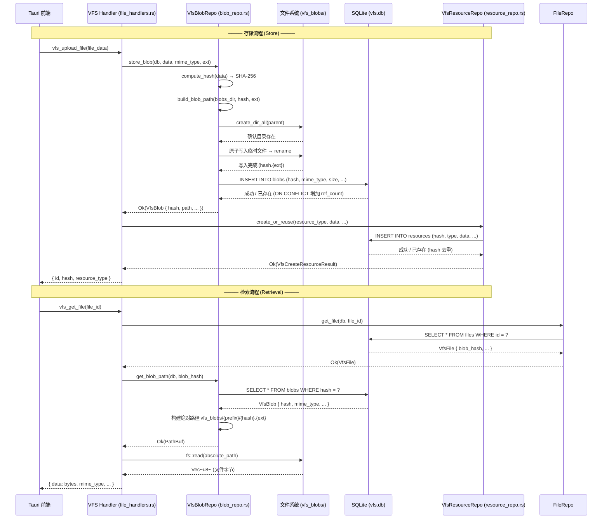
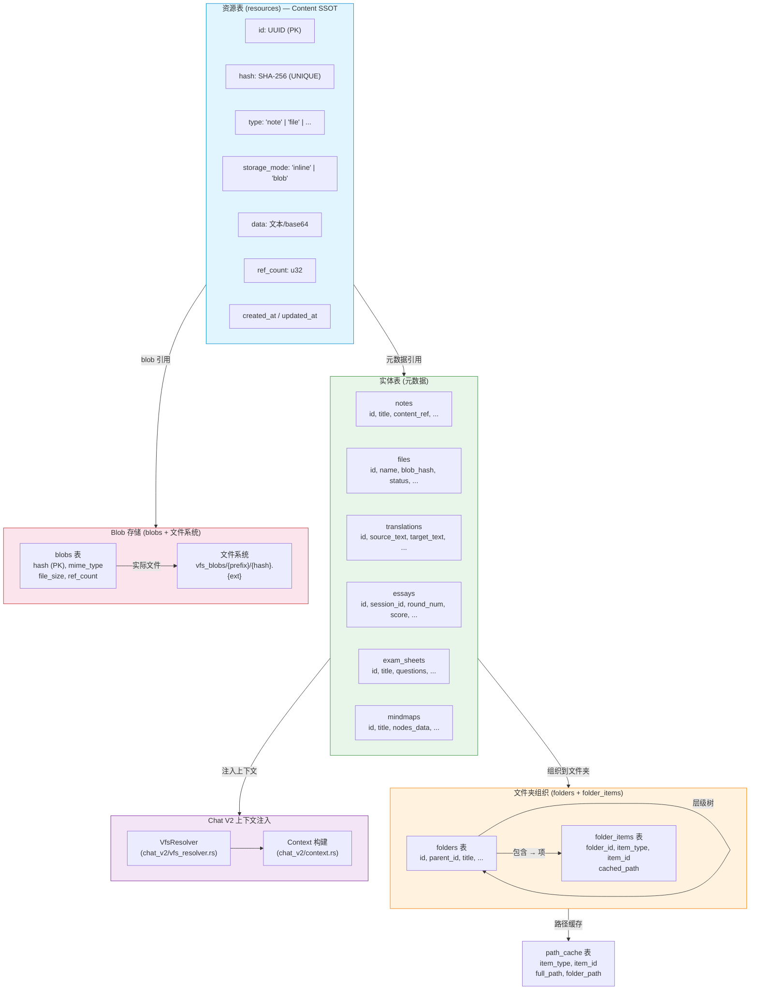

# VFS 虚拟文件系统 — 内部架构图

> 最后更新: 2026-06-06 | 源码路径: `src-tauri/src/vfs/`

## 概述

VFS (Virtual File System) 是统一存储层，基于 SQLite + 文件系统的混合架构。
- **单数据库**: 使用独立的 `vfs.db`，通过文件夹层级组织资源
- **全局去重**: 基于 SHA-256 哈希
- **统一资源协议**: 所有模块数据通过 VFS 暴露给 Chat V2 上下文注入

---

## 图 1: VFS 模块内部结构 (classDiagram)

```mermaid
classDiagram
    class VfsDatabase {
        - pool: RwLock~VfsPool~
        - db_path: PathBuf
        - blobs_dir: PathBuf
        + new(app_data_dir: &Path) VfsResult~Self~
        + get_conn() VfsResult~VfsPooledConnection~
        + get_conn_safe() VfsResult~VfsPooledConnection~
        + get_pool() VfsResult~VfsPool~
        + db_path() &Path
        + blobs_dir() &Path
        + enter_maintenance_mode() VfsResult~()~
        + exit_maintenance_mode() VfsResult~()~
        + reinitialize() VfsResult~()~
        + get_statistics() VfsResult~VfsDatabaseStats~
        - build_pool(db_path: &Path) VfsResult~VfsPool~
    }

    class VfsDatabaseStats {
        + resource_count: u64
        + note_count: u64
        + textbook_count: u64
        + exam_count: u64
        + translation_count: u64
        + essay_count: u64
        + blob_count: u64
        + schema_version: u32
    }

    class VfsFileRepo {
        + create_file() VfsResult~VfsFile~
        + get_file() VfsResult~Option~VfsFile~~
        + update_file() VfsResult~()~
        + delete_file() VfsResult~bool~
        + list_files() VfsResult~Vec~VfsFile~~
        + search_files() VfsResult~Vec~VfsFile~~
    }

    class VfsBlobRepo {
        + store_blob(db, data, mime_type, extension) VfsResult~VfsBlob~
        + store_blob_with_conn(conn, blobs_dir, data, mime_type, ext) VfsResult~VfsBlob~
        + get_blob(db, hash) VfsResult~Option~VfsBlob~~
        + get_blob_path(db, hash) VfsResult~PathBuf~
        + blob_exists(db, hash) VfsResult~bool~
        + delete_blob(db, hash) VfsResult~bool~
        + delete_blob_with_conn(conn, blobs_dir, hash) VfsResult~bool~
        - compute_hash(data: &[u8]) String
        - build_blob_path(blobs_dir, hash, ext) VfsResult~(PathBuf, PathBuf)
    }

    class VfsResourceRepo {
        + create_or_reuse(db, resource_type, data, source_id, source_table, metadata) VfsResult~VfsCreateResourceResult~
        + get_resource(db, id) VfsResult~Option~VfsResource~~
        + get_resource_by_hash(db, hash) VfsResult~Option~VfsResource~~
        + increment_ref(db, id) VfsResult~()~
        + decrement_ref(db, id) VfsResult~()~
        + delete_resource(db, id) VfsResult~bool~
    }

    class VfsIndexService {
        + index_resource(resource_id) VfsResult~()~
        + search(query, params) VfsResult~Vec~VfsSearchResult~~
        + rebuild_index() VfsResult~()~
        + get_index_stats() VfsResult~IndexStats~
    }

    class VfsIndexCoordinator {
        - db: Arc~VfsDatabase~
        - llm_manager: Arc~LLMManager~
        + new(db, llm_manager) Self
        + create_vector_index_callback() VectorIndexCallback
        + vector_index_resource(resource_id) VfsResult~()~
    }

    class PdfProcessingService {
        - db: Arc~VfsDatabase~
        - llm_manager: Arc~LLMManager~
        - active_jobs: DashMap~String, CancellationToken~
        - app_handle: AppHandle
        + submit_pdf(resource_id) VfsResult~()~
        + submit_image(resource_id) VfsResult~()~
        + cancel_job(resource_id)
        + get_progress(resource_id) Option~ProcessingProgress~
        + resume_pending_jobs() VfsResult~usize~
        - stage_text_extraction(resource_id) VfsResult~()~
        - stage_page_rendering(resource_id) VfsResult~()~
        - stage_ocr_processing(resource_id) VfsResult~()~
        - stage_vector_indexing(resource_id) VfsResult~()~
    }

    class PdfPreviewConfig {
        + render_dpi: u32
        + max_pages: usize
        + target_width: u32
        + max_height: u32
        + jpeg_quality: u8
        + compression_enabled: bool
    }

    class ProcessingStage {
        <<enumeration>>
        Pending
        TextExtraction
        PageRendering
        PageCompression
        ImageCompression
        OcrProcessing
        VectorIndexing
        Completed
        CompletedWithIssues
        Error
    }

    class ProcessingProgress {
        + stage: String
        + current_page: Option~usize~
        + total_pages: Option~usize~
        + percent: f32
        + ready_modes: Vec~String~
    }

    class VfsFolderRepo {
        + create_folder() VfsResult~VfsFolder~
        + get_folder() VfsResult~Option~VfsFolder~~
        + update_folder() VfsResult~()~
        + delete_folder() VfsResult~()~
        + get_folder_tree() VfsResult~Vec~FolderTreeNode~~
        + move_folder() VfsResult~()~
    }

    class VfsNoteRepo {
        + create_note() VfsResult~VfsNote~
        + get_note() VfsResult~Option~VfsNote~~
        + update_note() VfsResult~()~
        + delete_note() VfsResult~bool~
        + list_notes_by_folder() VfsResult~Vec~VfsNote~~
    }

    VfsDatabase --> VfsDatabaseStats : get_statistics() returns
    VfsBlobRepo ..> VfsDatabase : uses (blobs_dir)
    VfsBlobRepo --> VfsPooledConnection : store_blob_with_conn
    VfsResourceRepo ..> VfsDatabase : uses (get_conn_safe)
    VfsFileRepo ..> VfsDatabase : uses
    VfsFolderRepo ..> VfsDatabase : uses
    VfsNoteRepo ..> VfsDatabase : uses
    PdfProcessingService ..> VfsDatabase : depends on
    VfsIndexCoordinator ..> VfsDatabase : depends on
    VfsIndexCoordinator ..> VfsFullIndexingService : creates
    PdfProcessingService --> ProcessingStage : uses
    PdfProcessingService --> ProcessingProgress : emits
    PdfProcessingService --> PdfPreviewConfig : uses (from repos/pdf_preview.rs)
```

**图例**:
- `--` 表示关联关系
- `..>` 表示使用/依赖关系
- `<<enumeration>>` 表示枚举类型
- `+` 公开方法, `-` 私有方法

---

## 图 2: Blob 存储与检索流程 (sequenceDiagram)

**流程说明**:
- 存储流程：SHA-256 哈希计算 → 幂等文件写入 → 数据库记录（hash 去重）
- 检索流程：ID 查询 → hash 查找 → 文件系统读取 → 返回数据
- 原子写入使用临时文件 + rename 防止进程被杀导致损坏
- **源码参考**: `src-tauri/src/vfs/repos/blob_repo.rs`, `src-tauri/src/vfs/repos/resource_repo.rs`, `src-tauri/src/vfs/repos/file_repo.rs`

---

## 图 3: 资源引用系统 (flowchart)

**资源引用说明**:
- **resources 表** 是所有内容的 SSOT (Single Source of Truth)，基于 hash 去重
- **实体表** 存储元数据（标题、标签等），通过 `content_ref` 指向 resources 表
- **Blob 存储** 用于大文件（图片、PDF 渲染图），通过 hash 关联
- **文件夹** 通过 `folder_items` 表提供层级组织，支持 `cached_path` 路径缓存
- **Chat V2** 通过 `VfsResolver` 将 VFS 资源注入到对话上下文中
- **源码参考**: `src-tauri/src/vfs/types.rs`, `src-tauri/src/vfs/ref_handlers.rs`, `src-tauri/src/vfs/repos/folder_repo.rs`, `src-tauri/src/vfs/repos/path_cache_repo.rs`

---

## 文件索引

| 文件 | 说明 |
|------|------|
| `src-tauri/src/vfs/mod.rs` | 模块入口、re-exports、常量定义 |
| `src-tauri/src/vfs/database.rs` | `VfsDatabase` — SQLite 连接池管理 |
| `src-tauri/src/vfs/error.rs` | `VfsError` 枚举（20+ 变体） |
| `src-tauri/src/vfs/types.rs` | 所有 VFS 类型定义 |
| `src-tauri/src/vfs/pdf_processing_service.rs` | `PdfProcessingService` — 预处处理流水线 |
| `src-tauri/src/vfs/repos/blob_repo.rs` | `VfsBlobRepo` — Blob 存储 CRUD |
| `src-tauri/src/vfs/repos/resource_repo.rs` | `VfsResourceRepo` — 资源去重 CRUD |
| `src-tauri/src/vfs/repos/file_repo.rs` | `VfsFileRepo` — 文件元数据 CRUD |
| `src-tauri/src/vfs/repos/folder_repo.rs` | `VfsFolderRepo` — 文件夹层级 CRUD |
| `src-tauri/src/vfs/repos/path_cache_repo.rs` | `VfsPathCacheRepo` — 路径缓存 |
| `src-tauri/src/vfs/repos/note_repo.rs` | `VfsNoteRepo` — 笔记 CRUD |
| `src-tauri/src/vfs/repos/pdf_preview.rs` | `PdfPreviewConfig` — PDF 渲染配置 |
| `src-tauri/src/vfs/indexing/coordinator.rs` | `VfsIndexCoordinator` — 索引协调器 |
| `src-tauri/src/vfs/indexing/types.rs` | 共享类型（分块配置、OCR 结果） |
