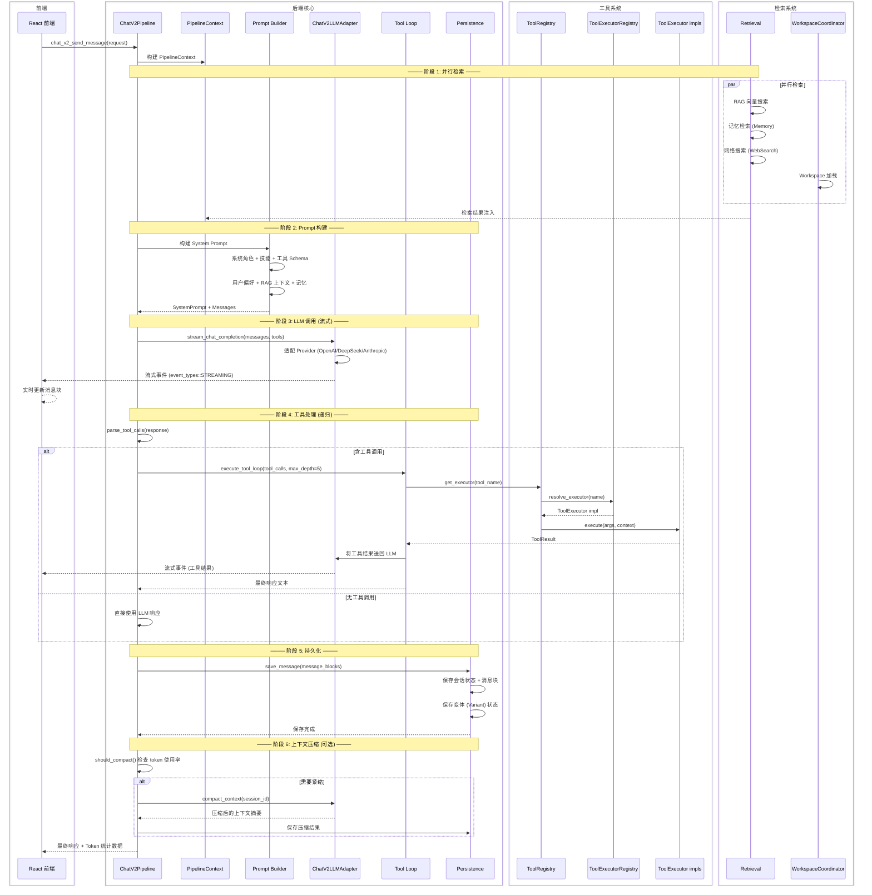

# Chat V2 聊天子系统 — 内部架构图

> 最后更新: 2026-06-06 | 源码路径: `src-tauri/src/chat_v2/`, `src-tauri/src/tools/`, `src-tauri/src/chat_v2/tools/`

## 概述

Chat V2 是基于 Block 的消息架构聊天后端，支持流式事件驱动、工具调用、多轮对话和上下文管理。

---

## 图 1: Chat V2 消息流水线 (sequenceDiagram)

**流程阶段**:
| 阶段 | 说明 | 源码 |
|------|------|------|
| 并行检索 | RAG + 记忆 + 网络搜索并行执行 | `pipeline/retrieval.rs` |
| Prompt 构建 | 组装系统提示词和消息序列 | `pipeline/prompt.rs` |
| LLM 调用 | 流式调用 LLM，事件驱动更新 UI | `pipeline/llm_adapter.rs` |
| 工具处理 | 递归处理工具调用（最多5层） | `pipeline/tool_loop.rs` |
| 持久化 | 保存消息块和会话状态 | `pipeline/persistence.rs` |
| 上下文压缩 | Token 过高时自动压缩 | `pipeline/compaction.rs` |

---

## 图 2: 工具执行架构 (classDiagram)

```mermaid
classDiagram
    class ToolRegistry {
        - tools: Arc~HashMap~String, Arc~dyn Tool~~~
        - default_timeout_ms: u64
        - enabled: Arc~HashMap~String, bool~~
        - mcp_namespace_prefix: Option~String~
        + new_with(tools: Vec~Arc~dyn Tool~~) Self
        + register(tool: Arc~dyn Tool~)
        + call_tool_with_details(name, args, ctx) (bool, Option~Value~, Option~String~, ...)
        + get_schema() Value
        + detect_tool_conflicts(mcp_client) Vec~ToolConflict~
        + apply_mcp_namespace(name) String
        + strip_mcp_namespace(name) String
    }

    class Tool {
        <<trait>>
        + name() &'static str
        + schema() Value
        + invoke(args: &Value, ctx: &ToolContext) (bool, Option~Value~, Option~String~, Option~Value~, Option~Vec~RagSourceInfo~~, Option~String~)
    }

    class ToolContext {
        + db: Option~&Database~
        + mcp_client: Option~Arc~McpClient~~
        + supports_tools: bool
        + window: Option~&Window~
        + stream_event: Option~&str~
        + stage: Option~&str~
        + memory_enabled: Option~bool~
        + llm_manager: Option~Arc~LLMManager~~
    }

    class ToolExecutor {
        <<trait>>
        + name() &'static str
        + sensitivity() ToolSensitivity
        + execute(args, context) ToolResult~ToolResultInfo~
    }

    class ExecutionContext {
        + session_id: String
        + message_id: String
        + variant_id: Option~String~
        + skill_state_version: Option~u64~
        + block_id: String
        + emitter: Arc~ChatV2EventEmitter~
        + tool_registry: Arc~ToolRegistry~
        + main_db: Option~Arc~Database~~
        + vfs_db: Option~Arc~VfsDatabase~~
        + vfs_lance_store: Option~Arc~VfsLanceStore~~
        + llm_manager: Option~Arc~LLMManager~~
        + chat_v2_db: Option~Arc~ChatV2Database~~
        + cancellation_token: Option~CancellationToken~
        + rag_top_k: Option~u32~
        + rag_enable_reranking: Option~bool~
        + pdf_processing_service: Option~Arc~PdfProcessingService~~
    }

    class ToolError {
        <<enumeration>>
        InvalidArgs(String)
        Execution(String)
        Timeout(String)
        NotFound(String)
        Cancelled
        Internal(String)
    }

    class ToolSensitivity {
        <<enumeration>>
        Low
        Medium
        High
    }

    class ToolExecutorRegistry {
        - executors: HashMap~String, Arc~dyn ToolExecutor~~
        + register(executor: Arc~dyn ToolExecutor~)
        + get_executor(name) Option~Arc~dyn ToolExecutor~~
        + execute(tool_call, context) ToolResult~ToolResultInfo~
    }

    class BuiltinRetrievalExecutor {
        + name() "builtin-rag_search" / "builtin-web_search"
        + execute(args, context) ToolResult~ToolResultInfo~
    }

    class ChatAnkiToolExecutor {
        + name() "builtin-chatanki_run"
        + execute(args, context) ToolResult~ToolResultInfo~
    }

    class MemoryToolExecutor {
        + name() "builtin-memory_search" / "builtin-memory_write"
        + execute(args, context) ToolResult~ToolResultInfo~
    }

    class PaperSaveExecutor {
        + name() "builtin-paper_save"
        + execute(args, context) ToolResult~ToolResultInfo~
    }

    class QBankExecutor {
        + name() "builtin-qbank_*"
        + execute(args, context) ToolResult~ToolResultInfo~
    }

    class CanvasToolExecutor {
        + name() "builtin-canvas_*"
        + execute(args, context) ToolResult~ToolResultInfo~
    }

    class FetchExecutor {
        + name() "builtin-fetch"
        + execute(args, context) ToolResult~ToolResultInfo~
    }

    ToolRegistry --> Tool : 注册和管理
    ToolExecutorRegistry --> ToolExecutor : 注册和管理
    ToolExecutorRegistry ..> ExecutionContext : 传入执行
    ToolExecutor --> ToolError : 返回错误
    ToolExecutor --> ToolSensitivity : 敏感等级
    BuiltinRetrievalExecutor --|> ToolExecutor : 实现
    ChatAnkiToolExecutor --|> ToolExecutor : 实现
    MemoryToolExecutor --|> ToolExecutor : 实现
    PaperSaveExecutor --|> ToolExecutor : 实现
    QBankExecutor --|> ToolExecutor : 实现
    CanvasToolExecutor --|> ToolExecutor : 实现
    FetchExecutor --|> ToolExecutor : 实现
```

**工具系统双注册表**:
| 注册表 | 类型 | 用途 | 源码 |
|--------|------|------|------|
| `ToolRegistry` | `dyn Tool` (通用) | 早期工具系统，`tools/mod.rs` 定义 | `src-tauri/src/tools/mod.rs` |
| `ToolExecutorRegistry` | `dyn ToolExecutor` (新) | 重构后的执行器，支持敏感等级 | `src-tauri/src/chat_v2/tools/executor_registry.rs` |

**工具执行器清单** (源码: `src-tauri/src/chat_v2/tools/`):
- `BuiltinRetrievalExecutor` — RAG 检索 + 网络搜索 + Web 抓取 (`builtin_retrieval_executor.rs`)
- `BuiltinResourceExecutor` — VFS 资源操作 (`builtin_resource_executor.rs`)
- `ChatAnkiToolExecutor` — Anki 制卡 (`chatanki_executor.rs`)
- `MemoryToolExecutor` — 记忆读写 (`memory_executor.rs`)
- `CanvasToolExecutor` — 画布/思维导图 (`canvas_executor.rs`)
- `PaperSaveExecutor` — 论文保存 (`paper_save_executor.rs`)
- `QBankExecutor` — 题库管理 (`qbank_executor.rs`)
- `FetchExecutor` — URL 抓取 (`fetch_executor.rs`)
- `SessionToolExecutor` — 会话管理 (`session_executor.rs`)
- `AttachmentToolExecutor` — 附件处理 (`attachment_executor.rs`)
- `TemplateDesignerExecutor` — 模板设计 (`template_executor.rs`)
- `TodoListExecutor` / `UserTodoExecutor` — 待办事项 (`todo_executor.rs`, `user_todo_executor.rs`)
- `DocxToolExecutor` / `PptxToolExecutor` / `XlsxToolExecutor` — 文档生成
- `ImageGenerationExecutor` — 图片生成 (`image_generation_executor.rs`)
- `AcademicSearchExecutor` — 学术搜索 (`academic_search_executor.rs`)
- `SubagentExecutor` — 子 Agent 调用 (`subagent_executor.rs`)
- `SkillsExecutor` — 技能执行 (`skills_executor.rs`)
- `WorkspaceToolExecutor` — Workspace 操作 (`workspace_executor.rs`)
- `CoordinatorSleepExecutor` — 休眠工具 (`sleep_executor.rs`)
- `GeneralToolExecutor` / `AskUserExecutor` — 通用工具

---

## 图 3: 会话与消息管理 (flowchart)

```mermaid
flowchart TB
    subgraph Frontend["前端操作"]
        NEW["创建会话"] --> INPUT["输入消息"]
        INPUT --> SEND["发送消息"]
        SEND --> LOAD["加载历史"]
        SEND --> VAR["切换变体"]
        SEND --> EDIT["编辑重发"]
        SEND --> RETRY["重试"]
        SEND --> DELETE["删除消息"]
        NEW --> ARCHIVE["归档会话"]
    end

    subgraph Backend["后端 Tauri Commands (handlers/mod.rs)"]
        C_CREATE["chat_v2_create_session"]
        C_SEND["chat_v2_send_message"]
        C_LOAD["chat_v2_load_session"]
        C_LIST["chat_v2_list_sessions"]
        C_DELETE["chat_v2_delete_session"]
        C_ARCHIVE["chat_v2_archive_session"]
        C_DEL_MSG["chat_v2_delete_message"]
        C_EDIT["chat_v2_edit_and_resend"]
        C_RETRY["chat_v2_retry_message"]
        C_VAR["chat_v2_switch_variant"]
        C_SAVE["chat_v2_save_session"]
        C_CANCEL["chat_v2_cancel_stream"]
        C_EMPTY["chat_v2_empty_deleted_sessions"]
        C_CNT["chat_v2_count_sessions"]
        C_COPY["chat_v2_copy_block_content"]
        C_MIGRATE["chat_v2_migrate_legacy_chat"]
        C_SETTINGS["chat_v2_update_session_settings"]
        C_UPSERT["chat_v2_upsert_streaming_block"]
    end

    subgraph Pipeline["消息流水线"]
        PIPE_INIT["ChatV2Pipeline.send_message()"]
        PIPE_RAG["检索阶段 (retrieval.rs)"]
        PIPE_LLM["LLM 阶段 (llm_adapter.rs)"]
        PIPE_TOOL["工具阶段 (tool_loop.rs)"]
        PIPE_SAVE["持久化阶段 (persistence.rs)"]
        PIPE_COMP["上下文压缩 (compaction.rs)"]
    end

    subgraph Storage["存储层 (chat_v2.db)"]
        DB_SESS["sessions 表<br/>id, title, settings, status, state<br/>created/updated/deleted_at"]
        DB_MSG["messages 表<br/>id, session_id, role, blocks_json<br/>token_usage, created_at"]
        DB_BLOCK["blocks 表<br/>id, message_id, type, content<br/>status, variant_id"]
        DB_VAR["variants 表<br/>id, session_id, message_id<br/>status, branch_id"]
    end

    subgraph Context["上下文管理"]
        CTX["PipelineContext (context.rs)"]
        CTX_RAG["RAG 上下文"]
        CTX_MEM["记忆上下文"]
        CTX_WORK["Workspace 上下文"]
        CTX_HIST["历史消息"]
        COMP_CTX["CompactContext (compaction.rs)"]
    end

    Frontend --> Backend
    Backend --> Pipeline
    Backend --> Storage
    Pipeline --> Storage
    Pipeline --> Context
    Context --> Storage

    style Frontend fill:#e3f2fd,stroke:#1565c0
    style Backend fill:#e8f5e9,stroke:#2e7d32
    style Pipeline fill:#fff3e0,stroke:#ef6c00
    style Storage fill:#fce4ec,stroke:#c62828
    style Context fill:#f3e5f5,stroke:#7b1fa2
```

**会话存储结构**:
- `sessions` 表 — 会话元数据（标题、状态、设置）
- `messages` 表 — 消息记录（角色、块 JSON、Token 用量）
- `blocks` 表 — 消息块（文本、工具调用、工具结果，支持变体关联）
- `variants` 表 — 变体管理（多分支执行）

**上下文管理**:
- `PipelineContext` (context.rs) — 全流水线上下文，传递所有依赖和状态
- `VariantExecutionContext` (variant_context.rs) — 变体执行上下文，管理并行变体执行
- 上下文压缩 (`compaction.rs`) — 当 Token 使用率达到 `TRIGGER_RATIO`(0.75) 时触发，保留头 N 轮 + 尾 N 轮

---

## 文件索引

| 文件 | 说明 |
|------|------|
| `src-tauri/src/chat_v2/mod.rs` | 模块入口、re-exports、统一初始化 |
| `src-tauri/src/chat_v2/pipeline.rs` | `ChatV2Pipeline` — 编排引擎主结构 |
| `src-tauri/src/chat_v2/context.rs` | `PipelineContext` — 流水线上下文 |
| `src-tauri/src/chat_v2/repo.rs` | `ChatV2Repo` — 数据存取层 |
| `src-tauri/src/chat_v2/types.rs` | 消息、快、会话等核心类型 |
| `src-tauri/src/chat_v2/events.rs` | `ChatV2EventEmitter` — 事件发射系统 |
| `src-tauri/src/chat_v2/state.rs` | `ChatV2State` — 全局状态 |
| `src-tauri/src/chat_v2/database.rs` | `ChatV2Database` — 独立数据库管理 |
| `src-tauri/src/chat_v2/handlers/mod.rs` | Tauri 命令处理器 |
| `src-tauri/src/chat_v2/pipeline/llm_adapter.rs` | LLM 适配器（流式调用） |
| `src-tauri/src/chat_v2/pipeline/tool_loop.rs` | 工具循环（递归执行） |
| `src-tauri/src/chat_v2/pipeline/retrieval.rs` | 并行检索阶段 |
| `src-tauri/src/chat_v2/pipeline/persistence.rs` | 数据持久化阶段 |
| `src-tauri/src/chat_v2/pipeline/compaction.rs` | 上下文压缩 |
| `src-tauri/src/chat_v2/pipeline/prompt.rs` | Prompt 构建 |
| `src-tauri/src/chat_v2/tools/executor.rs` | `ToolExecutor` trait + `ToolError` |
| `src-tauri/src/chat_v2/tools/executor_registry.rs` | `ToolExecutorRegistry` — 执行器注册表 |
| `src-tauri/src/chat_v2/tools/mod.rs` | 工具模块入口 |
| `src-tauri/src/tools/mod.rs` | `ToolRegistry` + `Tool` trait (通用) |
