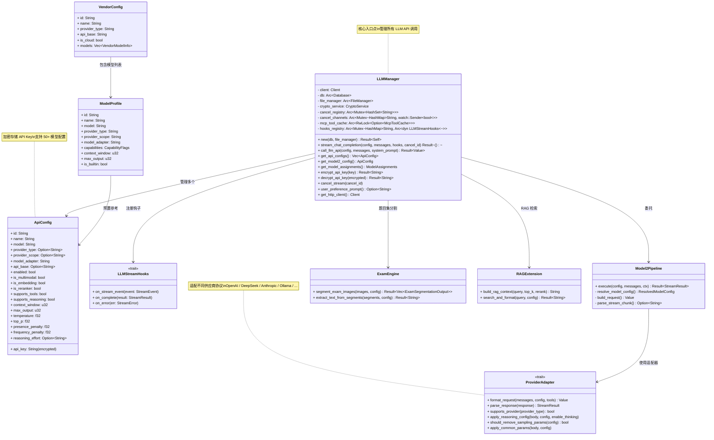
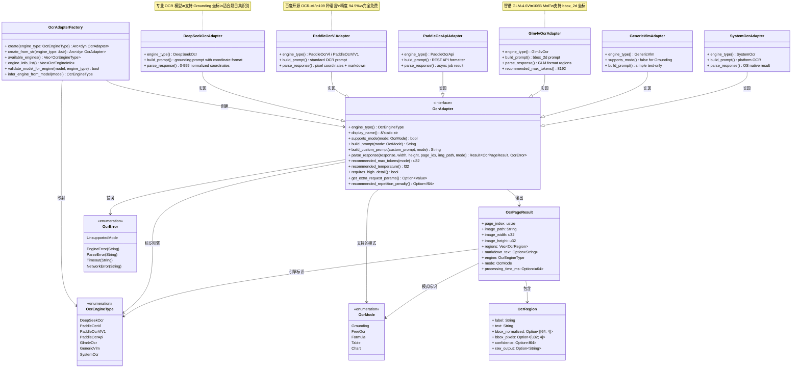
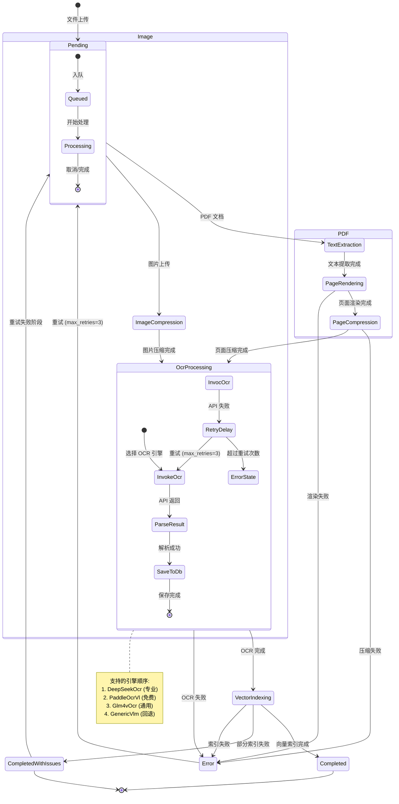

# LLM 管理与 OCR 子系统 — 内部架构图

> 最后更新: 2026-06-06 | 源码路径: `src-tauri/src/llm_manager/`, `src-tauri/src/ocr_adapters/`, `src-tauri/src/vfs/pdf_processing_service.rs`

## 概述

LLM Manager 负责统一管理多供应商 LLM API 调用，OCR 适配器系统提供可扩展的多引擎 OCR 能力，两者共同支撑 PDF 预处理流水线。

---

## 图 1: LLM Manager 架构 (classDiagram)

**关键源码引用**:
| 类型 | 文件 |
|------|------|
| `LLMManager` | `src-tauri/src/llm_manager/mod.rs` |
| `ApiConfig` | `src-tauri/src/llm_manager/config_types.rs` |
| `LLMStreamHooks` | `src-tauri/src/llm_manager/streaming.rs` |
| `Model2Pipeline` | `src-tauri/src/llm_manager/model2_pipeline.rs` |
| `ProviderAdapter` | `src-tauri/src/llm_manager/adapters/` |
| `VendorConfig` | `src-tauri/src/llm_manager/vendor_config_service.rs` |
| `ModelProfile` | `src-tauri/src/llm_manager/model_profile_service.rs` |
| `ExamEngine` | `src-tauri/src/llm_manager/exam_engine.rs` |

---

## 图 2: OCR 适配器插件系统 (classDiagram)

**适配器支持矩阵**:

| 适配器 | Grounding | FreeOcr | Formula | Table | Chart | 免费 | 专用 OCR |
|--------|-----------|---------|---------|-------|-------|------|---------|
| `DeepSeekOcrAdapter` | ✅ | ✅ | ✅ | ✅ | ✅ | ❌ | ✅ |
| `PaddleOcrVlAdapter` | ✅ | ✅ | ✅ | ✅ | ✅ | ✅ | ✅ |
| `PaddleOcrApiAdapter` | ❌ | ✅ | ✅ | ✅ | ✅ | ✅ | ✅ |
| `Glm4vOcrAdapter` | ✅ | ✅ | ✅ | ✅ | ✅ | ❌ | ❌ |
| `GenericVlmAdapter` | ❌ | ✅ | ✅ | ✅ | ✅ | ❌ | ❌ |
| `SystemOcrAdapter` | ❌ | ✅ | ❌ | ❌ | ❌ | ✅ | ✅ |

**源码引用**: `src-tauri/src/ocr_adapters/mod.rs`, `factory.rs`, `deepseek.rs`, `paddle.rs`, `paddle_api.rs`

---

## 图 3: OCR 流水线生命周期 (stateDiagram)

**阶段详情**:

| 阶段 | 说明 | 源码方法 | 事件 |
|------|------|----------|------|
| `TextExtraction` | PDF 文本提取 (pdfium) | `stage_text_extraction()` | `PdfProcessingProgressEvent` |
| `PageRendering` | PDF 页面渲染为图片 | `stage_page_rendering()` | 同上 |
| `PageCompression` | 渲染图片 JPEG 压缩 | `stage_page_compression()` | 同上 |
| `ImageCompression` | 图片压缩 (阈值 > 1MB) | `stage_image_compression()` | 同上 |
| `OcrProcessing` | OCR 识别 (多引擎可选) | `stage_ocr_processing()` | `PdfProcessingProgressEvent` |
| `VectorIndexing` | 向量化 + LanceDB 存储 | `stage_vector_indexing()` | 同上 |
| `Completed` | 处理成功完成 | — | `PdfProcessingCompletedEvent` |
| `Error` | 处理失败 | — | `PdfProcessingErrorEvent` |

**Checkpoint/Resume 机制**:
- 每个阶段完成后写数据库 `processing_stage` 字段
- 应用启动时 `resume_pending_jobs()` 扫描未完成的处理任务
- 使用 `CancellationToken` 支持取消正在进行的任务
- 失败阶段记录 `ProcessingIssue`，支持定向重试
- 图片复用：PDF 的 OCR 阶段直接使用 PageRendering 阶段生成的图片

**源码引用**:
- 流水线主逻辑: `src-tauri/src/vfs/pdf_processing_service.rs`
- 事件类型: 同上 (32000+ 行)
- 检查点恢复: `resume_pending_jobs()` 方法
- 进度事件: `PdfProcessingProgressEvent`, `PdfProcessingCompletedEvent`, `PdfProcessingErrorEvent`

---

## 文件索引

| 文件 | 说明 |
|------|------|
| `src-tauri/src/llm_manager/mod.rs` | `LLMManager` — LLM 管理器主结构 |
| `src-tauri/src/llm_manager/config_types.rs` | `ApiConfig`, `VendorConfig`, `ModelProfile` 等类型 |
| `src-tauri/src/llm_manager/model2_pipeline.rs` | `Model2Pipeline` — 新一代流式管线 |
| `src-tauri/src/llm_manager/streaming.rs` | `LLMStreamHooks` 流式钩子 |
| `src-tauri/src/llm_manager/adapters/` | `ProviderAdapter` trait 及各供应商实现 |
| `src-tauri/src/llm_manager/builtin_vendors.rs` | 内置供应商配置 |
| `src-tauri/src/llm_manager/vendor_config_service.rs` | 供应商配置服务 |
| `src-tauri/src/llm_manager/model_profile_service.rs` | 模型配置文件服务 |
| `src-tauri/src/llm_manager/exam_engine.rs` | 题目集图片分割引擎 |
| `src-tauri/src/llm_manager/rag_extension.rs` | RAG 上下文构建扩展 |
| `src-tauri/src/llm_manager/parser.rs` | API 响应流解析 |
| `src-tauri/src/llm_manager/tool_call.rs` | 工具调用格式转换 |
| `src-tauri/src/ocr_adapters/mod.rs` | `OcrAdapter` trait + `Glm4vOcrAdapter` + `GenericVlmAdapter` |
| `src-tauri/src/ocr_adapters/factory.rs` | `OcrAdapterFactory` + `OcrEngineInfo` |
| `src-tauri/src/ocr_adapters/deepseek.rs` | `DeepSeekOcrAdapter` |
| `src-tauri/src/ocr_adapters/paddle.rs` | `PaddleOcrVlAdapter` |
| `src-tauri/src/ocr_adapters/paddle_api.rs` | `PaddleOcrApiAdapter` |
| `src-tauri/src/ocr_adapters/system_ocr/` | `SystemOcrAdapter` |
| `src-tauri/src/ocr_adapters/types.rs` | `OcrEngineType`, `OcrMode`, `OcrPageResult`, `OcrRegion`, `OcrError` |
| `src-tauri/src/vfs/pdf_processing_service.rs` | PDF/图片预处理流水线 |
