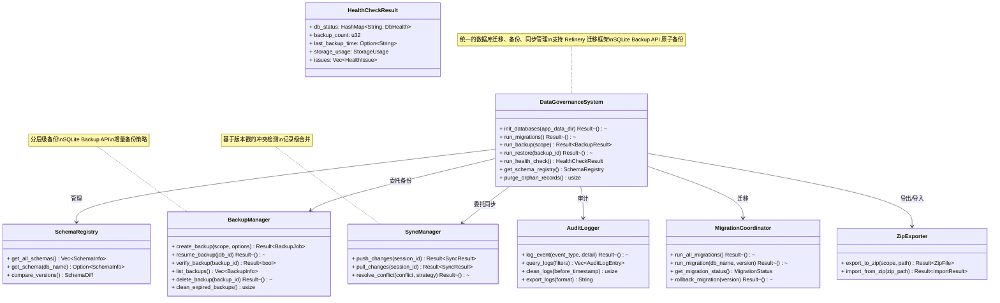
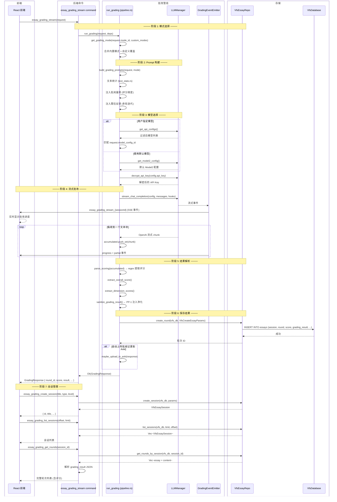

# 数据治理 / 记忆 / 作文批改子系统 — 内部架构图

> 最后更新: 2026-06-06 | 源码路径: `src-tauri/src/data_governance/`, `src-tauri/src/memory/`, `src-tauri/src/essay_grading/`

---

## 图 1: 数据治理系统 (classDiagram)

**数据治理命令清单** (源码: `src-tauri/src/data_governance/`):

| 命令 | 文件 | 说明 |
|------|------|------|
| `data_governance_get_database_status` | `commands.rs` | 数据库状态概览 |
| `data_governance_get_migration_status` | `commands.rs` | 迁移状态 |
| `data_governance_run_health_check` | `commands.rs` | 健康检查 |
| `data_governance_get_schema_registry` | `commands.rs` | Schema 注册表 |
| `data_governance_get_audit_logs` | `commands.rs` | 审计日志 |
| `data_governance_cleanup_audit_logs` | `commands.rs` | 清理审计日志 |
| `data_governance_run_backup` | `commands_backup.rs` | 执行备份 |
| `data_governance_resume_backup_job` | `commands_backup.rs` | 恢复备份 |
| `data_governance_verify_backup` | `commands_backup.rs` | 验证备份 |
| `data_governance_delete_backup` | `commands_backup.rs` | 删除备份 |
| `data_governance_get_backup_list` | `commands_backup.rs` | 备份列表 |
| `data_governance_list_backup_jobs` | `commands_backup.rs` | 备份任务列表 |
| `data_governance_backup_tiered` | `commands_backup.rs` | 分层备份 |
| `data_governance_export_zip` | `commands_zip.rs` | ZIP 导出 |
| `data_governance_import_zip` | `commands_zip.rs` | ZIP 导入 |
| `data_governance_backup_and_export_zip` | `commands_zip.rs` | 备份并导出 |
| `data_governance_restore_database` | `commands_restore.rs` | 数据库恢复 |
| `data_governance_list_resumable_jobs` | `commands_backup.rs` | 可恢复任务列表 |
| `data_governance_push_sync` | `commands_sync.rs` | 推送同步 |
| `data_governance_pull_sync` | `commands_sync.rs` | 拉取同步 |

---

## 图 2: 记忆系统 (classDiagram)

```mermaid
classDiagram
    class MemoryService {
        + write(knowledge, context, type, purpose) MemoryResult~SmartWriteOutput~
        + search(query, limit, types) MemoryResult~Vec~MemorySearchResult~~
        + get(id) MemoryResult~Option~MemoryItem~~
        + update(id, content, tags) MemoryResult~()~
        + delete(id) MemoryResult~bool~
        + list(filters, pagination) MemoryResult~Vec~MemoryListItem~~
        + get_stats() MemoryResult~MemoryStats~
    }

    class MemoryType {
        <<enumeration>>
        Fact
        Study
        Note
    }

    class MemoryPurpose {
        <<enumeration>>
        Write
        Chat
        Reading
        Review
        Exam
        General
    }

    class MemoryAutoExtractor {
        + extract_from_chat(messages) MemoryResult~Vec~ExtractedMemory~~
        + extract_from_response(text) MemoryResult~Vec~ExtractedMemory~~
        - classify_content(text) MemoryType
        - assess_confidence(text) f32
    }

    class MemoryLLMDecision {
        + decide_write(event, context) MemoryDecisionResponse
        + decide_read(query, memory_items) MemoryDecisionResponse
        + summarize_similar(items) SimilarMemorySummary
    }

    class MemoryQueryRewriter {
        + rewrite(query, context) QueryRewriteResult
        + expand_query(query) Vec~String~
    }

    class MemoryReranker {
        + rerank(query, items, top_k) Vec~MemorySearchResult~
        + compute_relevance(query, item) f32
    }

    class MemoryEvolution {
        + evolve_over_time() MemoryResult~EvolutionResult~
        + merge_duplicates() usize
        + decay_old_memories(before) usize
    }

    class MemoryCategoryManager {
        + categorize(item) Vec~String~
        + get_all_categories() Vec~Category~
        + auto_tag(content) Vec~String~
    }

    class MemoryConfig {
        + auto_extract_enabled: bool
        + max_items_per_type: HashMap~MemoryType, usize~
        + retention_days: HashMap~MemoryType, u64~
        + auto_extract_frequency: AutoExtractFrequency
    }

    class MemoryStorage {
        <<trait>>
        + store(item) MemoryResult~()~
        + search(query, limit) MemoryResult~Vec~MemoryItem~~
        + get(id) MemoryResult~Option~MemoryItem~~
        + delete(id) MemoryResult~bool~
        + list(filters) MemoryResult~Vec~MemoryItem~~
    }

    class VfsMemoryStorage {
        + store(item) MemoryResult~()~
        + search(query, limit) MemoryResult~Vec~MemoryItem~~
        + get(id) MemoryResult~Option~MemoryItem~~
        + delete(id) MemoryResult~bool~
        + list(filters) MemoryResult~Vec~MemoryItem~~
    }

    class MemoryCompressor {
        + compress(items) MemoryResult~Vec~CompressedMemory~~
        + estimate_tokens(items) usize
    }

    MemoryService --> MemoryStorage : 委托存储
    MemoryService --> MemoryAutoExtractor : 自动提取
    MemoryService --> MemoryLLMDecision : LLM 决策
    MemoryService --> MemoryQueryRewriter : 查询重写
    MemoryService --> MemoryReranker : 重排序
    MemoryService --> MemoryEvolution : 演化管理
    MemoryService --> MemoryCategoryManager : 分类管理
    MemoryService --> MemoryConfig : 配置
    MemoryService --> MemoryType : 类型系统
    MemoryService --> MemoryPurpose : 目的标签
    MemoryStorage <|.. VfsMemoryStorage : 实现 (VFS 后端)
    MemoryService --> MemoryCompressor : 压缩

    note for MemoryService "核心服务\n处理记忆的读写、搜索、管理\n基于 VFS 存储 (VfsMemoryStorage)"
    note for MemoryType "三种类型:\nFact(≤200字) — 原子事实\nStudy(≤4000字) — 学习记忆\nNote(≤2000字) — 经验笔记"
    note for MemoryLLMDecision "利用 LLM 判断\n是否写入/读取记忆\n确保记忆质量"
```

**记忆存储架构**:
- `MemoryStorage` trait 定义存储接口，`VfsMemoryStorage` 通过 VFS 实现
- 使用 VFS 的 `VfsNoteRepo` 实际存储记忆数据
- 使用标签系统（`_type:`, `_purpose:`, `_ref:` 前缀）标识记忆属性
- 搜索流程: 查询重写 → VFS RAG 向量搜索 → LLM 决策 → 重排序

**源码引用**:
| 文件 | 说明 |
|------|------|
| `src-tauri/src/memory/service.rs` | `MemoryService` — 核心服务 (112K) |
| `src-tauri/src/memory/storage_trait.rs` | `MemoryStorage` trait + `VfsMemoryStorage` |
| `src-tauri/src/memory/auto_extractor.rs` | `MemoryAutoExtractor` — 自动提取 |
| `src-tauri/src/memory/llm_decision.rs` | `MemoryLLMDecision` — LLM 决策 |
| `src-tauri/src/memory/query_rewriter.rs` | `MemoryQueryRewriter` — 查询重写 |
| `src-tauri/src/memory/reranker.rs` | `MemoryReranker` — 重排序 |
| `src-tauri/src/memory/evolution.rs` | `MemoryEvolution` — 演化管理 |
| `src-tauri/src/memory/category_manager.rs` | `MemoryCategoryManager` — 分类 |
| `src-tauri/src/memory/compressor.rs` | `MemoryCompressor` — 压缩 |
| `src-tauri/src/memory/config.rs` | `MemoryConfig` — 配置 |
| `src-tauri/src/memory/audit_log.rs` | `MemoryAuditLogger` — 审计日志 |
| `src-tauri/src/memory/error.rs` | `MemoryError` — 错误类型 |

---

## 图 3: 作文批改 (sequenceDiagram)

**批改管线阶段**:
| 阶段 | 说明 | 源码方法 |
|------|------|----------|
| 模式选择 | 获取批阅模式（内置 + 自定义覆盖） | `get_grading_mode()` |
| Prompt 构建 | 组装系统 Prompt + 用户作文 + 评分量规 | `build_grading_prompts()` |
| 模型选择 | 用户指定 / 默认 Model2 | `get_model2_config()` |
| 流式批改 | 流式调用 LLM，实时推送评分进度 | `stream_grade()` |
| 结果解析 | 正则提取评分、维度分、反馈文本 | `parse_scoring()` + PP-1 净化 |
| 保存结果 | 存储到 VFS essays 表 | `VfsEssayRepo::create_round()` |
| 会话管理 | 创建/列表/查询轮次/切换收藏 | 各 handler 方法 |

**评分维度**:
- 批阅模式通过 JSON 定义多个评分维度（内容、结构、语言、逻辑等）
- 每个维度含权重、评分标准和描述
- 支持自定义批阅模式 (`custom_modes.rs`)，优先级高于内置模式
- 内置模式包括：通用评分、高考作文、雅思作文、考研英语等

**安全机制**:
- PP-1: Prompt 输入净化，防止注入攻击 (`pipeline.rs`)
- M-8: 评分边界校验，防止除零 (`pipeline.rs`)
- PP-2: 评分正则支持属性顺序变化 (`pipeline.rs`)
- MAX_INPUT_CHARS = 50000 (与前端保持一致)

**源码引用**:
| 文件 | 说明 |
|------|------|
| `src-tauri/src/essay_grading/mod.rs` | 模块入口 + Tauri 命令 |
| `src-tauri/src/essay_grading/pipeline.rs` | `run_grading()` 批改管线核心 |
| `src-tauri/src/essay_grading/types.rs` | `GradingMode`, `GradingRequest`, `GradingResponse` |
| `src-tauri/src/essay_grading/custom_modes.rs` | 自定义批阅模式 CRUD |
| `src-tauri/src/essay_grading/events.rs` | `GradingEventEmitter` — 事件发射 |
| `src-tauri/src/essay_grading/text_stats.rs` | 文本统计（字数、段落等） |
| `src-tauri/src/essay_grading/error.rs` | `EssayGradingError` |
| `src-tauri/src/vfs/repos/essay_repo.rs` | `VfsEssayRepo` — VFS 批改数据存储 |
| `src-tauri/src/vfs/types.rs` | `VfsEssaySession`, `VfsCreateEssayParams` 等 |

---

## 文件索引

| 子系统 | 文件 | 说明 |
|--------|------|------|
| Data Governance | `src-tauri/src/data_governance/mod.rs` | 模块入口 + re-exports |
| Data Governance | `src-tauri/src/data_governance/commands.rs` | 核心治理命令 |
| Data Governance | `src-tauri/src/data_governance/commands_backup.rs` | 备份命令 |
| Data Governance | `src-tauri/src/data_governance/commands_restore.rs` | 恢复命令 |
| Data Governance | `src-tauri/src/data_governance/commands_sync.rs` | 同步命令 |
| Data Governance | `src-tauri/src/data_governance/commands_zip.rs` | ZIP 导入导出命令 |
| Data Governance | `src-tauri/src/data_governance/schema_registry.rs` | Schema 注册表 |
| Data Governance | `src-tauri/src/data_governance/init.rs` | 统一初始化 |
| Data Governance | `src-tauri/src/data_governance/backup/` | 备份管理器 |
| Data Governance | `src-tauri/src/data_governance/sync/` | 同步管理器 |
| Data Governance | `src-tauri/src/data_governance/audit/` | 审计日志 |
| Data Governance | `src-tauri/src/data_governance/dto/` | 统一 DTO |
| Memory | `src-tauri/src/memory/service.rs` | `MemoryService` — 核心服务 (112K) |
| Memory | `src-tauri/src/memory/storage_trait.rs` | `MemoryStorage` trait |
| Memory | `src-tauri/src/memory/handlers.rs` | Tauri 命令处理器 |
| Memory | `src-tauri/src/memory/auto_extractor.rs` | 自动提取 |
| Memory | `src-tauri/src/memory/llm_decision.rs` | LLM 决策 |
| Memory | `src-tauri/src/memory/evolution.rs` | 演化管理 |
| Memory | `src-tauri/src/memory/category_manager.rs` | 分类管理 |
| Essay | `src-tauri/src/essay_grading/pipeline.rs` | 批改管线核心 |
| Essay | `src-tauri/src/essay_grading/custom_modes.rs` | 自定义模式管理 |
| Essay | `src-tauri/src/essay_grading/types.rs` | 批改类型定义 |
| Essay | `src-tauri/src/vfs/repos/essay_repo.rs` | VFS 批改存储 (63K) |
